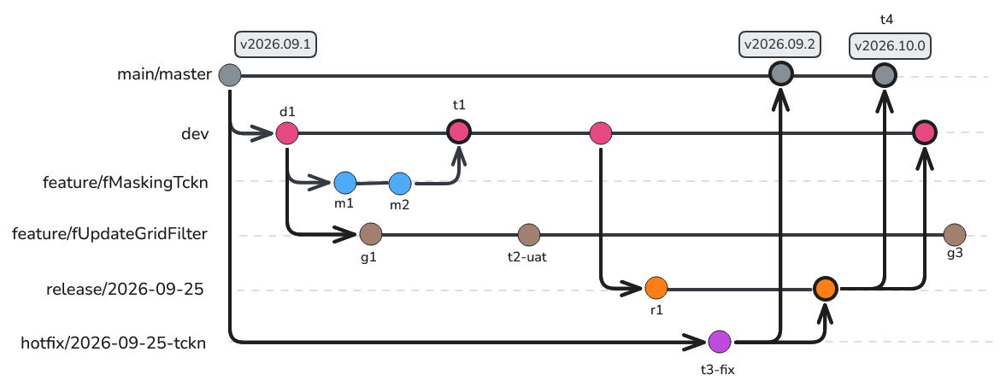
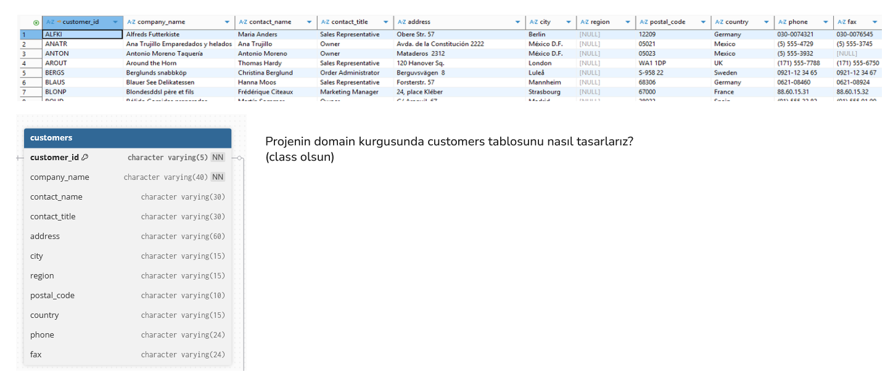

# Hafta 01

## Gitflow Branch Stratejisi

Bu derste aşağıdaki çizim üzerinde durduk ve proje geliştirme süreçlerinde kullanılan branch stratejilerinden birisi olan `git-flow` stratejisini tanıttık.



Senaryoya göre ürüne eklenmek istenen iki geliştirme *(feature)* var.

|**Branch**|**Work Item**|
|---|---|
| `feature/fMaskingTckn` | Müşteri TCKN bilgisinin KVKK gereğince maskelenmesi |
| `feature/fUpdateGridFilter` | Grid kontrollerindeki filtreleme özelliğinin yenilenmesi |

> Bu anlatımda bugfix kapsam dışıdır. Yalnızca **üretimdeki (production) hata için hotfix** senaryosu ele alınır.

---

### Branch'ler Hakkında

| Branch | Nereden açılır | Nereye kapanır | Ömrü | İsimlendirme örneği |
|---|---|---|---|---|
| `main` / `master` | — | — | Kalıcı | Her commit bir sürüm tag'i taşır: `v2026.09.1` |
| `dev` | `main` *(bir kez)* | — | Kalıcı | `dev` / `develop` |
| `feature/*` | `dev` | `dev` | Kısa, belki bir en fazla iki sprint *(iş bitince silinir)* | `feature/fMaskingTckn` |
| `release/*` | `dev` | `main` + `dev` | Kısa *(sürüm çıkınca silinir)* | `release/2026-09-25` |
| `hotfix/*` | `main` *(üretimdeki tag)* | `main` + (`release` **veya** `dev`) | Çok kısa *(saatler, en fazla birkaç gün)* | `hotfix/2026-09-25-tckn-null` |

Kalıcı dallar yalnızca `main/master` ve `dev`'dir. Diğer tüm dallar merge edildikten sonra silinir. Tarihlerde ISO formatı *(`YYYY-MM-DD`)* yaygın olarak kullanılır. `2026-25-09` veya `20262509` gibi formatlar alfabetik sıralamayı bozar ve gün/ay karışıklığına yol açabilir. Mümkünse ticket numarası da eklenmelidir; `hotfix/DMS-1234-tckn-null`.

---

### t1: Feature, dev'e alınır

TCKN maskeleme işi tamamlanır, code review'dan geçer ve `dev`'e merge edilir. `dev`'e giren kod, **potansiyel olarak bir sonraki sürümle üretime çıkabilecek** kod olarak düşünülmelidir. Bu yüzden `dev`'e yalnızca bitmiş ve review'dan geçmiş işler alınır. **Code Review** süreci çok önemlidir ve genellikle **Pull Request** üzerinden yürütülür.

```bash
git switch dev
git switch -c feature/fMaskingTckn
# ... geliştirme, commit'ler ...
git switch dev
git merge --no-ff feature/fMaskingTckn
git branch -d feature/fMaskingTckn
git push origin --delete feature/fMaskingTckn
```

`--no-ff`, feature'ın geçmişte tek bir merge commit'i olarak görünmesini sağlar. Böylece gerektiğinde tüm feature'ı tek bir `git revert -m 1` ile geri almak kolaylaşır.

### t2: Feature halen test aşamasında *(UAT - User Acceptance Test)*

`feature/fUpdateGridFilter` henüz tamamlanmamış ve UAT *(User Acceptance Test)* sürecindedir. Dolayısıyla henüz `dev` ortamına alınmamıştır ve bu nedenle de release kapsamında **değildir**.

> **Not:** Klasik Gitflow'da UAT, release dalında yapılır. Ancak gerçek hayat senaryolarında feature'ların üretim ortamına çok yakın izole preprod ortamlarında test edilmesi yaygın ve faydalı bir pratiktir.

### Release dalının açılması

Bir sonraki sürüme dahil edilecek işler `dev` ortamına kapatıldıktan sonra yeni bir **release branch** açılır. Bu andan itibaren:

- `dev` yeni feature'lar almaya devam eder *(bir sonraki sürüm için)*.
- Release dalına **yeni özellik eklenmez/eklenmemelidir**. Yalnızca stabilizasyon, sürüm numarası ve dokümantasyon değişiklikleri yapılır.

```bash
git switch dev
git switch -c release/2026-09-25
git push -u origin release/2026-09-25
```

### t3: Üretimde hata bulunmuş ve bir hotfix açılmıştır

**Release** henüz tamamlanmamışken **üretimdeki** sürümde *(`main`, t3)* düzeltilmesi gereken acil bir hata bulunur. Hata üretimde olduğu için düzeltme üretimdeki kodun üzerine yapılmalıdır. Bu nedenle hotfix dalı **`main`'den** açılır.

> **Not:** Neden `dev`'den açılmaz? Çünkü söz konusu branch henüz üretime çıkmamış kodları da içerir. Oradan açılan bir "hotfix", test edilmemiş feature'ları da üretime taşır.

```bash
git switch main
git pull
git switch -c hotfix/2026-09-25-tckn-null
# ... düzeltme + test ...
git commit -am "fix: TCKN alanı null geldiğinde maskeleme hatası"
```

### Hotfix'in kapatılması *(iki yönlü merge)*

Hotfix **iki branch'e** merge edilir:

- `main`'e (zorunlu):** Hotfix'in varlık sebebi üretimi hemen düzeltmektir. Önce `main`'e merge edilir, yeni bir patch tag'i atılır ve deploy edilir.

```bash
git switch main
git merge --no-ff hotfix/2026-09-25-tckn-null
git tag -a v2026.09.2 -m "Hotfix: TCKN null maskeleme"
git push origin main --tags
```

- Açık release varsa `release`'e, yoksa `dev`'e:** Düzeltme bir sonraki sürümde kaybolmamalıdır. Bu senaryoda açık bir release olduğu için hotfix **release'e** merge edilir. Release t4'te `dev`'e kapatılacağı için düzeltme oradan `dev`'e de ulaşır.

```bash
git switch release/2026-09-25
git merge --no-ff hotfix/2026-09-25-tckn-null
git branch -d hotfix/2026-09-25-tckn-null
```

### t4: Release kapatılır

Release stabil hale geldiğinde:

1. `main`'e merge edilir ve sürüm tag'i atılır. Üretime çıkan budur.
2. `dev`'e merge edilir. Release sırasında yapılan düzeltmeler ve release'e giren hotfix, `dev`'e taşınır.
3. Release branch kapatılır/silinir.

```bash
git switch main
git merge --no-ff release/2026-09-25
git tag -a v2026.10.0 -m "Release 2026-09-25"

git switch dev
git merge --no-ff release/2026-09-25

git branch -d release/2026-09-25
git push origin main dev --tags
git push origin --delete release/2026-09-25
```

t4 sonrasında `dev`, `main`'deki her şeyi içerir. Bu iki dal commit geçmişi olarak birebir aynı olmayabilir *(merge commit'leri farklıdır)* ve `dev` bu sırada yeni feature'larla ilerlemiş olabilir. Lakin şu söylem geçerlidir; **"main'de olup dev'de olmayan bir değişiklik yoktur."**

`feature/fUpdateGridFilter` bu sürüme girmedi. Gelişimine devam eder ve hazır olduğunda bir sonraki release için `dev`'e merge edilir.

---

### Hotfix karar tablosu

| **Durum** | **Hotfix nereden açılır** | **Nereye merge edilir** |
|---|---|---|
| Üretimde hata var, açık release **yok** | `main` | `main` (+ tag) -> `dev` |
| Üretimde hata var, açık release **var** | `main` | `main` (+ tag) -> `release` (release daha sonra `dev`'e gider) |
| Hata release testinde bulundu (üretimde değil) | Hotfix **değildir** | Doğrudan `release` dalına commit / `bugfix/*` dalı |
| Hata `dev`'de bulundu | Hotfix **değildir** | Normal `feature/*` veya `bugfix/*` akışı |

---

### Tartışma soruları

Aşağıdaki konuları tartışabiliriz;

1. Açık bir **release** varken **hotfix** neden `dev` yerine `release`'e merge ediliyor? İkisine birden merge edilse ne olurdu?
2. **Hotfix** ile **release** aynı dosyada değişiklik yaptıysa çakışmayı kim, hangi dalda çözmeli?
3. `feature/fMaskingTckn` bir KVKK zorunluluğu. Bu iş bir sonraki **release**'i beklemeden üretime çıkmak zorunda olsaydı, Gitflow içinde hangi seçenekler olurdu? **Feature flag** bu sorunu nasıl değiştirir?
4. Günde birkaç kez üretime deploy yapan bir ekip için Gitflow'un maliyeti nedir? GitHub Flow veya trunk-based development ile karşılaştırabiliriz.

[Referans Kaynak](https://danielkummer.github.io/git-flow-cheatsheet/index.html)

## Biraz Java Kodlaması

Bu dersin bir diğer bölümünde kobay **Nortwhind** veritabanındaki **Customers** tablosunun kod tarafındaki karşılığının bir sınıf olarak nasıl yazılacağı üzerinde duruldu.



Kurumsal çözümlerde iş nesnelerinin *(business objects)* farklı türlerde temsili söz konusu olabilir. Sadece alanlardan oluşan bir POJO *(Plain Old Java Object)* sınıfı olabileceği gibi, davranışları da içeren daha karmaşık sınıflar da olabilir. Değiştirilemez iş kuralları ve mantık bu sınıfların içinde yer alabilir. Değiştirilemezlik söz konusu ise sınıf yerine **record** kullanımı da tercih edilebilir. Hatta Domain Driven Design *(DDD)* yaklaşımında **Entity**, **Value Object**, **Aggregate** gibi kavramlar da iş nesnelerinin temsili için kullanılır. Bu dersteki ısınma turunda ilk olarak **Customers** tablosunun POJO karşılığı değerlendirildi.

```java
package com.lectures.business.design.domain;

public final class Customer {

    private String customerId;
    private String contactName;
    private String companyName;
    private String contactTitle;

    public String getCustomerId() {
        return customerId;
    }

    public void setCustomerId(String customerId) {
        this.customerId = customerId;
    }

    public String getContactName() {
        return contactName;
    }

    public void setContactName(String contactName) {
        this.contactName = contactName;
    }

    public String getCompanyName() {
        return companyName;
    }

    public void setCompanyName(String companyName) {
        this.companyName = companyName;
    }

    public String getContactTitle() {
        return contactTitle;
    }

    public void setContactTitle(String contactTitle) {
        this.contactTitle = contactTitle;
    }
}
```

Bu ilk tasarım aslında bir müşterinin temsili için yeterli bilgilere sahiptir. Ancak birkaç sorun vardır. Bir Customer varsayılan yapıcı metot *(constructor)* ile oluşturulabilir ve hiçbir alanına değer atılmayabilir. Bu durumda sistemde gerçekten bir müşteri nesnesinden bahsedemeyiz. Zira veritabanındaki alanlarda boyut kısıtlamaları ve null olamaz gibi kurallar yer almaktadır. Üstelik şu haliyle örneğin 5 alfanünmerik karakter uzunluğunda olması gereken gereken customerId alanı boş veya geçersiz bir değer alabilir. Bu diğer alanlar için de geçerlidir. Özellikle bir domain ile ilgili veri taşıyan iş nesnelerinde iş kurallarını hiçbir bağımlılık olmadan nesne tasarımında **uygulamak** önemlidir. Bu nedenle sınıf tasarımı aşağıdaki şekilde değiştirilmiştir.

```java
package com.lectures.business.design.domain;

public final class Customer {

    // Immutable fields
    private final String customerId;
    private final String contactName;
    private final String companyName;
    private final String contactTitle;

    // Overload bir constructor eklediğimiz için default constructor ezilmiş oldu.
    public Customer(String customerId, String contactName, String companyName, String contactTitle) {
        this.customerId = requireText("customerId", customerId);
        this.companyName = requireText("companyName", companyName);
        this.contactTitle = requireText("contactTitle", contactTitle);
        this.contactName = requireText("contactName", contactName);
    }

    private static String requireText(String fieldName, String value) {
        if (value == null || value.isBlank()) {
            //System.out.println(fieldName + " can not be null or blank!");
            throw new IllegalArgumentException(fieldName + " can not be null or blank!");
        }
        return value;
    }

    public String getCustomerId() {
        return customerId;
    }
    public String getContactName() {
        return contactName;
    }
    public String getCompanyName() {
        return companyName;
    }
    public String getContactTitle() {
        return contactTitle;
    }
}
```

Bu yeni tasarımda **object user**, bir müşteri nesnesine ihtiyaç duyduğunda overloaded constructor'ı kullanmak zorundadır. Varsayılan yapıcı *(default constructor)* artık mevcut olmadığından hiçbir bilgi içermeyen bir müşteri bilgisi sistemde dolaşamaz. Ayrıca alanlara yapılan atamalarda **null** ve boş değer kontrolleri yapılmaktadır. Bu sayede müşteri nesnesi her zaman geçerli ve eksiksiz bilgiye sahip olur. Örnek olması açısından eklenen bu iş kuralları daha da genişletilebilir. Örneğin minimum ve maksimum uzunluk kontrolleri eklenebilir veya belirli bir formatın sağlanması zorunlu kılınabilir. Tüm bunlar iş nesnesinin kurallarının Customer sınıfının bulunduğu paket nereye taşınırsa taşınsın korunmasını sağlar. İhlaller özellikle bir **exception** nesnesi fırlatılarak bilgilendirilir. Burada amaç **object user**'ın her zaman geçerli bir müşteri nesnesi ile çalışmasını garanti etmektir.

Bu örnekte değindiğimiz bir diğer önemli konu, **immutability** yani nesnelerin değiştirilemezliği konusudur. Customer sınıfındaki tüm alanlar `final` olarak tanımlanmıştır ve setter metodları kaldırılmıştır. Bu sayede bir müşteri nesnesi oluşturulduktan sonra içeriği değiştirilemez, sadece okunabilir. Bunu veri bütünlüğünü korumak ve çoklu iş parçacığı *(multi-threading)* ortamlarında nesneyi güvenli bir şekilde kullanmak için tercih ederiz.

```java
package com.lectures.business.design;

import com.lectures.business.design.domain.Customer;

public class BusinessDesign {

    public static void main(String[] args) {
        try {
            Customer bob = new Customer(
                    "BOBIB",
                    "Babi bobi",
                    "AZON CORP",
                    "Owner"
            );

//            Customer bobRight = new Customer(
//                    bob.getCustomerId(),
//                    bob.getContactName(),
//                    "Azon Crop Ltd",
//                    bob.getCompanyName()
//            );

        System.out.println(bob.getContactName()
                    + " (" + bob.getContactTitle() + ")");
        } catch (IllegalArgumentException e) {
            // loglama yapılır
            //System.out.println(e);
        }
    }
}
```

---

Bir sonraki konuda iş nesnelerinin farklı türevlerini incelemeye devam edeceğiz. Daha farklı iş kuralları içeren zengin domain nesneler, record'lar ve zaman kalırsa aggregate root'lar üzerinde duracağız.

---

## Sorular

Bu dersle ilgili olarak bizi araştırmaya itecek soruları aşağıdaki bulabilirsiniz.

- Customer sınıfı `final` olarak tanımlandı. `final` belirteci kaldırılırsa alt sınıflar **immutability** garantisini hangi yollarla bozabilir?
- Customer constructor'ı dört adet `String` parametre alıyor. `main` metodundaki yorum satırına alınmış `bobRight` örneğine dikkatlice bakalım. Argümanlar doğru sırada mı geçilmiş? Bu tür hataları derleme zamanında yakalamak için neler yapılabilir? *(Builder pattern, static factory metotlar, `CustomerId` gibi value object'ler, Primitive Obsession vs konuları araştırılabilir)*
- `customerId` alanının 5 alfanümerik karakterden oluşması gerekiyor. Bu kuralı Customer içinde mi tutmalıyız yoksa ayrı bir `CustomerId` tipine mi taşımalıyız? Hangisi daha fazla yerde tekrar kullanılabilir?
- Doğrulama hatalarını **exception** fırlatarak bildirdik. Kullanıcı formundan gelen dört alanın da hatalı olduğu bir senaryoda kullanıcı hataları tek tek mi görür? *(Notification pattern veya `Result` / `Either` gibi alternatifleri araştırabilirsiniz)*
- Null kontrolü için `IllegalArgumentException` mı, yoksa `Objects.requireNonNull` ile `NullPointerException` mı fırlatılmalı? *(JDK'nın kendi sınıfları hangi yaklaşımı izliyor bakılabilir)*
- Bir müşterinin şirket adı değiştiğinde immutable Customer nesnesi ile ne yaparız? `withCompanyName(...)` gibi yeni bir nesne döndüren metotlar bu durumu nasıl çözer? Kimliği *(identity)* olan bir Entity'nin immutable olması mantıklı mıdır?
- İçerikleri birebir aynı olan iki Customer nesnesi `equals` ile karşılaştırıldığında ne sonuç verir? Bir Entity için eşitlik tüm alanlara göre mi, yoksa yalnızca kimlik *(customerId)* değerine göre mi tanımlanmalıdır?
- "Immutable nesneler thread-safe'tir" diyoruz. **Java Memory Model**'in `final` işaretlenmiş alanlar için verdiği özel bir garanti var mıdır araştıralım *(safe publication)*
- İş kurallarını hiçbir bağımlılık olmadan nesnenin kendi tasarımında tutmayı hedefledik. Customer sınıfına `@Entity`, `@Column` gibi JPA anotasyonları eklemek bu ilkeyi bozar mı?
- `main` metodundaki `catch` bloğu boş bırakılmış. Exception'ı yutmanın *(swallowing)* üretim ortamında ne gibi sonuçları olabilir?
- Sürüm tag'lerinde `v2026.09.2` gibi tarih bazlı bir format kullandık. CalVer *(Calendar Versioning)* ile SemVer *(Semantic Versioning)* yaklaşımlarını araştıralım. Bir kütüphane ile bir son kullanıcı uygulaması için hangisi daha uygun olabilir tartışalım.
