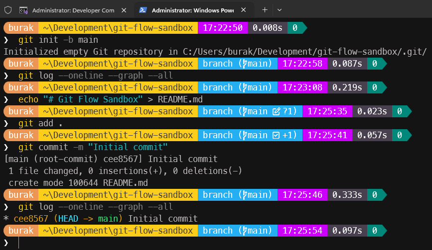
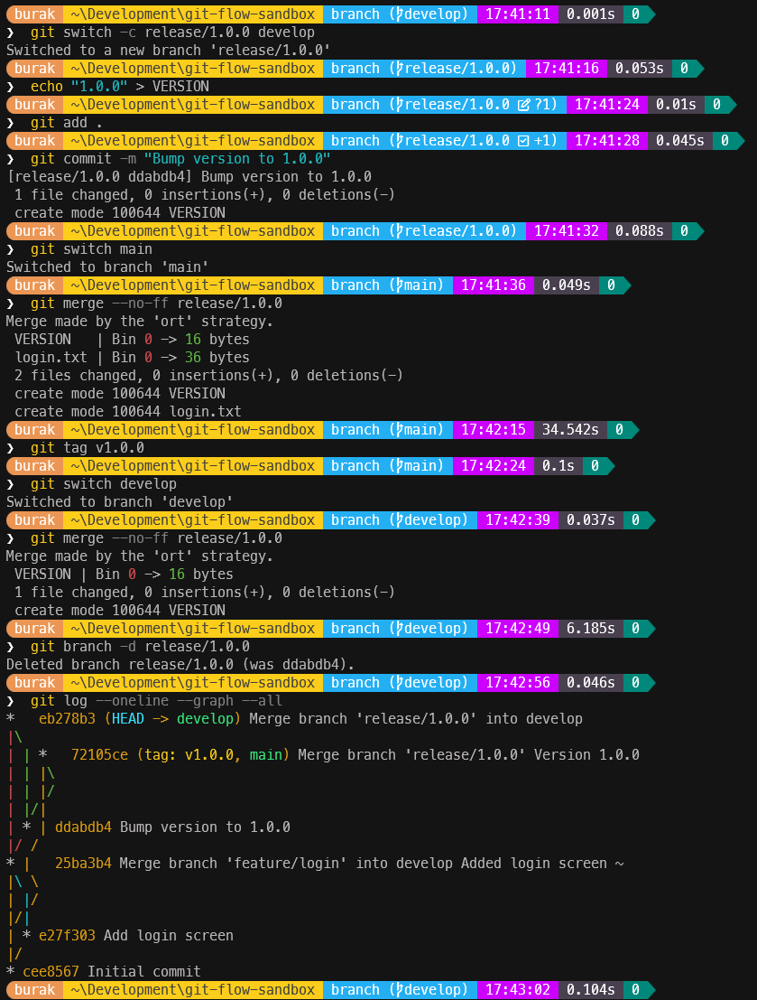
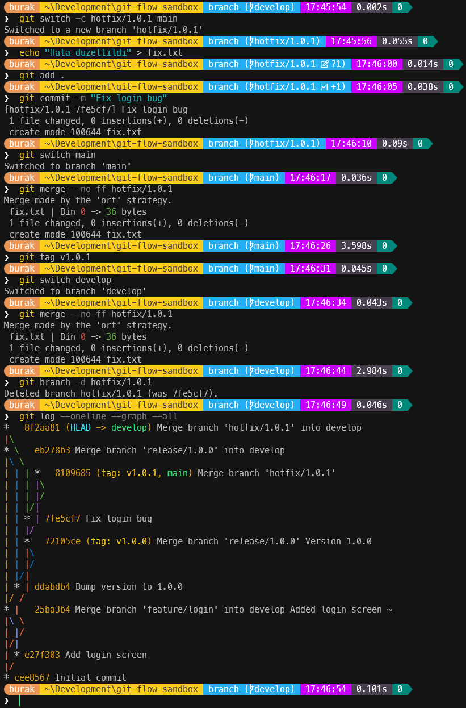
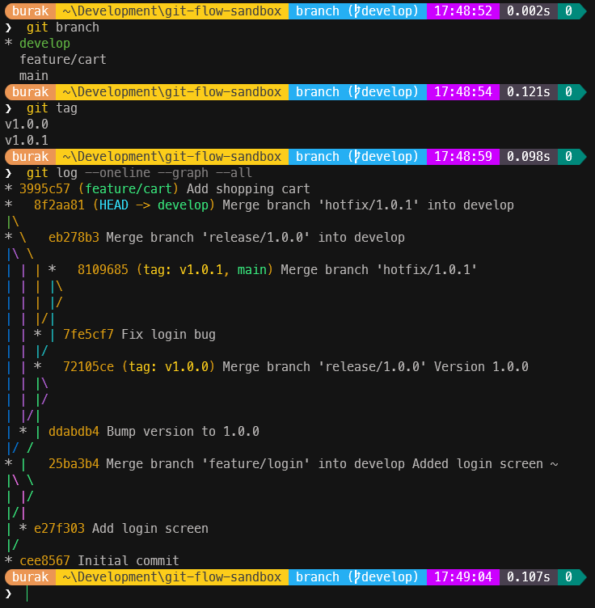
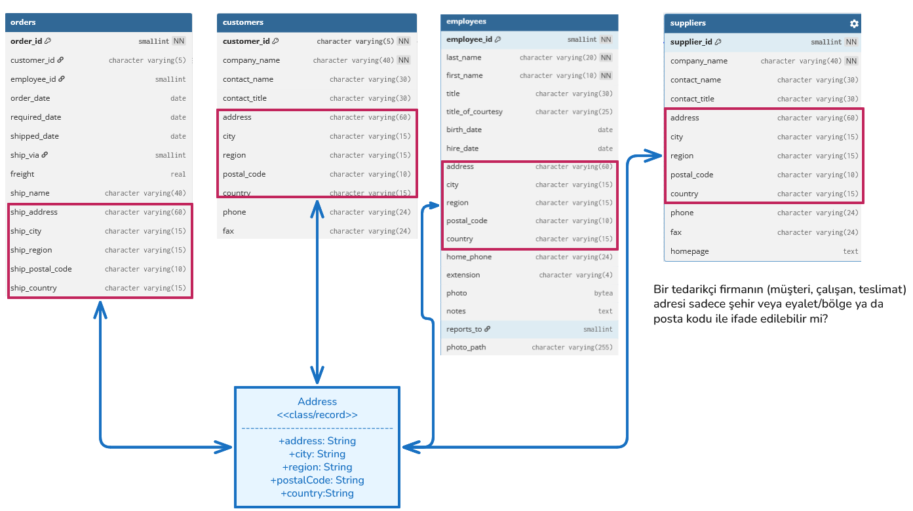

# Hafta 2

Bu hafta ele aldığımız konular ve detayları aşağıda bulabilirsiniz.

## Projeler için Önerilen Gitflow Stratejisi

Hafif bir **gitflow** stratejisi izleyebiliriz.

- feature branch mantığında ilerleyelim
- dev ve main branch'lerini koruyalım
- feature'dan önce dev branch'e merge edelim.
- dev branch'i main branch'e merge edelim.
- pull request ile değişiklikleri entegre edelim

Örneğin yeni bir feature eklemek istediğimizde dev branch'ten `feature/<feature-ismi>` şeklinde bir branch oluşturarak ilerleyelim. Değişikliklerimizi tamamladıktan sonra **pull request** ile **dev branch**'e entegre edelim *(merge)*. İşi biten feature'ları kapatalım.

## Temel Git Komutları

Aşağıda bazı temel git komutlarının ele alındığı örnek bir senaryo yer almaktadır. Bu senaryo sonucunda aşağıdaki gibi bir kurgu oluşacaktır. Adımları denerken en sonda aşağıdaki terminal komutunu çalıştırarak nelerin değiştiğini kolayca görebiliriz.

```bash
git log --oneline --graph --all
```

### Bir Repo Oluşturup Main Branch'ini Başlatalım

```bash
# Çalışacağımız bir klasör oluşturalım
mkdir git-flow-sandbox
cd git-flow-sandbox
# ve main branch'i oluşturalım
git init -b main
```

### İlk commit'imizi yapalım

```bash
echo "# Git Flow Sandbox" > README.md
git add .
git commit -m "Initial commit"

git log --oneline --graph --all
```

Şu ana kadar yaptıklarımızın karşılığında aşağıdakine benzer bir çıktı elde etmeliyiz.



### Development Branch'ini Oluşturalım

```bash
# Eğer yoksa develop branch oluşturulur ve hemen ona geçilir
git switch -c develop
```

### Feature Branch Oluşturalım

```bash
# Örneğin login özelliği üzerinde çalışmak için feature branch oluşturulur
# Feature branch develop branch'inden türetilir
git switch -c feature/login develop
echo "Login screen..." > login.txt
git add .
git commit -m "Add login screen"
```

### Feature Branch'i Dev Branch'e Merge Edelim

```bash
# Önce develop branch'ine geçelim
git switch develop
# Feature branch'teki değişiklikleri develop branch'e merge edelim
# --no-ff bayrağı birleştirme işlemi için ayrı bir commit oluşturur
# böylece grafikte özelliğin ayrı bir kol olarak geliştirildiği görülebilir
# commit sırasında çıkan mesajı onaylayabiliriz ya da kendimiz bir bilgi ekleyebiliriz
git merge --no-ff feature/login
# Feature branch artık silinebilir
git branch -d feature/login

git log --oneline --graph --all
```


### Bir Release Hazırlanması

```bash
# Önce develop branch'inden bir release branch'i oluşturalım
git switch -c release/1.0.0 develop

# Release branch üzerinde gerekli değişiklikleri yapalım
echo "1.0.0" > VERSION
git add .
git commit -m "Bump version to 1.0.0"

# Release branch'teki değişiklikleri main branch'e merge edelim
git switch main
git merge --no-ff release/1.0.0
# tag ile sürüm numarasını işaretleyelim
git tag v1.0.0

# Release branch'teki değişiklikler develop'a da merge edilir
git switch develop
git merge --no-ff release/1.0.0
# Release branch artık silinebilir
git branch -d release/1.0.0

git log --oneline --graph --all
```



### Bir Acil Düzeltme Geldi *(Hotfix)*

```bash
# Öncelikle main branch'ten bir hotfix branch'i oluşturalım
git switch -c hotfix/1.0.1 main

# Bir düzeltme yapalım
echo "Hata duzeltildi" > fix.txt
# Değişiklikleri commit edelim
git add .
git commit -m "Fix login bug"

# Düzeltmeleri hem main hem de develop branch'ine merge edelim
git switch main
git merge --no-ff hotfix/1.0.1
git tag v1.0.1

git switch develop
git merge --no-ff hotfix/1.0.1
git branch -d hotfix/1.0.1

git log --oneline --graph --all
```



### Devam eden bir feature ekleyelim

```bash
git switch -c feature/cart develop

echo "Sepet" > cart.txt
git add .
git commit -m "Add shopping cart"

git switch develop
```

### Yapılanları Kontrol Edelim

```bash
git branch
git tag
git log --oneline --graph --all
```



### Özetle

Kullandığımız komutları aşağıdaki tablo ile özetleyebiliriz;

| **Komut** | **Ne yapar?** |
|---|---|
| `git switch -c <name> <source>` | Kaynaktan yeni bir branch açar ve ona geçer |
| `git switch <name>` | Var olan branch'e geçer |
| `git add .` | Değişiklikleri commit'e hazırlar |
| `git commit -m "..."` | Değişiklikleri kaydeder |
| `git merge --no-ff <name>` | Branch'i, bulunduğun branch'e birleştirir *(merge)* |
| `git branch -d <name>` | Merge edilmiş branch'i siler |
| `git tag <name>` | Bulunduğun commit'e bir etiket *(tag)* koyar |

> tag sistemi, belirli commit'leri işaretlemek ve sürüm yönetimini kolaylaştırmak için kullanılır.

---

## Product Sınıfı ve Business Sorunları

// EKLENECEK

## Class ve Record Karşılaştırması

Kobay Northwind veritabanındaki birkaç tablo içeriğini göz önüne alalım.



// DEVAM EDECEK
