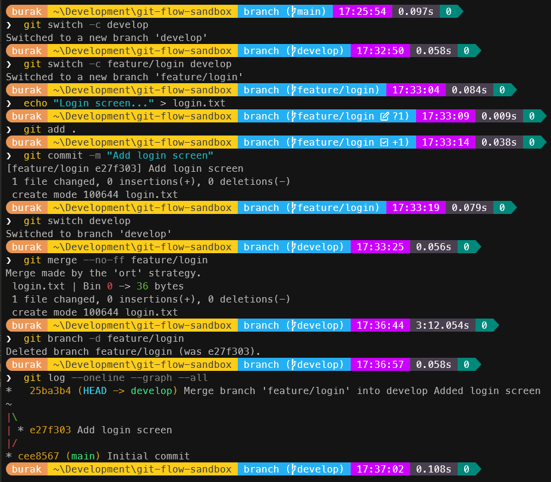
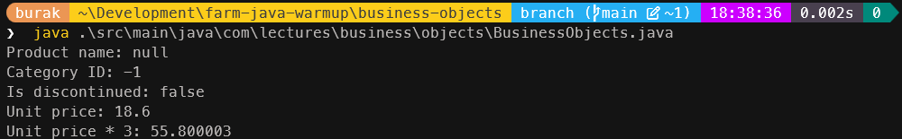
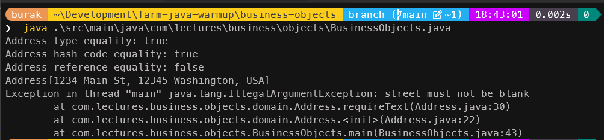
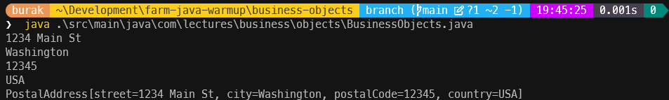
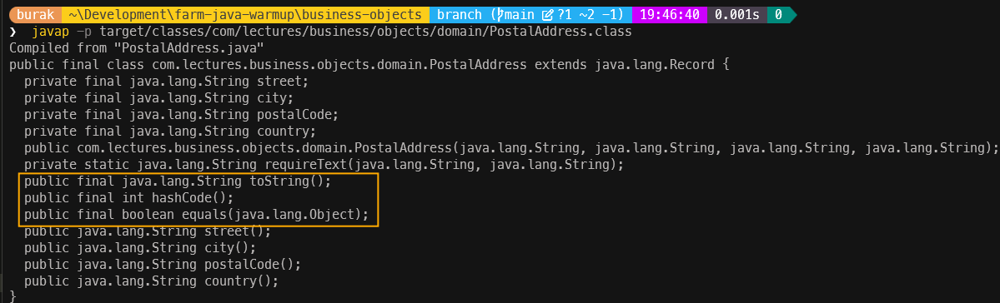
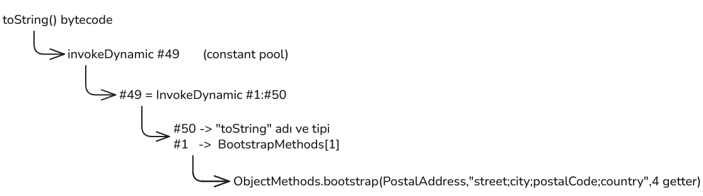
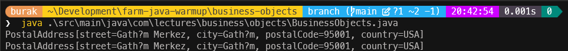
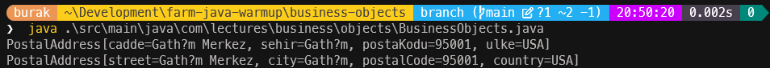

# Bölüm 02: Git Pratikleri, Anemik Model ve Record'lar

Bu hafta ele aldığımız konular ve detayları aşağıda bulabilirsiniz.

## Projeler için Önerilen Gitflow Stratejisi

Hafif bir **gitflow** stratejisi izleyebiliriz.

- feature branch mantığında ilerleyelim
- dev ve main branch'lerini koruyalım
- feature'dan önce dev branch'e merge edelim.
- dev branch'i main branch'e merge edelim.
- pull request ile değişiklikleri entegre edelim

Örneğin yeni bir feature eklemek istediğimizde dev branch'ten `feature/<feature-ismi>` şeklinde bir branch oluşturarak ilerleyelim. Değişikliklerimizi tamamladıktan sonra **pull request** ile **dev branch**'e entegre edelim *(merge)*. İşi biten feature'ları kapatalım.

## Temel Git Komutları

Aşağıda bazı temel git komutlarının ele alındığı örnek bir senaryo yer almaktadır. Adımları denerken en sonda aşağıdaki terminal komutunu çalıştırarak nelerin değiştiğini kolayca görebiliriz.

```bash
git log --oneline --graph --all
```

### Bir Repo Oluşturup Main Branch'ini Başlatalım

```bash
# Çalışacağımız bir klasör oluşturalım
mkdir git-flow-sandbox
cd git-flow-sandbox
# ve main branch'i oluşturalım
git init -b main
```

### İlk commit'imizi yapalım

```bash
echo "# Git Flow Sandbox" > README.md
git add .
git commit -m "Initial commit"

git log --oneline --graph --all
```

Şu ana kadar yaptıklarımızın karşılığında aşağıdakine benzer bir çıktı elde etmeliyiz.


### Development Branch'ini Oluşturalım

```bash
# Eğer yoksa develop branch oluşturulur ve hemen ona geçilir
git switch -c develop
```

### Feature Branch Oluşturalım

```bash
# Örneğin login özelliği üzerinde çalışmak için feature branch oluşturulur
# Feature branch develop branch'inden türetilir
git switch -c feature/login develop
echo "Login screen..." > login.txt
git add .
git commit -m "Add login screen"
```

### Feature Branch'i Dev Branch'e Merge Edelim

```bash
# Önce develop branch'ine geçelim
git switch develop
# Feature branch'teki değişiklikleri develop branch'e merge edelim
# --no-ff bayrağı birleştirme işlemi için ayrı bir commit oluşturur
# böylece grafikte özelliğin ayrı bir kol olarak geliştirildiği görülebilir
# commit sırasında çıkan mesajı onaylayabiliriz ya da kendimiz bir bilgi ekleyebiliriz
git merge --no-ff feature/login
# Feature branch artık silinebilir
git branch -d feature/login

git log --oneline --graph --all
```



### Bir Release Hazırlanması

```bash
# Önce develop branch'inden bir release branch'i oluşturalım
git switch -c release/1.0.0 develop

# Release branch üzerinde gerekli değişiklikleri yapalım
echo "1.0.0" > VERSION
git add .
git commit -m "Bump version to 1.0.0"

# Release branch'teki değişiklikleri main branch'e merge edelim
git switch main
git merge --no-ff release/1.0.0
# tag ile sürüm numarasını işaretleyelim
git tag v1.0.0

# Release branch'teki değişiklikler develop'a da merge edilir
git switch develop
git merge --no-ff release/1.0.0
# Release branch artık silinebilir
git branch -d release/1.0.0

git log --oneline --graph --all
```


### Bir Acil Düzeltme Geldi *(Hotfix)*

```bash
# Öncelikle main branch'ten bir hotfix branch'i oluşturalım
git switch -c hotfix/1.0.1 main

# Bir düzeltme yapalım
echo "Hata duzeltildi" > fix.txt
# Değişiklikleri commit edelim
git add .
git commit -m "Fix login bug"

# Düzeltmeleri hem main hem de develop branch'ine merge edelim
git switch main
git merge --no-ff hotfix/1.0.1
git tag v1.0.1

git switch develop
git merge --no-ff hotfix/1.0.1
git branch -d hotfix/1.0.1

git log --oneline --graph --all
```


### Devam eden bir feature ekleyelim

```bash
git switch -c feature/cart develop

echo "Sepet" > cart.txt
git add .
git commit -m "Add shopping cart"

git switch develop
```

### Yapılanları Kontrol Edelim

```bash
git branch
git tag
git log --oneline --graph --all
```


### Özetle

Kullandığımız komutları aşağıdaki tablo ile özetleyebiliriz;

| **Komut** | **Ne yapar?** |
| --- | --- |
| `git switch -c <name> <source>` | Kaynaktan yeni bir branch açar ve ona geçer |
| `git switch <name>` | Var olan branch'e geçer |
| `git add .` | Değişiklikleri commit'e hazırlar |
| `git commit -m "..."` | Değişiklikleri kaydeder |
| `git merge --no-ff <name>` | Branch'i, bulunduğun branch'e birleştirir *(merge)* |
| `git branch -d <name>` | Merge edilmiş branch'i siler |
| `git tag <name>` | Bulunduğun commit'e bir etiket *(tag)* koyar |

> tag sistemi, belirli commit'leri işaretlemek ve sürüm yönetimini kolaylaştırmak için kullanılır.

---

## Product Sınıfı ve Business Sorunları

Northwind tarafında tanımlı Products tablosunu ele alalım. Programatik ortamda bir ürünü Product isimli sınıf ile aşağıdaki gibi temsil edebiliriz.

```java
public class Product {

    private int productId;              // schema: smallint NOT NULL
    private String productName;         // schema: varchar(40) NOT NULL
    private Integer categoryId;         // schema: smallint, nullable
    private String quantityPerUnit;     // schema: varchar(20)
    private float unitPrice;            // schema: real
    private short unitsInStock;         // schema: smallint
    private boolean discontinued;       // schema: integer NOT NULL (0/1)

    public Product() {
        // JavaBean contract: public no-arg constructor
    }

    public int getProductId() {
        return productId;
    }

    public void setProductId(int productId) {
        this.productId = productId;
    }

    public String getProductName() {
        return productName;
    }

    public void setProductName(String productName) {
        this.productName = productName;
    }

    public Integer getCategoryId() {
        return categoryId;
    }

    public void setCategoryId(Integer categoryId) {
        this.categoryId = categoryId;
    }

    public String getQuantityPerUnit() {
        return quantityPerUnit;
    }

    public void setQuantityPerUnit(String quantityPerUnit) {
        this.quantityPerUnit = quantityPerUnit;
    }

    public float getUnitPrice() {
        return unitPrice;
    }

    public void setUnitPrice(float unitPrice) {
        this.unitPrice = unitPrice;
    }

    public short getUnitsInStock() {
        return unitsInStock;
    }

    public void setUnitsInStock(short unitsInStock) {
        this.unitsInStock = unitsInStock;
    }

    public boolean isDiscontinued() {
        return discontinued;
    }

    public void setDiscontinued(boolean discontinued) {
        this.discontinued = discontinued;
    }
}
```

Bu tipik bir POJO *(Plain Old Java Object)* örneğidir. Bu haliyle pekala bir ürün verisini temsil edebilir. Ancak iş kuralları açısından bakıldığında sistemde anlamlı bir ürün nesnesini örnekleyemez. Söz gelimi veritabanında Not Null olarak imzalanmış product_name alanı çalışma zamanında pekala null olarak kullanılabilir ya da integer tanımladığımız category_id alanı negatif bir değer alabilir vb. Bu nedenle iş kurallarını garanti altına almak için ek doğrulamalar veya özel yapıcılar *(constructor)* kullanmak gerekir *(Domain'e ait iş kurallarını nesne ile birlikte taşımak için)*

Şu haliyle product sınıfının anomalilerini görmek için aşağıdaki kodu çalıştırabilirsiniz.

```java
public class Main {
    public static void main(String[] args) {
        var someProduct = new Product();

        System.out.println("Product name: " + someProduct.getProductName()); // null   — NOT NULL 
        someProduct.setCategoryId(-1);
        System.out.println("Category ID: " + someProduct.getCategoryId()); // -1
        System.out.println("Is discontinued: " + someProduct.isDiscontinued()); // false
        someProduct.setUnitPrice(18.6f);
        System.out.println("Unit price: " + someProduct.getUnitPrice()); // 0.0
        System.out.println("Unit price * 3: " + someProduct.getUnitPrice() * 3); // 55.800003
    }
}
```



## Class ve Record Karşılaştırması

Yine kobay Northwind veritabanındaki birkaç tablo içeriğini göz önüne alalım. orders, customers, employees ve suppliers.


Grafikten de görüleceği üzere her tablo adres bilgisi için aynı türden alanları içermekte. İlişkisel veritabanında adres bilgisini ayrı bir tablo olarak tutmak da mantıklı olabilir. Bu sadece join maliyetini artırır ancak veri bütünlüğünü ve tekrar kullanılabilirliği sağlar. Veritabanı modeli bir yana kod tarafından duruma baktığımızda adres dediğimiz kavramın birden fazla alanın bir arada tutulduğu bir nesne olarak temsil edilmesi gerekir. Şehir tek başına bir alan olabilir ama bir sipariş adresinden, müşterinin posta adresinden veya tedarikçinin iletişim adresinden bahsettiğimizde yeterli değildir. Adres bilgisi genellikle sokak, cadde, mahalle, şehir, posta kodu, eyalet, ülke gibi birden fazla bileşenden oluşur. Bu nedenle kod tarafında adres nesnesini aşağıdaki gibi bir sınıfla temsil etmek mantıklıdır.

```java
public final class Address {

    private final String street;
    private final String city;
    private final String postalCode; // can be Value Object
    private final String country;

    public Address(String street, String city, String postalCode, String country) {
        this.street = requireText(street, "street");
        this.city = requireText(city, "city");
        this.postalCode = requireText(postalCode, "postalCode");
        this.country = requireText(country, "country");
    }

    private static String requireText(String value, String field) {
        if (value == null || value.isBlank()) {
            throw new IllegalArgumentException(field + " must not be blank");
        }
        return value.strip();
    }

    public String street() {
        return street;
    }

    public String city() {
        return city;
    }

    public String postalCode() {
        return postalCode;
    }

    public String country() {
        return country;
    }

    @Override
    public boolean equals(Object other) {
        if (this == other) {
            return true;
        }
        if (!(other instanceof Address address)) {
            return false;
        }
        return street.equals(address.street)
                && city.equals(address.city)
                && postalCode.equals(address.postalCode)
                && country.equals(address.country);
    }

    @Override
    public int hashCode() {
        return Objects.hash(street, city, postalCode, country);
    }

    @Override
    public String toString() {
        return "Address[" + street + ", " + postalCode + " " + city + ", " + country + "]";
    }
}
```

Şimdi bu sınıf üzerinde biraz düşünelim. final belirteci sınıfın alt sınıflar tarafından genişletilemeyeceğini ifade eder ve Address nesnesinin değiştirilemez *(immutable)* olmasını destekler. Gerçekten de çalışma zamanında ilgili constructor ile oluşturulan bir adres bilgisi, nesne oluşturulduktan sonra değiştirilmez. Sokak yanlış mı yazıldı; yeni bir Address nesnesi oluşturulmalıdır. Diğer yandan tüm alanlar *(fields)* final olarak tanımlanmıştır, yani bir kez atandıktan sonra değiştirilemezler. Bu, çok iş parçacıklı *(multi-threaded)* ortamlarda güvenli bir kullanım sağlar ve nesnenin durumunun beklenmedik şekilde değişmesini önler. Address sınıfı ayrıca üç metodu override etmektedir. equals, hashCode ve toString metotları aslında Object sınıfında varsayılan halleriyle gelen ve kendi yazdığımız nesne prototiplerinde değiştirilebilen davranışlardır.

equals metodundaki amacımız aynı veri içeriğine sahip iki Address nesne örneğinin eşit olduğunu sağlamaktır. Bu, özellikle koleksiyonlar gibi veri yapılarında nesnelerin doğru şekilde karşılaştırılabilmesi için önemlidir. hashCode metodu ise equals ile uyumlu olacak şekilde nesnenin hash kodunu üretir; böylece HashMap veya HashSet gibi yapılar doğru çalışır. toString metodu ise nesnenin okunabilir bir temsilini sağlar ve genellikle hata ayıklama veya loglama sırasında oldukça işe yarar.

Address sınıfını bir örnekte kullanalım.

```java
public class Main {
    public static void main(String[] args) {
        var workAddress = new Address(
                "1234 Main St",
                "Washington",
                "12345",
                "USA"
        );
        var workAddressAgain = new Address(
                "1234 Main St",
                "Washington",
                "12345",
                "USA"
        );
        System.out.println("Address type equality: " + workAddress.equals(workAddressAgain)); // true
        System.out.println("Address hash code equality: " + (workAddress.hashCode() == workAddressAgain.hashCode())); // true
        System.out.println("Address reference equality: " + (workAddress == workAddressAgain)); // false
        System.out.println(workAddress); // calls toString() method

        var invalidAddress = new Address("", "Berlin", "10115", "Germany");
        // should throw an exception due to empty street
        System.out.println(invalidAddress);
    }
}
```



Address sınıfı gibi immutable ve eşit olma halini tüm veri içeriği ile tanımlayan sınıflar, değer nesnesi *(value object)* olarak da adlandırılır. Bu tür sınıflar, nesne kimliğinden *(tekil ve benzersiz bir identity değeri)* ziyade içeriklerine göre karşılaştırılırlar ve genellikle iş mantığında veri bütünlüğünü sağlamak için kullanılırlar. Aynı tasarım ilkesi **record** türü yardımıyla da uygulanabilir. Bu sefer posta adresini temsil eden bir **record** tanımlayalım.

```java
public record PostalAddress(String street, String city, String postalCode, String country) {

    /**
     * Compact constructor: runs before the fields are assigned.
     */
    public PostalAddress {
        street = requireText(street, "street");
        city = requireText(city, "city");
        postalCode = requireText(postalCode, "postalCode");
        country = requireText(country, "country");
    }

    private static String requireText(String value, String field) {
        if (value == null || value.isBlank()) {
            throw new IllegalArgumentException(field + " must not be blank");
        }
        return value.strip();
    }
}
```

Dikkat edileceği üzere Address sınıfında yaptığımız gibi getter metotlarımız ya da override ettiğimiz equals ve hashCode metotlarımız yok. Bunun yerine record türü, tüm alanları için otomatik olarak equals, hashCode ve hatta toString metotlarını sağlar. Record türü için üretilen class içeriğine baktığımızda durumu daha net görebiliriz. Örnek bir kullanıma bakalım.

```java
var postalAddress = new PostalAddress("1234 Main St", "Washington", "12345", "USA");
System.out.println(postalAddress.street());
System.out.println(postalAddress.city());
System.out.println(postalAddress.postalCode());
System.out.println(postalAddress.country());
System.out.println(postalAddress); // calls toString() method
```



```bash
javap -p target/classes/com/lectures/business/objects/domain/PostalAddress.class
```



### ByteCode'un Derinlikleri

PostalAddress isimli record için üretilen bytecode içeriğine bir bakalım.

```bash
javap -c -p target/classes/com/lectures/business/objects/domain/PostalAddress.class
```

> javap ya da Java Class File Disassembler JDK ile gelen bir komut satırı aracıdır. Bu aracı kullanarak derleme ile üretilen sınıf dosyalarını okunabilir formatta görebiliriz. -c seçeneği, bytecode içeriğini gösterir, -p seçeneği ise private alanları ve metotları da dahil eder, -v seçeneği ise verbose anlamındadır ve constant pool, flag'ler, BootstrapMethods gibi detaylı bilgileri de gösterir.

toString metodunun implementasyonunu bulduğumuzda aşağıdaki içeriği elde ederiz.

```text
public final java.lang.String toString();
    Code:
         0: aload_0
         1: invokedynamic #49,  0             // InvokeDynamic #1:toString:(Lcom/lectures/business/objects/domain/PostalAddress;)Ljava/lang/String;
         6: areturn
```

Dikkat çeken nokta **invokedynamic** çağrısıdır. **toString** metotunun asıl içeriği **JVM *(Java Virtual Machine)*** tarafından çalışma zamanında üretilir. Şimdi buradaki `#49` ve yorum satırındaki `#1` numarasını not edelim. `#49` Constant Pool'daki girdiyi işaret eder. Şimdi aşağıdaki komutu işletelim.

```bash
javap -v -p target/classes/com/lectures/business/objects/domain/PostalAddress.class
```

ve Constant Pool'daki `#49` girdisine bakalım.

```text
#49 = InvokeDynamic      #1:#50        // #1:toString:(Lcom/lectures/business/objects/domain/PostalAddress;)Ljava/lang/String;
#50 = NameAndType        #51:#52       // toString:(Lcom/lectures/business/objects/domain/PostalAddress;)Ljava/lang/String;
#51 = Utf8               toString
#52 = Utf8               (Lcom/lectures/business/objects/domain/PostalAddress;)Ljava/lang/String;
```

`#49` girdisinde `#1:#50` ifadesi yer alır. Bu, `#1` numaralı BootstrapMethod ve `#50` numaralı NameAndType girdisine işaret eder. Şimdi dosya sonundaki BootstrapMethods bölümünde yer alan `#1` girdisine bakalım.

```text
BootstrapMethods:
  0: #87 REF_invokeStatic java/lang/invoke/StringConcatFactory.makeConcatWithConstants:(Ljava/lang/invoke/MethodHandles$Lookup;Ljava/lang/String;Ljava/lang/invoke/MethodType;Ljava/lang/String;[Ljava/lang/Object;)Ljava/lang/invoke/CallSite;
    Method arguments:
      #79 \u0001 must not be blank
  1: #93 REF_invokeStatic java/lang/runtime/ObjectMethods.bootstrap:(Ljava/lang/invoke/MethodHandles$Lookup;Ljava/lang/String;Ljava/lang/invoke/TypeDescriptor;Ljava/lang/Class;Ljava/lang/String;[Ljava/lang/invoke/MethodHandle;)Ljava/lang/Object;
    Method arguments:
      #10 com/lectures/business/objects/domain/PostalAddress
      #81 street;city;postalCode;country
      #83 REF_getField com/lectures/business/objects/domain/PostalAddress.street:Ljava/lang/String;
      #84 REF_getField com/lectures/business/objects/domain/PostalAddress.city:Ljava/lang/String;
      #85 REF_getField com/lectures/business/objects/domain/PostalAddress.postalCode:Ljava/lang/String;
      #86 REF_getField com/lectures/business/objects/domain/PostalAddress.country:Ljava/lang/String;
```

Biraz kafa karıştırıcı tabii. `1:` kısmındaki `#` ile başlayan parçalar yine Constant Pool'daki girdilere işaret eder. Buradaki metot zincirini aslında aşağıdaki gibi özetleyebiliriz.



Aslında ortada `[TypeName(Value;Value;Value;Value)]` gibi bir yapı görünmüyor. Bootstrap'ın JVM tarafında bir tarifi işlediğini iddia ediyoruz. Bunu ispat etmek için JVM'in yaptığını elle yapmayı deneyebiliriz. Aşağıdaki kod parçasına bir bakalım. Burada ObjectMethods.bootstrap metodunu doğrudan çağırıyoruz ve yukarıdaki bytecode tarifinin benzerini parametre olarak geçiyoruz. lookup, "toString" aslında çağırmak istediğimiz metodu temsil ediyor. Eğer her şeyi doğru yaparsak, handle.invoke(address) çağrısı, son satırdaki println çağrısı ile aynı çıktıyı verecektir.

```java
public static void main(String[] args) throws NoSuchMethodException, IllegalAccessException, Throwable {
    var address = new PostalAddress("Gathım Merkez", "Gathım", "95001", "USA");
    var lookup = MethodHandles.lookup();
    var type = MethodType.methodType(String.class);

    MethodHandle[] getters = {
        lookup.findVirtual(PostalAddress.class, "street", type),
        lookup.findVirtual(PostalAddress.class, "city", type),
        lookup.findVirtual(PostalAddress.class, "postalCode", type),
        lookup.findVirtual(PostalAddress.class, "country", type)
    };

    MethodHandle handle = ((CallSite) ObjectMethods.bootstrap(
            lookup, "toString",
            MethodType.methodType(String.class, PostalAddress.class),
            PostalAddress.class,
            "street;city;postalCode;country",
            getters)).getTarget();

    System.out.println(handle.invoke(address));
    System.out.println(address);
}
```

Çıktı aşağıdaki gibidir. Sonuçlar görüldüğü gibi aynı.



Şimdi handle nesnesindeki bootstrap parametrelerinde bir değişiklik yapalım. Türkçeleştirelim.

```java
MethodHandle handle = ((CallSite) ObjectMethods.bootstrap(
            lookup, "toString",
            MethodType.methodType(String.class, PostalAddress.class),
            PostalAddress.class,
            "cadde;sehir;postaKodu;ulke",
            getters)).getTarget();
```



Çıktıdaki alan adları, record'daki gerçek alan adlarından değil, bootstrap'a verdiğimiz metinden geldi. Bu da `PostalAddress[alan=değer, ...]` formatının `ObjectMethods` tarafından, sınıf dosyasındaki tarife göre üretildiğini gösteriyor. Hatırlarsanız bu tarif en son baktığımız bytecode çıktısındaki Bootstrap metodunda veriliyordu.

> Bu ispat üzerine biraz daha derinlemesine çalışmak ve kantıları somutlaştırmak gerekiyor.

---

## Sorular

Bu dersle ilgili olarak bizi araştırmaya itecek soruları aşağıdaki bulabilirsiniz.

- JavaBean sözleşmesi *(Product sınıfı)* neden parametresiz *(no-arg)* bir constructor gerektiriyor? `JPA/Hibernate` veya `Jackson` gibi framework'ler bu kurala neden ihtiyaç duyar?
- Martin Fowler'ın *Anemic Domain Model* kavramını araştırın ve neden bir `anti-pattern` olarak görüldüğünü açıklamaya çalışın. Anemik bir modelin kabul edilebilir olduğu senaryolar var mıdır *(DTO'lar olabilir mi)*?
- Product sınıfında `productId` için `int`, `categoryId` içinse `Integer` primitive kullandık. Bu tercihin veritabanındaki NULL kavramı ile ilişkisi nedir? `0` ile `null` arasındaki anlam farkını araştırın.
- `unitsInStock` alanı `short` tanımlı. Buna göre örneğin `setUnitsInStock((short) 40000)` çağrısı ne üretir? Bu tür sessiz veri taşmaları *(overflow)* domain nesnelerinde nasıl engellenebilir?
- `equals` metodunu override edip `hashCode` metodunu override etmezsek, örneğin bir `HashSet<Address>` içine aynı içerikteki iki adresi eklediğimizde ne olur? *(equals/hashCode sözleşmesini inceleyebilirsiniz)*
- Address sınıfındaki `equals` metodu `instanceof` kullanıyor. Bunun yerine `getClass() != other.getClass()` kullanılsaydı ne değişirdi? Sınıfın `final` olmasının bu tercihle bir ilişkisi var mı? *(simetri ve Liskov Substitution prensibine bakmak gerekebilir)*
- Address constructor'ı değerleri `strip()` ile kırpıyor. "Main St" ile "main st" sizce aynı adres midir? Normalizasyon *(büyük/küçük harf, boşluk, Türkçe karakterler)* value object içinde mi yoksa dışında mı yapılmalıdır?
- `postalCode` alanının yanında "can be Value Object" notunu düşmüştük. Posta kodu ülkeye göre farklı formatlarda olduğuna göre `PostalCode` değer nesnesi nasıl tasarlanır? Doğrulama için ülke bilgisine ihtiyaç duyması tasarımı nasıl etkiler?
- Record'lar başka bir sınıftan türeyemez ve kendileri de türetilemezken bir interface uygulayabilirler. Neden böyle bir kısıtlama getirilmiş olabilir?
- Record'lar *shallow immutable*'dır. `List<String>` tipinde bir alanı olan bir record gerçekten değiştirilemez midir? *(Compact constructor içinde `List.copyOf` kullanmanın etkilerini analiz edebilirsiniz)*
- Record'ların `toString`, `equals` ve `hashCode` metotları neden derleme zamanında bytecode olarak gömülmek yerine `invokedynamic` ile çalışma zamanında üretilmekte? JEP 280 *(Indify String Concatenation özelliği)* ile benzer bir motivasyon var mıdır?
- Bir record JPA *(Java Persistence API)* entity'si olarak kullanılabilir mi? Kullanılamıyorsa record'lar kalıcılık *(persistence)* katmanında hangi rollerde işe yarar?
- Adres bilgisini her tabloda ayrı kolonlar olarak tutmak ile ayrı bir `addresses` tablosunda tutmak arasındaki tercih, kod tarafındaki değer nesnesi *(Value Object)* tasarımını etkiler mi?
