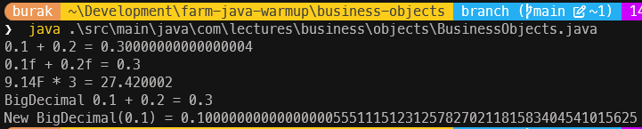
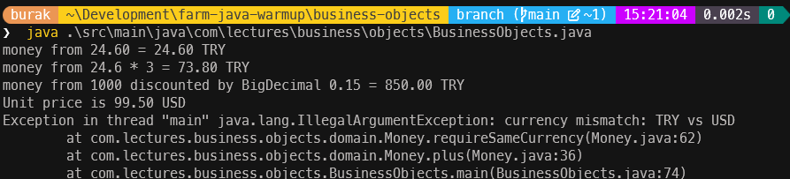
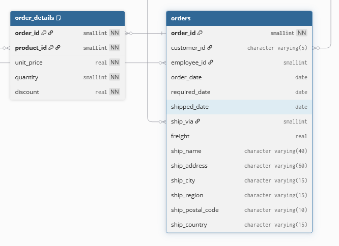
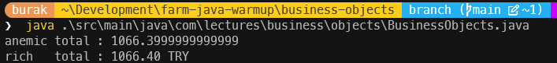

# Bölüm 03: Money Value Object ve Rich Entity Tasarımı

Birçok domain hassas sayısal değerlere ihtiya duyar. Örneğin finansal uygulamalarda para birimi değerleri veya bilimsel hesaplamalarda ölçüm sonuçları hassasiyet gerektirir. Programlama dillerinde bu tür hassasiyet isteyen değişkenler double, float, BigDecimal gibi veri tipleri ile ifade edilirler. Ancak parasal değerler için double veya float kullanmak yuvarlama hatalarına yol açabilir. Bu nedenle finansal uygulamalarda genellikle BigDecimal tercih edilir. Bir para birimini sadece BigDecimal ile ifade etmek de çoğu zaman yeterli değildir. Zira bu para biriminin hangi ülkeye ait olduğu veya hangi döviz cinsinden olduğu bilgisi de önemlidir. Farklı para birimlerinden değerleri birbirileriyle toplamak hatadır ve bu bir domain kuralı olarak ele alınmalıdır.

Öncelikle double veya float türleri için olası hesaplama hatalarına bir bakalım.

```java
public static void main(String[] args) {
    double total = 0.1 + 0.2;
    System.out.println("0.1 + 0.2 = " + total); // 0.30000000000000004
    float total2 = 0.1f + 0.2f;
    System.out.println("0.1f + 0.2f = " + total2); // 0.3
    float price = 9.14f;
    System.out.println("9.14F * 3 = " + price * 3); // 27.420002
    var total2 = new BigDecimal("0.1").add(new BigDecimal("0.2"));
    System.out.println("BigDecimal 0.1 + 0.2 = " + total2); // 0.3
    System.out.println("New BigDecimal(0.1) = " + new BigDecimal(0.1)); // 0.1000000000000000055511151231257827021181583404541015625
}
```

Bu kod parçasının çıktısını dikkatle inceleyelim.



İlk örnekte double türü ile yapılan toplama işleminde beklenmeyen bir yuvarlama hatası görüyoruz. 0.1 + 0.2 işleminin sonucu tam olarak 0.3 değil, 0.30000000000000004 olarak karşımıza çıkıyor. f ile tanımlanan float türünde ise bu hata daha az belirgin, ancak hassasiyet kaybı yine de mevcut. Zira 9.14f * 3 işleminin sonucu tam olarak 27.42 değil, 27.420002. En garanti yol BigDecimal kullanımı gibi duruyor ancak orada da dikkat edilmesi gereken nokta, BigDecimal nesnesini double veya float değerlerinden oluşturduğumuzda yine hassasiyet kaybı olabileceğidir. Bu nedenle BigDecimal nesnelerini string değerlerinden oluşturmanın daha güvenli bir yaklaşım olduğunu ifade edebiliriz.

## Value Object Olarak Money Record

Yukarıdaki örnekleri göz önüne aldığımızda parasal değerin doğruluğunu belirli kurallar ile garanti eden, toplama, çarpma ya da indirim oranı uygulama gibi fonksiyonellikler kapsülleyen bir iş nesnesi tasarlamak mantıklı olacaktır. Parasal bir değerin double veya float türler ile çalışmaması bunların yerine BigDecimal kullanması önerilir. Bahsettiğimiz aritmetik işlemler her zaman yeni bir para nesnesi döndürmelidir ve mevcut nesneyi değiştirmemelidir. Bu da immutable bir tasarım yapacağımız anlamına gelir. Farklı para birimleri birbirleriyle aritmetik işleme girmemelidir vb Tüm bunlara istinaden aşağıdaki gibi bir record tasarımı pekala iş görecektir.

```java
public record Money(BigDecimal amount, Currency currency) implements Comparable<Money> {

    private static final Currency TL = Currency.getInstance("TRY");

    public Money {
        Objects.requireNonNull(amount, "amount must not be null");
        Objects.requireNonNull(currency, "currency must not be null");
        amount = amount.setScale(currency.getDefaultFractionDigits(), RoundingMode.HALF_UP);
    }

    public static Money tl(String amount) {
        return new Money(new BigDecimal(amount), TL);
    }

    public static Money zero(Currency currency) {
        return new Money(BigDecimal.ZERO, currency);
    }

    public Money plus(Money other) {
        requireSameCurrency(other);
        return new Money(amount.add(other.amount), currency);
    }

    public Money minus(Money other) {
        requireSameCurrency(other);
        return new Money(amount.subtract(other.amount), currency);
    }

    public Money times(int factor) {
        return new Money(amount.multiply(BigDecimal.valueOf(factor)), currency);
    }

    public Money discountedBy(BigDecimal rate) {
        if (rate.signum() < 0 || rate.compareTo(BigDecimal.ONE) > 0) {
            throw new IllegalArgumentException("discount rate must be within [0, 1]: " + rate);
        }
        return new Money(amount.multiply(BigDecimal.ONE.subtract(rate)), currency);
    }

    public boolean isZero() {
        return amount.signum() == 0;
    }

    private void requireSameCurrency(Money other) {
        if (!currency.equals(other.currency)) {
            // Gerçek senaryolarda IllegalArgumentException yerine özel bir domain exception sınıfı kullanılabilir.
            throw new IllegalArgumentException(
                    "currency mismatch: " + currency + " vs " + other.currency);
        }
    }

    @Override
    public int compareTo(Money other) {
        requireSameCurrency(other);
        return amount.compareTo(other.amount);
    }

    @Override
    public String toString() {
        return amount.toPlainString() + " " + currency.getCurrencyCode();
    }
}
```

Money tipi bir record olarak tasarlanmıştır. Immutable *(değiştirilemez)* bir yapıya sahiptir. Ayrıca Money nesnelerinin birbirleriyle karşılaştırılmasını kontrol altına almak için `Comparable<Money>` arayüzünü uygular ve para birimi uyumsuzluklarını önler. `java.util` tarafından sağlanan Currency sınıfı, para birimlerini temsil etmek için kullanılır. Varsayılan parabirimi TL olarak belirlenmiştir. Compact Constructor kullanılarak amount ve currency alanlarının null olmaması ve amount değerinin para biriminin varsayılan kesir basamağına göre yuvarlanması sağlanır.

Money record tipi üstünden doğrudan çağrılabilen static metotlara da dikkat edelim. Örneğin `Money.tl("100")` ifadesi 100 TL değerinde bir Money nesnesi oluşturur. Benzer şekilde `Money.zero(Currency.getInstance("USD"))` ifadesi belirtilen para biriminde sıfır değerinde bir Money nesnesi döndürür. Bu tip metotlar object user'ın nesne oluşturmadan da Money nesneleriyle çalışabilmesini sağlar.

Money türü için aritmek işlemler plus, minus, times ve discountedBy metotları ile gerçekleştirilir. Bu metotlar, mevcut Money nesnesi üzerinde belirtilen işlemi yapar ve sonucu yeni bir Money nesnesi olarak döndürür. Burada dikkat edilmesi gereken konu her aritmetik operasyonun yeni bir Money nesnesi oluşturmasıdır.

Tasarladığımız Money record'una ait üyeleri aşağıdaki tablo ile özetleyebiliriz.

| **Member** | **Description** |
| --- | --- |
| **amount** | Parasal değeri temsil eden BigDecimal alanı. |
| **currency** | Para birimini temsil eden `java.util`' den gelen Currency alanı. |
| **plus(Money other)** | İki Money nesnesini toplar ve sonucu yeni bir Money nesnesi olarak döndürür. Çalışmak için mevcut Money nesnesi örneğine ihtiyaç duymaz. |
| **tl(String amount)** | Belirtilen miktarda TL cinsinden bir Money nesnesi oluşturur. |
| **zero(Currency currency)** | Belirtilen para biriminde sıfır değerinde bir Money nesnesi oluşturur. |
| **minus(Money other)** | İki Money nesnesini çıkarır ve sonucu yeni bir Money nesnesi olarak döndürür. Çalışmak için mevcut Money nesnesi örneğine ihtiyaç duymaz. |
| **times(int factor)** | Money nesnesini belirtilen katsayı ile çarpar ve sonucu yeni bir Money nesnesi olarak döndürür. Çalışmak için mevcut Money nesnesi örneğine ihtiyaç duymaz. |
| **discountedBy(BigDecimal rate)** | Money nesnesine belirtilen indirim oranını uygular ve sonucu yeni bir Money nesnesi olarak döndürür. Çalışmak için mevcut Money nesnesi örneğine ihtiyaç duymaz. |
| **isZero()** | Money nesnesinin sıfır olup olmadığını kontrol eder. |
| **compareTo(Money other)** | Money nesnelerini karşılaştırır. Comparable arayüzünden gelir ve mevcut Money nesnesi örneğine ihtiyaç duymaz. |
| **toString()** | Money nesnesini okunabilir bir string formatında döndürür. |

Birde Money record'un kullanımına bakalım.

```java
var money = Money.tl("24.60");
System.out.println("money from 24.60 = " + money);
var money2 = Money.tl("24.6").times(3);
System.out.println("money from 24.6 * 3 = " + money2);
var money3 = Money.tl("1000").discountedBy(new BigDecimal("0.15"));
System.out.println("money from 1000 discounted by BigDecimal 0.15 = " + money3);
var money4 = new Money(new BigDecimal("99.50"), Currency.getInstance("USD"));
System.out.println("Unit price is " + money4);
// Para birimi uyuşmazlığı nedeniyle bir istisna fırlatması gerekir
var money5 = Money.tl("50").plus(new Money(new BigDecimal("15"), Currency.getInstance("USD")));
System.out.println(money5);
```



Şimdilik Money record tek başına bir anlam ifade etmiyor olabilir. Ancak daha önceden ele aldığımız Product ve sonradan bakacağımız Order türlerindeki fiyat, toplam fiyat gibi alanların artık Money türünden olması, para birimi ve hesaplama konularında daha güvenli ve tutarlı bir yaklaşıma sahip olmamızı sağlayacaktır. Parasal birimlerin garantisini bu türü içerecek diğer iş nesnelerine de taşımış olacağız.

## Rich Entity Oluşturmak

Elimizdeki domain nesneleri daha tutarlı hale gelmeye başladığında zengin entity ve aggregate root tasarımlarına geçiş yapabiliriz. Bu sayede iş kuralları ve davranışlar, veri yapılarından ayrılarak daha anlamlı ve yönetilebilir hale gelecektir. İşe yine Northwind veritabanındaki siparişler üzerinden devam edebiliriz. Siparişler Order tablosunda tutulmaktadır. Her sipariş içerisinde birden fazla sipariş kalemi olabilir. Tablo yapıları aşağıdaki grafikte olduğu gibidir.



Orders tablosu ile Order_Details tablolarının nesne olarak ifade edeceğiz. Sipariş adreslerini temsil edecek bir türümüz var *(Address sınıfımız veya record verisyonu)*. Order_Details tablosu ayrı bir tür olarak tanımlanabilir *(record kullanabiliriz)*. Sipariş kaleminin fiyatı için yeni tasarladığımız Money nesnesini kullanabiliriz. Siparişlerin durum bilgisi de önemlidir. Bunun için bir enum tanımlayabiliriz. İşe OrderStatus enum'ı ile başlayalım.

```java
public enum OrderStatus {
    DRAFT,
    CONFIRMED,
    SHIPPED,
    DELIVERED,
    CANCELLED
}
```

Bir siparişin hangi durumda olduğu bilgisi iş kuralları açısından önemlidir. Duruma göre aksiyonlar alınabilir ve iş süreçleri yönetilebilir.

### OrderLine Record

Sipariş kalemlerini temsil edecek OrderLine record'u ile devam edelim.

```java
public record OrderLine(int productId, Money unitPrice, int quantity, BigDecimal discount) {

    public OrderLine {
        if (productId <= 0) {
            throw new IllegalArgumentException("productId must be positive: " + productId);
        }
        Objects.requireNonNull(unitPrice, "unitPrice must not be null");
        if (quantity <= 0) {
            throw new IllegalArgumentException("quantity must be positive: " + quantity);
        }
        Objects.requireNonNull(discount, "discount must not be null");
        if (discount.signum() < 0 || discount.compareTo(BigDecimal.ONE) > 0) {
            throw new IllegalArgumentException("discount must be within [0, 1]: " + discount);
        }
    }

    public Money lineTotal() {
        return unitPrice.times(quantity).discountedBy(discount);
    }

    public OrderLine withAdditionalQuantity(int extra) {
        return new OrderLine(productId, unitPrice, quantity + extra, discount);
    }
}
```

Dikkat edileceği üzere birim fiyat `Money` türünde tutulmaktadır ve sipariş kaleminin toplam tutarı `lineTotal` metodu ile hesaplanırken yine Money türünden gelen times ve discountedBy metotları kullanılmaktadır. Bu sayede birim fiyat ve toplam tutar arasındaki ilişki, `OrderLine` record'u içerisinde kapsüllenmiş olur. Sipariş kaleminin miktarını artırmak için `withAdditionalQuantity` metodu kullanılabilir ve bu metodun dönüş değeri yeni bir `OrderLine` nesnesidir. Compact constructor bir dizi basit kural kontrolü de yapar. Örneğinde productId ve quantity'nin pozitif olması, unitPrice ve discount'un null olmaması ve discount'un [0, 1] aralığında olması gibi kontroller burada icra edilir. Dolayısıyla object user bir OrderLine nesnesi örneklerken birçok garantiye sahip olur. Exception fırlatılarak yapılan cezalandırmalar bazen garip gelebilir ancak domain primitive bir hata mekanizması ile işler ve burayı kullanacak diğer bileşenlerin doğru domain kurallarına göre inşa edilmesi sağlanır.

### Order Aggregate

Bir siparişin içerisinde değişken birçok alan vardır. Sipariş kalemleri eklenip, çıkartılabilir ve bu toplam sipariş tutarının yeniden hesaplanmasını gerektirir. Her siparişin gideceği bir adres bilgisi vardır ama bazen bu da değiştirilebilir *(siparişim komşuma gelsin gibi)*. Bununla birlikte siparişin akış boyunca durumu da değişir. Önce draft halindedir ve onaylandığında veya iptal edildiğinde de state bilgisi değişir. Bu tip durumlar göz önüne alındığında birçok davranışa sahip, veri tutan ve bazı domain kurallarını uygulayan, değer türlerini veya başka nesneleri içeren bir tasarımdan bahsediyor oluruz. Bunu şu an için bir rich entity olarak düşünebiliriz *(Her siparişin benzersiz bir kimlik bilgisi olacağı(OrderId) düşüncesinden yola çıkarak)* Diğer yandan sipariş kalemlerini kendi üzerinde yönettiği için bir aggregate root olarak da davranır. Şimdi oldukça uzun bir sınıf ile karşı karşıyayız.

> İlerleyen haftalarda bu kavramlar daha da netleşecek ve nesne yapılarımız yer yer değişerek evrilecektir.

```java
public final class Order {

    private static final int MAX_LINES = 50;

    private final int orderId;
    private final String customerId;
    private final LocalDate orderDate;
    private final List<OrderLine> lines = new ArrayList<>();

    private OrderStatus status = OrderStatus.DRAFT;
    private Address shippingAddress;
    private LocalDate shippedDate;

    public Order(int orderId, String customerId, LocalDate orderDate) {
        if (orderId <= 0) {
            throw new IllegalArgumentException("orderId must be positive: " + orderId);
        }
        if (customerId == null || customerId.isBlank()) {
            throw new IllegalArgumentException("customerId must not be blank");
        }
        this.orderId = orderId;
        this.customerId = customerId.strip();
        this.orderDate = Objects.requireNonNull(orderDate, "orderDate must not be null");
    }

    public void addLine(int productId, Money unitPrice, int quantity, BigDecimal discount) {
        requireStatus(OrderStatus.DRAFT, "add a line");

        int existing = indexOfProduct(productId);
        if (existing >= 0) {
            lines.set(existing, lines.get(existing).withAdditionalQuantity(quantity));
            return;
        }
        if (lines.size() == MAX_LINES) {
            throw new IllegalStateException("an order cannot hold more than " + MAX_LINES + " lines");
        }
        lines.add(new OrderLine(productId, unitPrice, quantity, discount));
    }

    public void removeLine(int productId) {
        requireStatus(OrderStatus.DRAFT, "remove a line");
        int index = indexOfProduct(productId);
        if (index < 0) {
            throw new IllegalArgumentException("product is not on this order: " + productId);
        }
        lines.remove(index);
    }

    public void shipTo(Address address) {
        requireStatus(OrderStatus.DRAFT, "change the shipping address");
        shippingAddress = Objects.requireNonNull(address, "address must not be null");
    }

    public void confirm() {
        requireStatus(OrderStatus.DRAFT, "confirm");
        if (lines.isEmpty()) {
            throw new IllegalStateException("an order without lines cannot be confirmed");
        }
        if (shippingAddress == null) {
            throw new IllegalStateException("an order without a shipping address cannot be confirmed");
        }
        status = OrderStatus.CONFIRMED;
    }

    public void ship(LocalDate date) {
        requireStatus(OrderStatus.CONFIRMED, "ship");
        Objects.requireNonNull(date, "shipped date must not be null");
        if (date.isBefore(orderDate)) {
            throw new IllegalArgumentException("shipped date cannot precede the order date");
        }
        shippedDate = date;
        status = OrderStatus.SHIPPED;
    }

    public void cancel() {
        if (status == OrderStatus.SHIPPED) {
            throw new IllegalStateException("a shipped order cannot be cancelled");
        }
        status = OrderStatus.CANCELLED;
    }

    // --- behaviour end ---    
    public Money total() {
        return lines.stream()
                .map(OrderLine::lineTotal)
                .reduce(Money::plus)
                .orElse(Money.tl("0"));
    }

    // --- state begin ---
    public int orderId() {
        return orderId;
    }

    public String customerId() {
        return customerId;
    }

    public LocalDate orderDate() {
        return orderDate;
    }

    public OrderStatus status() {
        return status;
    }

    public Optional<Address> shippingAddress() {
        return Optional.ofNullable(shippingAddress);
    }

    public Optional<LocalDate> shippedDate() {
        return Optional.ofNullable(shippedDate);
    }

    // Defensive copy: callers cannot reach into the aggregate.
    public List<OrderLine> lines() {
        return List.copyOf(lines);
    }
    // --- state end ---

    // --- helpers begin ---
    private int indexOfProduct(int productId) {
        for (int i = 0; i < lines.size(); i++) {
            if (lines.get(i).productId() == productId) {
                return i;
            }
        }
        return -1;
    }

    private void requireStatus(OrderStatus expected, String action) {
        if (status != expected) {
            throw new IllegalStateException(
                    "cannot " + action + " an order in status " + status);
        }
    }

    @Override
    public boolean equals(Object other) {
        if (this == other) {
            return true;
        }
        if (!(other instanceof Order order)) {
            return false;
        }
        return orderId == order.orderId;
    }

    @Override
    public int hashCode() {
        return Integer.hashCode(orderId);
    }
    // --- helpers end ---
}
```

Bu sınıfın neler vaat ettiğini özetlemeye çalışalım.

- Order nesnesi, siparişin durumunu ve içindeki ürünleri yönetebilir.
- Alanları için setter metotları barındırmaz.
- Sipariş yönetimi için addLine, removeLine gibi metotlar sunar ve bu metotlar nesneyi ilk örneklediğimizde oluşturulan List'e etki eder.
- Siparişin bir adrese yönlendirilmesi shipTo ile sağlanırken, adresin tamamı bir bütün olarak değiştirilir; yarım bir adres güncellenemez. Adresin geçerliliğini Address sınıfının *(veya record)* üzerindeki domain kuralları sağlıyordu hatırlayalım.
- Siparişin gönderilmesi de ship() metodu ile gerçekleştirilir ve bu işlem siparişin durumunu değiştirir. Tarih bilgisi `java.time` paketinden gelen `LocalDate` ile tutulur ki bu da bir immutable tarih-zaman nesnesidir.
- Siparişin durumu confirm, ship, cancel gibi metotlarla değişir.
- Bir siparişin toplam tutarı aslında tuttuğu OrderLine listesi üzerinden hesaplanır. total metodu her çağrıldığında güncel ve doğru bir değer hesaplaması yapar zira toplam tutar herhangi bir ara değişkene bağlı değildir. Doğrudan OrderLine nesnelerinin toplamı alınır.
- Pek tabii getter metotları da mevcuttur ancak bunlar nesnenin iç durumunu doğrudan değiştirmeye izin vermez; sadece bilgiyi dışarıya sunar.
- Bir sipariş oluştuğunda hemen sipariş adresi veya sipariş tarihi bilgisine sahip olmayabilir *(draft modda mesela)*. Bu nedenle shippingAddress ve shippedDate gibi metotlar Optional döner. Yani çağıran taraf bu bilgilerin mevcut olup olmadığını kontrol etmek zorundadır.
- lines metodu içinse ayrı bir durum söz konusudur. Dikkat edileceği üzere Order nesnesinin sahip olduğu listeyi döndürmek yerine onun bir kopyasını döndürür. Bu sayede dışarıdan yapılan değişiklikler Order nesnesinin iç durumunu etkilemez. *(Referans türlerini düşünün)*
- Order nesnesinin eşitlik ve hashCode mantığı, sadece orderId alanına dayanır. Bu sayede aynı sipariş kimliğine sahip iki nesne eşit kabul edilir, diğer alanlar dikkate alınmaz. Bu son derece normaldir çünkü bir siparişin kimliği onun tekil tanımlayıcısıdır. *(PostalAddress record gibi değer nesnelerinden farklı bir mantık izler)*

---

## Anemic Tasarımlar

Bu hafta ele aldığımız sipariş nesnelerinin zengin domain tasarımı ile neyi çözdüğünü daha iyi anlamak için anemik varyasyonları ile karşılaştırma yapabiliriz. Bu amaçlar AnemicOrder ve AnemicOrderLine isimli aşağıdaki sınıfları yazdığımızı düşünelim.

```java
public class AnemicOrderLine {

    private int productId;
    private double unitPrice;
    private int quantity;
    private double discount;

    public int getProductId() { return productId; }
    public void setProductId(int productId) { this.productId = productId; }

    public double getUnitPrice() { return unitPrice; }
    public void setUnitPrice(double unitPrice) { this.unitPrice = unitPrice; }

    public int getQuantity() { return quantity; }
    public void setQuantity(int quantity) { this.quantity = quantity; }

    public double getDiscount() { return discount; }
    public void setDiscount(double discount) { this.discount = discount; }
}
```

AnemicOrderLine görüldüğü üzere sadece veri taşıyan, standart getter ve setter'ları olan bir sınıf. Üzerinde hiçbir domain kuralı barındırmıyor. Benzer şekilde AnemicOrder sınıfını da aşağıdaki gibi düşünebiliriz.

```java
public class AnemicOrder {

    private int orderId;
    private String customerId;
    private LocalDate orderDate;
    private List<AnemicOrderLine> lines = new ArrayList<>();
    private String status;
    private LocalDate shippedDate;

    public int getOrderId() {
        return orderId;
    }

    public void setOrderId(int orderId) {
        this.orderId = orderId;
    }

    public String getCustomerId() {
        return customerId;
    }

    public void setCustomerId(String customerId) {
        this.customerId = customerId;
    }

    public LocalDate getOrderDate() {
        return orderDate;
    }

    public void setOrderDate(LocalDate orderDate) {
        this.orderDate = orderDate;
    }

    public List<AnemicOrderLine> getLines() {
        return lines;
    }

    public void setLines(List<AnemicOrderLine> lines) {
        this.lines = lines;
    }

    public String getStatus() {
        return status;
    }

    public void setStatus(String status) {
        this.status = status;
    }

    public LocalDate getShippedDate() {
        return shippedDate;
    }

    public void setShippedDate(LocalDate shippedDate) {
        this.shippedDate = shippedDate;
    }
}
```

AnemicOrder sınıfı da sadece veri taşıyan, standart getter ve setter metotları içeren bir yapıda. Bir siparişin kalemleri lines isimli ArrayList üzerinden sağlanıyor. Kurguya birde sipariş kalemlerinin toplam tutarını hesaplayan aşağıdaki OrderCalculator bileşenini ekleyelim.

```java
public final class OrderCalculator {

    public double total(AnemicOrder order) {
        double sum = 0;
        for (AnemicOrderLine line : order.getLines()) {
            sum += line.getUnitPrice() * line.getQuantity() * (1 - line.getDiscount());
        }
        return sum;
    }
}
```

Bu tasarımı göz önüne alarak hem anemik hem de zengin modele bazı sorular sorabiliriz. Aşağıdaki tabloda bu soruları bulabilirsiniz.

| **Soru** | **Anemic Model** | **Rich Model** |
| --- | --- | --- |
| Gönderilmiş bir siparişe sonradan satır ekleyebilir miyiz? | Evet, getter ve setter'lar sayesinde ekleyebiliriz. | Hayır, zengin modelde sipariş gönderildiyse satır eklenemez IllegalStateException fırlatılır. |
| Sipariş toplamlarında kuruş farkı çıkar mı? | Evet, zira anemik modelde double kullanılıyor ve her satır ayrı ayrı hesaplanıyor. | Hayır, zengin modelde BigDecimal kullanılıyor ve toplam tek bir yerde hesaplanıyor. |
| Boş bir sipariş onaylanabilir mi? | Evet, anemik modelde herhangi bir kısıtlama yoktur. | Hayır, zengin modelde boş sipariş onaylanamaz, IllegalStateException fırlatılır. |
| Toplam hesabı iki farklı yerde farklı yazılabilir mi? | Evet, anemik modelde toplam hesaplama her yerde ayrı ayrı yapılabilir ve double kullanımı nedeniyle küçük farklar oluşabilir. | Hayır, zengin modelde toplam tek bir yerde hesaplanır ve BigDecimal kullanıldığı için tutarsızlık oluşmaz. |

Sizde bunlara benzer soruları çoğaltabilir ve neden anemik modelden uzak durmamız gerektiğini tartışabilirsiniz.

Her iki model arasındaki farkları görmek için aşağıdaki deneysel kodun çıktılarına da bakabiliriz.

```java
public class BusinessObjects {

    public static void main(String[] args) {
        Order rich = new Order(10248, "VINET", LocalDate.of(1996, 7, 4));
        AnemicOrder anemic = new AnemicOrder();
        for (int i = 0; i < PRODUCTS.length; i++) {
            rich.addLine(PRODUCTS[i], Money.tl(PRICES[i]), QUANTITIES[i], new BigDecimal(DISCOUNTS[i]));
            AnemicOrderLine line = new AnemicOrderLine();
            line.setProductId(PRODUCTS[i]);
            line.setUnitPrice(Double.parseDouble(PRICES[i]));
            line.setQuantity(QUANTITIES[i]);
            line.setDiscount(Double.parseDouble(DISCOUNTS[i]));
            anemic.getLines().add(line);
        }
        System.out.println("anemic total : " + new OrderCalculator().total(anemic));
        System.out.println("rich   total : " + rich.total());
    }
    private static final int[] PRODUCTS = {11, 42, 72, 28, 39};
    private static final String[] PRICES = {"14.00", "9.80", "34.80", "45.60", "18.00"};
    private static final int[] QUANTITIES = {12, 10, 5, 9, 21};
    private static final String[] DISCOUNTS = {"0.05", "0.15", "0.10", "0.25", "0.05"};
}
```



---

## Değer Nesnesi mi Entity mi?

Şu ana kadar ki tasarımlarımızda Money türünü *(veya Address)* değer nesnesi *(value object)* olarak, Order'ı ise entity olarak kabul ettik. Bir kimliği olduğu ve bu ID gibi benzersiz bir özellikle sağlandığı için Order bir entity'dir. Değer nesneleri ise kimlikten bağımsız olarak sahip oldukları değerlerle tanımlanırlar. Her iki kavramı aşağıdaki tablo ile kıyaslamamız mümkün.

| | **Değer Nesnesi *(Value Object)*** | **Entity** |
| --- | --- | --- |
| Eşitlik | Tüm alanlar hesaba katılır | Identity alanı vardır ve bu alan üzerinden karşılaştırılır |
| Yaşam döngüsü | Kısa ömürlüdür yani değiştirildiğinde yenisi doğar | Uzun ömürlüdür zaman içerisinde değişir |
| Şu ana kadarki örneklerimiz | Money, PostalAddress, OrderLine | Order, *(İlerleyen haftalarda Customer, Product)* |

> Dikkat! Henüz Java Persistence API (JPA) ile ilgili konulara girmedik. Zira entity kimliği açısından bakıldığında henüz veritabanına yazılmamış iki Entity nesnesi eşit kabul edilebilir. Şimdilik bunu göz ardı ediyoruz.

---

## Sorular

Bu dersle ilgili olarak bizi araştırmaya itecek soruları aşağıdaki bulabilirsiniz. Bu sorular tasarladığımız Money, Order, OrderLine gibi nesnelerin ne kadar doğru ve etkili tasarlandığını sorgulamamıza yardımcı olacaktır.

### Money

- Money nesnelerinin neden `immutable` olması gerekir?
- `tl(String amount)` metodu yerine `from(String amount, Currency currency)` gibi bir metot tercih edilebilir miydi?
- `new BigDecimal(0.1)` ile `new BigDecimal("0.1")` neden farklı sonuç üretir? `BigDecimal.valueOf(0.1)` bu ikisinden hangisine benzer davranır ve neden? *(İpucu: `Double.toString` ve IEEE 754)*
- 0.1 sayısı neden ikilik tabanda tam olarak ifade edilemez? Aynı problem onluk tabanda hangi sayılar için yaşanır *(örneğin 1/3)*?
- `new BigDecimal("2.0").equals(new BigDecimal("2.00"))` ifadesi `false`, `compareTo` ise `0` döner. Money record'unun `equals` metodu derleyici tarafından üretildiğine göre, compact constructor'daki `setScale` çağrısı olmasaydı `Money.tl("2.0")` ile `Money.tl("2.00")` eşit kabul edilir miydi? Bir `HashSet<Money>` bu durumda nasıl davranırdı?
- `RoundingMode.HALF_UP` yerine `HALF_EVEN` *(banker's rounding)* hangi senaryolarda tercih edilir? Milyonlarca işlemin yapıldığı bir sistemde bu seçim toplam tutarı nasıl etkiler?
- Yuvarlama her aritmetik işlemden sonra mı yapılmalı, yoksa yalnızca nihai sonuçta mı? Art arda iki kez `discountedBy` uygulandığında kuruş kaybı oluşabilir mi? Deneyerek gösterin.
- 100 TL'lik bir tutarı üç eşit taksite bölmek istediğimizde ne olur? Hiçbir kuruşun kaybolmadığı bir `allocate` / `split` metodu nasıl tasarlanır? *(Martin Fowler'ın Money pattern'ine bakabilirsiniz)*
- `times` metodu neden `int` parametre alıyor? 1.5 kg peynirin fiyatını hesaplamak için `BigDecimal` alan bir overload eklemek hangi yeni riskleri getirir?
- `Currency.getDefaultFractionDigits()` Japon Yeni için 0, Bahreyn Dinarı için 3 döner. Peki 8 ondalık basamağa sahip Bitcoin `java.util.Currency` ile temsil edilebilir mi? Edilemiyorsa Money tasarımı nasıl değişmeli?
- `compareTo` farklı para birimlerinde exception fırlatıyor. Bu, `Comparable` sözleşmesindeki *total ordering* beklentisini ihlal eder mi? Farklı para birimlerinden Money nesnelerini bir `TreeSet` içine koymaya çalışırsak ne olur?
- Money negatif bir değer taşıyabilmeli mi? `minus` sonucunun negatif çıkması bir iade veya borç senaryosunda anlamlı olabilirken, bir ürün fiyatında hata olabilir. Bu kural Money'nin mi yoksa onu kullanan nesnenin *(Product, Order)* mi sorumluluğundadır?
- `IllegalArgumentException` yerine `CurrencyMismatchException` gibi bir domain exception kullanmanın faydası nedir? Bu exception checked mi yoksa unchecked mi olmalı?
- Döviz çevirimi *(örneğin TL'den USD'ye)* Money'nin bir metodu olabilir mi? `money.convertTo(usd)` ile ayrı bir `ExchangeRateService` yaklaşımını Single Responsibility ve bağımlılık yönetimi açısından karşılaştırın.
- Money bir JPA entity'si içinde nasıl saklanır? `@Embeddable` ve `AttributeConverter` yaklaşımlarını araştırın. Veritabanında tutar ve para birimi için iki kolon mu, tek kolon mu kullanılmalı?
- Java ekosisteminde JSR 354 *(JavaMoney / Moneta)* ve Joda-Money gibi kütüphaneler neden ortaya çıkmıştır? Kendi Money tipimizi yazmak ile bu kütüphaneleri kullanmanın artıları ve eksileri nelerdir?
- Hafta 2'deki Product sınıfında `float unitPrice` alanını `Money` ile değiştirdiğimizde hangi hataları derleme zamanında, hangilerini çalışma zamanında yakalamış oluruz?

### Order, OrderLine ve OrderStatus

- `cancel()` metodu yalnızca `SHIPPED` durumunu engelliyor. Teslim edilmiş *(DELIVERED)* ya da zaten iptal edilmiş bir sipariş iptal edilebilir mi? Ayrıca sınıfta `DELIVERED` durumuna geçiren bir metot var mı? Siparişin durum geçişlerini bir durum diyagramı *(state diagram)* olarak çizip konuyu daha net açıklayabiliriz.
- Durum geçiş kurallarını `requireStatus` ile Order içinde dağınık olarak kontrol etmek yerine `OrderStatus` enum'ına `canTransitionTo(OrderStatus next)` gibi bir metot eklesek nasıl olurdu?
- `OrderStatus`'a ileride `RETURNED` gibi yeni bir durum eklendiğinde kodun hangi noktalarının değişmesi gerekir? `switch` ifadelerinin *(switch expression)* enum'larda sağladığı *exhaustiveness* kontrolü burada nasıl yardımcı olur?
- `addLine` metoduna listede zaten bulunan bir ürün farklı bir birim fiyat veya indirim oranı ile gönderilirse ne olur? *(Bu bir iş kuralı mı yoksa bir hata mı?)*
- Listede zaten bulunan bir ürün için `addLine(productId, price, -2, discount)` çağrısı yapılırsa ne olur? Negatif miktar kontrolü yeni kalem eklerken çalışıyor, mevcut kalemi güncellerken de çalışıyor mu? *(Deneyerek bakalım)*
- Bir siparişteki tüm kalemlerin aynı para biriminde olması gerektiğini düşünelim. Şu anki tasarımda TL ve USD kalemleri aynı siparişe eklenebilir ve hata ancak `total()` çağrıldığında ortaya çıkar. Sizce bu kural hangi metod ile korunmalıdır? Bir invariant'ın ihlal edildiği anda değil de sonradan fark edilmesinin bedeli ne olur?
- Hiç kalemi olmayan bir siparişte `total()` metodu `Money.tl("0")` dönüyor. Sipariş farklı bir para birimi cinsinden olsaydı bu yine de doğru bir sonuç olur muydu? Siparişin para birimi nerede tanımlanmalıdır?
- İndirim her kalemde ayrı ayrı uygulanıp yuvarlanıyor, ardından kalem toplamları toplanıyor. Önce toplamı bulup sonra yuvarlamak farklı bir sonuç üretebilir mi? Faturada görünen tutar ile sistemdeki toplam arasında kuruş farkı oluşursa hangisi doğrudur?
- OrderLine neden ürünün fiyatını `Product` nesnesinden okumak yerine kendi `unitPrice` alanında tutuyor? Ürünün fiyatı yarın değişirse geçmiş siparişlerin toplamı ne olmalıdır? *(Northwind veritabanındaki `order_details.unit_price` kolonunun neden var olduğunu düşünelim)*
- İndirim oranının [0, 1] aralığında olması kuralı hem `Money.discountedBy` hem de `OrderLine` constructor'ında kontrol ediliyor. Bu bir kod tekrarı ise nasıl ortadan kaldırabiliriz? *(`DiscountRate` veya `Percentage` gibi bir value object tasarlamayı deneyin)*
- OrderLine bir record yani bir value object olarak tasarlandı ancak veritabanında `(order_id, product_id)` birleşik anahtarı ile tutulan bir satır. Bu durumda OrderLine bir Entity mi yoksa Value Object midir? Kimliği olmayan bir şeyi nasıl güncelleriz?
- Order, sipariş kalemlerine dışarıdan erişimi yalnızca kendi metotları üzerinden sağlıyor. Bu yaklaşımın DDD'deki *Aggregate Root* kavramı ile bir ilişkisi var mıdır? `MAX_LINES` kuralı neden OrderLine'da değil de Order'da korunabilir?
- Order, müşteriyi bir `Customer` nesnesi yerine yalnızca `customerId` ile tutuyor. Aggregate'lerin birbirine nesne referansı yerine kimlik *(id)* ile referans vermesinin faydaları nelerdir? `customerId` alanı da `CustomerId` gibi bir value object olabilir mi?
- `lines()` metodu `List.copyOf` ile kopya döndürüyor. Bunun yerine `Collections.unmodifiableList(lines)` de kullanılabilirdi. Ne değişirdi?
- `shippingAddress()` ve `shippedDate()` metotları `Optional` döndürüyor ama alanların kendisi `Optional` değil. Neden böyle olabilir?
- Order'ın eşitliği yalnızca `orderId` üzerinden tanımlandı. Kimlik değeri veritabanı tarafından üretiliyorsa *(identity / sequence)* henüz kaydedilmemiş bir siparişin kimliği ne olur? Böyle bir nesneyi `HashSet` içine koyup sonra kaydettiğimizde ne olur? Nesne kimliğini kim ve ne zaman üretmelidir? *(UUID, sequence, ULID gibi kavramlara bakalım)*
- Sipariş adresi yalnızca `DRAFT` durumunda değiştirilebiliyor. Onaylanmış ama henüz kargoya verilmemiş bir siparişte müşteri "siparişim komşuma gelsin" derse ne olacak? Bu kuralın sahibi kimdir; yazılımcı mı, iş birimi mi?
- `ship(LocalDate date)` gelecekteki bir tarihi de kabul ediyor. Bu doğru mu? "Bugün" bilgisini `LocalDate.now()` ile Order'ın içinden almak yerine dışarıdan *(örneğin `java.time.Clock` ile)* vermenin test edilebilirlik açısından faydası nedir? Sipariş tarihi için `LocalDate`, `LocalDateTime`, `Instant` ve `OffsetDateTime` seçeneklerini karşılaştırın.
- Order mutable bir nesne ve `thread-safe` değil. Buna göre aynı siparişi iki farklı kullanıcı aynı anda güncellerse *(biri kalem eklerken diğeri onaylarsa)* ne olur? Bu sorun nesne seviyesinde mi yoksa *(persistence)* seviyesinde mi çözülmelidir? *(Optimistic locking, `@Version` veya farklı bir yol)*
- Order bir `final` sınıf. Hibernate'in lazy loading için proxy sınıfları ürettiğini düşünürsek bu tercih JPA ile nasıl bir çatışma yaratır? Domain modelini framework kısıtlarından korumak için ne tür yaklaşımlar vardır?
- Kural ihlallerinde bazen `IllegalArgumentException`, bazen `IllegalStateException` fırlatılıyor. Bu ikisinin anlamsal farkı nedir ve hangi durumda hangisini seçmeliyiz?
- Sipariş onaylandığında stok düşülmesi, müşteriye e-posta gönderilmesi gibi aksiyonlar gerekir. Bu işleri `confirm()` metodunun içine yazmak yerine *Domain Event* *(örneğin `OrderConfirmed`)* yayınlamak ne kazandırır?
- Order'ı da Money gibi immutable olarak tasarlasaydık *(her `addLine` yeni bir Order döndürseydi)* ne kazanır, ne kaybederdik? Entity'ler için immutability her zaman iyi bir fikir midir?
