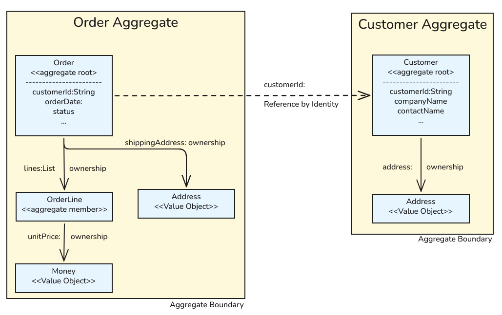
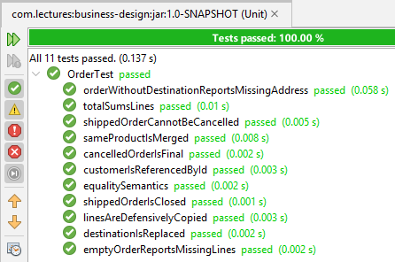

# Hafta 04

İş nesnelerini incelemek için işe Customer tasarımı ile başlamıştık. İlk tasarım birçok kusuru içermekteydi. Elimizdeki materyaller ve kavramlar arttıkça iş nesnelerinin daha sağlam ve güvenilir bir şekilde tasarlanabileceğini fark ediyoruz. Kobay veritabanımız Northwind'in Customers tablosunu ifade edecek sınıf tasarımını yeniden değerlendirelim. Domain kuralına göre her customerın ID bilgisinin 5 karakterden oluşan bir değer olması bekleniyor *(ALFKI, VINET gibi)*. Ayrıca artık bir müşterinin adres bilgisine ait detaylar domain katmanında Address tipi ile ifade edilmekte. Bunlara ek diğer iş kuralları ile birlikte Customer sınıfını bir aggregate olarak ele alabiliriz.

## Customer Sınıfı Tasarımı

```java
public final class Customer {

    private static final Pattern ID_PATTERN = Pattern.compile("^[A-Z]{5}$");

    private final String customerId;
    private String companyName;
    private String contactName;
    private Address address;

    public Customer(String customerId, String companyName, Address address) {
        this.customerId = normaliseId(customerId);
        this.companyName = requireText(companyName, "companyName");
        this.address = Objects.requireNonNull(address, "address must not be null");

    }

    public void relocateTo(Address newAddress) {
        address = Objects.requireNonNull(newAddress, "address must not be null");
    }

    public void renameTo(String newCompanyName) {
        companyName = requireText(newCompanyName, "companyName");
    }

    public void assignContact(String newContactName) {
        contactName = requireText(newContactName, "contactName");
    }

    public void clearContact() {
        contactName = null;
    }

    public String customerId() {
        return customerId;
    }

    public String companyName() {
        return companyName;
    }

    public Optional<String> contactName() {
        return Optional.ofNullable(contactName);
    }

    public Address address() {
        return address;
    }

    private static String requireText(String value, String field) {
        if (value == null || value.isBlank()) {
            throw new IllegalArgumentException(field + " must not be blank");
        }
        return value.strip();
    }

    private static String normaliseId(String value) {
        String id = requireText(value, "customerId").toUpperCase(Locale.ROOT);
        if (!ID_PATTERN.matcher(id).matches()) {
            throw new IllegalArgumentException(
                    "customerId must be exactly five letters (A-Z): " + value);
        }
        return id;
    }

    @Override
    public boolean equals(Object other) {
        if (this == other) {
            return true;
        }

        if (!(other instanceof Customer customer)) {
            return false;
        }

        return customerId.equals(customer.customerId);
    }

    @Override
    public int hashCode() {
        return customerId.hashCode();
    }

    @Override
    public String toString() {
        return "Customer[" + customerId + " " + companyName + "]";
    }
}
```

Customer sınıfının bu yeni tasarımındaki üyeleri kısaca tanıyalım.

| **Üye** | **Açıklama** |
| --- | --- |
| `customerId` | Müşterinin benzersiz kimliğini ifade eder. Beş harfli bir metin olmalıdır. |
| `companyName` | Şirket adını ifade eder. Boş olamaz. |
| `contactName` | İletişim kurulan kişinin adını ifade eder. Boş olabilir. |
| `address` | Müşterinin adresini ifade eder. Address türünden bir nesnedir. Boş olamaz. |
| `ID_PATTERN` | Müşteri kimliğinin doğrulanmasında kullanılan regex ifadesidir. |
| `requireText` | Metin alanlarının boş olup olmadığını kontrol eden yardımcı metot. Sınıf içi üyelere hizmet ettiğinde private static olarak tanımlanmıştır. |
| `normaliseId` | Müşteri kimliğini normalize eden ve doğrulayan yardımcı metot. Private static olarak tanımlanmıştır. |
| `equals` | Override edilen bu metot iki Customer nesnesinin eşitliğini sadece customerId alanını karşılaştırarak belirler. |
| `hashCode` | Override edilen bu metot Customer nesnesinin hash kodunu customerId alanına göre üretir. |
| `toString` | Override edilen bu metot Customer nesnesinin string temsilini döndürür. |
| `clearContact` | İletişim kurulan kişinin adını temizleyen metot. `contactName` alanını `null` yapar. |
| `relocateTo` | Müşterinin adresini güncelleyen metot. `address` alanını verilen yeni adresle değiştirir. Hatırlayalım Address bir record'a dönüştü ve immutable. |
| `renameTo` | Müşterinin şirket adını güncelleyen metot. `companyName` alanını verilen yeni adla değiştirir. |
| `assignContact` | İletişim kurulan kişinin adını güncelleyen metot. `contactName` alanını verilen yeni adla değiştirir. |

Sistemdeki bir müşteri ID bilgisi ile diğerlerinden ayrılır. Bu nedenle `equals` ve `hashCode` metotları sadece `customerId` alanına göre işlem yapar. customerId alanı müşteri kimliğini ifade eder ve Customer sınıfının bir Entity olacağını gösterir. Diğer yandan bir müşteri address bilgisini de Address record türü ile taşır. Customer nesnesi dolaşıma girdiğinde yapıcı metot üzerinden bir Address bilgisinin de sağlanması gerekir. Buna göre Customer'ın bir aggregate root olarak değerlendirilmesi mantıklıdır. *(Tartışalım, kime Entity kime Value Object denir, aggregate root ne zaman ortaya çıkar)*

Burada duralım ve bir önceki derste tasarladığımız Order sınıfında müşteri bilgisinin nasıl ele alındığına bakalım. Hatırlanacağı üzere bir siparişin müşteri ile de ilişkilendirilmesi beklenir. Order sınıfında müşteri bağlantısı String türünden olan customerId alanı üzerinden karşılanmaktadır. Bu yaklaşım, müşteri bilgilerini doğrudan Order nesnesine dahil etmek yerine sadece müşteri kimliğini saklamayı tercih eder. Bu bilinçli bir tercihtir zira Order nesnesi dolaşımdayken beraberinde bir Customer nesne örneğini dolaştırmayı gerektirmez. Buradaki durum Order ve OrderLine arasındaki ilişki gibi değildir. Bir sipariş, sipariş kalemleri olduğu sürece anlamlı bir nesnedir. Benzer teori Customer ve Address arasında da geçerlidir; bir Customer nesnesi dolaşımdayken beraberinde Address nesnesini taşır, zira bir müşterinin adresi olmadan müşteri tam anlamıyla tanımlanamaz. Bu ifadeler yoruma açıktır. Zira Order üzerinde müşteri bilgisini Customer türünden bir nesne ile taşımak yasak değildir fakat bir maliyeti olabilir.

## Aggregate Sınırları, Parça, Köken *(Root)* ilişkileri

Şu sorunun cevabını arayalım; *Order sınıfı neden Customer türünden bir nesne tutmaz?*

Order sınıfının Customer bilgisini nesne olarak tuttuğunu düşünelim. Kuvvetle muhtemel aşağıdakine benzer bir tasarıma gideriz.

```java
public final class Order{
    private final Customer customer;
    private final List<OrderLine> orderLines = new ArrayList<>();
}
```

Şimdi bu tasarıma aşağıdaki soruları soralım *(Elimizde Address, Order, OrderLine ve Customer tasarımlarının güncel halleri var)*

- **Bu tasarıma göre bir siparişi yüklemek başka neleri yükler?** Şu anki tasarımımıza göre sipariş yüklenirken beraberinde Customer nesnesini ve dolayısıyla Customer'ın Address bilgisini yükler. İlaveten OrderLine nesneleri de yüklenir. Tek bir sipariş satırını okumak istediğimizde ortama gereğinden fazla nesne yüklemiş oluruz. Buradaki basit kurguda dahi nesne grafiği bir noktadan sonra kontrolden çıkabilir.
- **Bir işlemde kaç nesne değişir?** Order nesnesini kullanan object user açısından baktığımızda pekala bir sipariş bilgisi üzerinden müşteri bilgisi kod yoluyla değiştirilebilir. Yani müşterinin contact bilgisi alakalı olmadığı halde sipariş bilgisi üzerinden değiştirilebilir. Özellikle transaction sınırının belirsizleştiği bir durumla karşı karşıya kalırız. Görüldüğü üzere domain tasarımı transaction sınırları dahil birçok yeri etkileyen bir faktör.
- **Bu iki nesne aynı modülde midir?** Sistem tasarlanırken bu enstrümanların aynı modül içerisinde olacağının bir garantisi yoktur. Örneğin Order ve OrderLine, sales modülünün bir parçası iken Customer ve Address, crm modülünün bir parçası olabilir. Bu durumda Order sınıfının Customer nesnesini doğrudan tutması beraberinde bazı zorluklar da getirecektir. İki modül arasındaki iletişimin nasıl sağlanacağı sorusu bunun güzel bir örneğidir. Bir API üzerinden iletişim kurmak ya da bir mesajlaşma altyapısı kullanmak gibi çözümler söz konusudur. Böyle bir senaryoda Order sınıfının Crm modülüne ait bir Customer nesnesini doğrudan tutması mümkün olmayacaktır. Kendi modülünde pekala bir Customer tasarımı içerebilir ancak müşteri bilgisinin asıl sahibi olan Crm ile senkronizasyon mekanizmasını da düşünmek zorunda kalırız.

> Görüldüğü üzere bir siparişin ilişkili olduğu müşteri bilgisini de içeren bir sınıfı bildiğimiz yollarla tasarlamak oldukça kolayken, tasarımın yer aldığı domain'in kullanıldığı bağlamda dikkat edilmesi gereken birçok nokta ortaya çıkmaktadır.

Buraya kadar anlattıklarımızdan yola çıkarak iki aggregate arasında referans kimlikleri ile ilişki kurmanın daha uygun olduğunu söyleyebiliriz. Yani Order sınıfı doğrudan Customer nesnesini tutmak yerine sadece Customer'ın kimliğini tutar. Bu yaklaşım, yukarıda bahsedilen yükleme, değişim ve modül bağımlılığı sorunlarını minimize eder. Ek olarak bu yöntem aggregate'ler arası bileşen bağımlılığını da basitleştirir ve primitive değerler üzerinden yürütülmesini sağlar.

Var olan nesnelerimizi bu bağlamda aşağıdaki tabloda olduğu gibi değerlendirebiliriz.

| **Referans** | **Nasıl kurulur?** | **Neden tercih edilir?** |
| --- | --- | --- |
| **Order -> Customer** | String türden customerId tutulur. | Muhtemelen aggregate'ler ayrı modüllerde yer alacak ayrı transaction sınırları olacaktır. |
| **Order -> OrderLine** | `List<OrderLine>` nesnesi ile tutulur. | Bir sipariş, içerdiği sipariş kalemleri olmadan anlamlı değildir. Parça, root object'in bir parçası olarak kabul edilir. Şöyle de düşünebiliriz, bir sipariş silindiğinde beraberindeki sipariş kalemlerinin varlığını sürdürmesi beklenmez. |
| **Order -> Address** | Address türünden nesne tutulur. | Address bir value object olarak tanımlanmıştır. Kimliği olmadığı, paylaşılan değil kopyalanan bir nesne olduğu için doğrudan nesne olarak tutulması uygundur. *(Onu LocalDate, BigDecimal gibi diğer value object'ler gibi düşünelim)* Şu iş kuralını düşünelim birde; bir siparişin teslimat adresi değiştiğinde, bu değişikliğin sadece ilgili siparişin adresini etkilemesi gerekir, müşteri adresini değil. |
| **Order -> Money** | Money türünden nesne tutulur. | Money bir value object olarak tanımlanmıştır. |
| **Customer -> Address** | Address türünden nesne tutulur. | Address bir value object olarak tanımlanmıştır. |

Sistemin bütününe baktığımızda bir müşterinin siparişleri olduğunu biliriz ancak sipariş bilgilerini Customer sınıfında `List<Order>` gibi bir koleksiyon ile tutmayız. Çünkü;

- Sipariş kavramı müşterinin bir parçası değildir, kendi kimliği vardır *(orderId)* ve kendi yaşam döngüsüne sahiptir.
- Bir müşteri nesnesini belleğe almak onun verdiği tüm siparişleri belleğe yüklemek anlamına gelmez. Sayısız sipariş vermiş bir müşteriyi temsil eden nesneyi siparişleri ile birlikte belleğe taşıdığınızı düşünün, imkansız değil ama mantıklı da değil.
- `customer.getOrders().add(newOrder)` gibi bir kod yazabildiğimiz anda, Order nesnesi için geçerli olan kuralları *(confirm ve ship fonksiyonlarını düşünelim)* atlamış oluruz.

Şunu unutmayalım ki bir müşterinin siparişlerini bulmak bir sorgu *(query)* işlemidir, bir aggregate'in parçası olma durumu değildir. Örneğin bunu ilerleyen zamanlarda bir repository nesnesi üzerinden `OrderRepository.findByCustomer(customerId)` gibi bir metotla gerçekleştirebiliriz.

Şu ana kadarki bilgilerden yola çıkarak Customer, Order, OrderLine, Address, Money nesneleri arasındaki ilişkileri aşağıdaki şekilde özetleyebiliriz.



## OrderStatus'u Bir State Machine Olarak Değerlendirmek

Daha önceden tasarladığımız Order sınıfını tekrardan değerlendirelim. Siparişin durumu aslında sipariş nesnesinin anlık durumunu da ifade eder. Bu durumu Order sınıfının önceki versiyonunda cancel, confirm, ship gibi metotlar içerisinde requireStatus metodu yardımıyla ele almıştık. Bunda herhangi bir sorun olmamakla birlikte statüler arası geçişleri üç ayrı yerde ele almak durumunda kalıyoruz. Aslında bir siparişin olası durumları arasındaki geçişlerin merkezi bir yerde görünür kılınması yeni bir durum eklendiğinde veya mevcut bir durum değiştirildiğinde tüm geçişlerin kolayca gözden geçirilmesini sağlayacaktır. Sipariş durumlarını temsil eden OrderStatus enum'ını bir state machine olarak ele almak bu sorunu çözebilir. Şimdi OrderStatus tasarımını aşağıdaki gibi değiştirelim.

```java
public enum OrderStatus {
    DRAFT,
    CONFIRMED,
    SHIPPED,
    CANCELLED;
    // DELIVERED durumunu bilinçli olarak kaldırdık.

    private Set<OrderStatus> allowedTransitions;

    static {
        DRAFT.allowedTransitions = EnumSet.of(CONFIRMED, CANCELLED);
        CONFIRMED.allowedTransitions = EnumSet.of(SHIPPED, CANCELLED);
        SHIPPED.allowedTransitions = EnumSet.noneOf(OrderStatus.class);
        CANCELLED.allowedTransitions = EnumSet.noneOf(OrderStatus.class);
    }

    public Set<OrderStatus> allowedTransitions() {
        return Collections.unmodifiableSet(allowedTransitions);
    }

    public boolean canTransitionTo(OrderStatus target) {
        return allowedTransitions.contains(target);
    }

    public boolean isTerminal() {
        return allowedTransitions.isEmpty();
    }

    public boolean isModifiable() {
        return this == DRAFT;
    }
}
```

Görüldüğü üzere Java'nın zengin enum özellikleri onu davranışları *(behaviors)* ve durum bazlı geçişleri *(state transitions)* merkezi bir şekilde tanımlayabilen güçlü bir araç haline getirdi. Dolayısıyla OrderStatus enum nesnesini artık sipariş durumlarını yöneten merkezi bir otorite olarak düşünebiliriz. İzin verilen geçişler Set veri yapısı içerisinde tutulur. static kod bloğu içerisinde her bir durum için izin verilen durum geçişleri de tanımlanır. Örneğin DRAFT durumundan yalnızca CONFIRMED veya CANCELLED durumlarına geçiş yapılabilir veya iptal edilen bir sipariş hiçbir duruma geçiş yapmaz ve bu `EnumSet.noneOf(OrderStatus.class)` ile ifade edilir. Veri yapısı birkaç fonksiyonelliği de dışarıya açar. allowedTransitions metodu izin verilen geçişleri değiştirilemez bir Set olarak döner. canTransitionTo metodu belirli bir duruma geçişin mümkün olup olmadığını bildirir, isTerminal metodu siparişin başka bir duruma geçip geçemeyeceğini belirtir. isModifiable metodu ise siparişin henüz taslak aşamasında olup olmadığını döndürür gibi. *(Aşağıdaki kod parçasını çalıştırarak deneyin)*

```java
public class OrderStatusTest {
    public static void main(String[] args) {
        OrderStatus draft = OrderStatus.DRAFT;
        System.out.println("DRAFT allowed transitions: " + draft.allowedTransitions());
        System.out.println("Can DRAFT transition to CONFIRMED? " + draft.canTransitionTo(OrderStatus.CONFIRMED));
        System.out.println("Is DRAFT terminal? " + draft.isTerminal());
        System.out.println("Is DRAFT modifiable? " + draft.isModifiable());
    }
}
```

> Ele aldığımız yaklaşım her ne kadar avantajlı gözükse de state'lerin çok fazla olduğu senaryolarda enum yapısının yönetimi ve izin verilen geçişlerin takibi zorlaşır. Bunu ilerleyen derslerde State Design Pattern ile yeniden değerlendirebiliriz.

Buna göre Order sınıfını yeniden tasarlayabiliriz ama öncesinde önemli olan bir diğer konuyu da ele alalım.

## Domain Nesnelerinde Exception Yönetimi

Şu ana kadarki tasarımlarımızda domain iş kurallarının ihlal edildiği yerlerde kesin cezalar verdik. Bunu genellikle Java'nın var olan Exception türleri ile karşıladık *(IllegalArgumentException veya IllegalStateException gibi)*. Ancak bu yaklaşımın bazı dezavantajları vardır. Örneğin, exception türlerinin domain bağlamında anlamlı olmaması veya exception yönetiminin merkezi bir şekilde yapılamaması söz konusudur. Ayrıca var olan exception'larda text içerikleri ile bilgi vermek birim testler açısından kırılgandır. Domain nesnesinden fırlatılan Exception nesnesinde kullanılan ve anlamlı bir bilgi vermeye çalışan metinsel bilginin değişmesi yine bu metinsel bilgiyi baz alan birim testlerin patlamasına yol açar. Dolayısıyla domain kurallarını anlatan güçlendirilmiş exception türleri tanımlamak daha doğru bir yaklaşımdır. Önceki derslerde tasarlamaya çalıştığımız modelleri de düşünerek aşağıdaki hiyerarşiyi inşa etmeye başlayalım.

```text
DomainException (base, abstract)
 ├─ InvalidStateTransitionException (Geçersiz state geçişlerinde)
 ├─ OrderNotModifiableException (Taslak durumda olmayan siparişe müdahale edilmeye çalışıldığında)
 └─ IncompleteOrderException (Eksik sipariş bilgisinin onaylanmaya çalışılması halinde)
```

Dersin ilerleyen kısımlarında veya şu anda daha fazla Exception nesnesi de tanımlayabiliriz. Şimdilik bunlar yeterli olacaktır.

DomainException sınıfı ile işe başlayalım.

```java
public abstract class DomainException extends RuntimeException {
    protected DomainException(String message) {
        super(message);
    }
}
```

Birkaç Java temel bilgisini hatırlamakta yarar var.

- DomainException, RuntimeException sınıfından türer ve böylece unchecked exception olarak davranır *(Runtime exception'lar derleme zamanında yakalanmak zorunda değildir)*.
- DomainException soyut bir sınıftır ve doğrudan örneklenemez. Sadece ondan türeyen alt sınıflar kullanılabilir.
- DomainException sınıfının yapıcı metodu *(constructor)* protected olarak tanımlanmıştır, bu da sadece alt sınıflar tarafından çağrılabileceği anlamına gelir.

> Domain ile ilgili exception'ları unchecked olarak tanımladık zira kural ihlalleri çağıranın hata yaptığı durumu temsil eder ama çağıranın bu hataları yakalaması zorunlu değildir. Checked exception daha çok çağıran tarafın gerçekten anlamlı bir yol izlemesi beklendiğinde kullanılır. Jakarta gibi framework'ler genellikle unchecked exception kullanır (PersistenceException, WebApplicationException, ConstraintViolationException gibi)

Şimdi bu sınıftan türeteceğimiz diğer domain exception sınıflarını yazalım.

**InvalidStateTransitionException:** Domain nesnesinde geçersiz bir state geçişi yapıldığında fırlatılır.

```java
public class InvalidStateTransitionException extends DomainException {
    private final int orderId;
    private final OrderStatus from;
    private final OrderStatus to;
    public InvalidStateTransitionException(int orderId, OrderStatus from, OrderStatus to) {
        super("order " + orderId + " cannot move from " + from + " to " + to);
        this.orderId = orderId;
        this.from = from;
        this.to = to;
    }

    public int orderId() {
        return orderId;
    }

    public OrderStatus from() {
       return from;
    }

    public OrderStatus to() {
        return to;
    }
}
```

**OrderNotModifiableException:** Domain nesnesinde, belirli bir durumda değiştirilemez olan bir sipariş üzerinde geçersiz bir işlem yapılmaya çalışıldığında fırlatılır.

```java
public class OrderNotModifiableException extends DomainException {
    private final int orderId;
    private final OrderStatus status;
    private final String attemptedAction;
    
    public OrderNotModifiableException(int orderId, OrderStatus status, String attemptedAction) {
        super("cannot " + attemptedAction + " on order " + orderId + " in status " + status);
        this.orderId = orderId;
        this.status = status;
        this.attemptedAction = attemptedAction;
    }

    public int orderId() {
        return orderId;
    }

    public OrderStatus status() {
        return status;
    }

    public String attemptedAction() {
        return attemptedAction;
    }
}
```

**IncompleteOrderException:** Domain nesnesinde, eksik olan siparişler üzerinde geçersiz bir işlem yapılmaya çalışıldığında fırlatılır.

```java
public class IncompleteOrderException extends DomainException {

    public enum MissingPart {
        LINES,
        SHIPPING_ADDRESS
    }
    private final int orderId;
    private final MissingPart missingPart;

    public IncompleteOrderException(int orderId, MissingPart missingPart) {
        super("order " + orderId + " cannot be confirmed: " + missingPart + " missing");
        this.orderId = orderId;
        this.missingPart = missingPart;
    }

    public int orderId() {
        return orderId;
    }

    public MissingPart missingPart() {
        return missingPart;
    }
}
```

Exception sınıflarının içeriklerini dikkatlice inceleyelim. Herbiri domain iş kurallarının ihlali ile ilgili daha detaylı ve zenginleştirilmiş bilgi taşır.

## Order Sınıfı Yeniden

Order sınıfını yeniden ele alacağız. İki önemli değişikliğimiz var. OrderStatus enum nesnesinin yeni implementasyonu ve domain exception'ların kullanımı.

```java
public final class Order {

    private static final int MAX_LINES = 50;

    private final int orderId;
    private final String customerId;
    private final LocalDate orderDate;
    private final List<OrderLine> lines = new ArrayList<>();
    private OrderStatus status = OrderStatus.DRAFT;
    private Address shippingAddress;
    private LocalDate shippedDate;

    public Order(int orderId, String customerId, LocalDate orderDate) {
        if (orderId <= 0) {
            throw new IllegalArgumentException("orderId must be positive: " + orderId);
        }

        if (customerId == null || customerId.isBlank()) {
            throw new IllegalArgumentException("customerId must not be blank");
        }
        this.orderId = orderId;
        this.customerId = customerId.strip();
        this.orderDate = Objects.requireNonNull(orderDate, "orderDate must not be null");
    }

    public void addLine(int productId, Money unitPrice, int quantity, BigDecimal discount) {
        requireModifiable("add a line");
        int existing = indexOfProduct(productId);
        if (existing >= 0) {
            lines.set(existing, lines.get(existing).withAdditionalQuantity(quantity));
            return;
        }
        if (lines.size() == MAX_LINES) {
            throw new IllegalStateException("an order cannot hold more than " + MAX_LINES + " lines");
        }
        lines.add(new OrderLine(productId, unitPrice, quantity, discount));
    }

    public void removeLine(int productId) {
        requireModifiable("remove a line");
        int index = indexOfProduct(productId);
        if (index < 0) {
            throw new IllegalArgumentException("product is not on this order: " + productId);
        }
        lines.remove(index);
    }

    public void confirm() {
        requireModifiable("confirm");
        if (lines.isEmpty()) {
            throw new IncompleteOrderException(orderId, IncompleteOrderException.MissingPart.LINES);
        }

        if (shippingAddress == null) {
            throw new IncompleteOrderException(
                    orderId, IncompleteOrderException.MissingPart.SHIPPING_ADDRESS);
        }
        transitionTo(OrderStatus.CONFIRMED);
    }

    public void shipTo(Address address) {
        requireModifiable("change the shipping address");
        shippingAddress = Objects.requireNonNull(address, "address must not be null");
    }

    public void ship(LocalDate date) {
        requireTransition(OrderStatus.SHIPPED);
        Objects.requireNonNull(date, "shipped date must not be null");
        if (date.isBefore(orderDate)) {
            throw new IllegalArgumentException("shipped date cannot precede the order date");
        }
        shippedDate = date;
        status = OrderStatus.SHIPPED;
    }

    public void cancel() {
        transitionTo(OrderStatus.CANCELLED);
    }

    // --- behaviour end ---    
    public Money total() {
        return lines.stream()
                .map(OrderLine::lineTotal)
                .reduce(Money::plus)
                .orElse(Money.tl("0"));
    }

    // --- state begin ---
    public int orderId() {
        return orderId;
    }

    public String customerId() {
        return customerId;
    }

    public LocalDate orderDate() {
        return orderDate;
    }

    public OrderStatus status() {
        return status;
    }

    public Optional<Address> shippingAddress() {
        return Optional.ofNullable(shippingAddress);
    }

    public Optional<LocalDate> shippedDate() {
        return Optional.ofNullable(shippedDate);
    }

    // Defensive copy: callers cannot reach into the aggregate.
    public List<OrderLine> lines() {
        return List.copyOf(lines);
    }
    // --- state end ---

    // --- helpers begin ---
    private int indexOfProduct(int productId) {
        for (int i = 0; i < lines.size(); i++) {
            if (lines.get(i).productId() == productId) {
                return i;
            }
        }
        return -1;
    }

    private void requireModifiable(String action) {
        if (!status.isModifiable()) {
            throw new OrderNotModifiableException(orderId, status, action);
        }
    }

    private void requireTransition(OrderStatus target) {
        if (!status.canTransitionTo(target)) {
            throw new InvalidStateTransitionException(orderId, status, target);
        }
    }

    private void transitionTo(OrderStatus target) {
        requireTransition(target);
        status = target;
    }

    @Override
    public boolean equals(Object other) {
        if (this == other) {
            return true;
        }

        if (!(other instanceof Order order)) {
            return false;
        }
        return orderId == order.orderId;
    }

    @Override
    public int hashCode() {
        return Integer.hashCode(orderId);
    }
    // --- helpers end ---
}
```

- Artık Order sınıfında `requireStatus` yerine `requireModifiable` kullanıyoruz. Böylece statü bilgisinin hangi durumda değiştirilebileceği bilgisi enum yapısı tarafından karşılanıyor.
- Statü geçişlerinde örneğin cancel metodunda if ile kontrol yapmak yerine bu işi `transitionTo` metoduna devrediyoruz. Kural if bloğundan geçiş tablosuna aktarılıyor. Buna göre örneğin CANCELLED'dan CANCELLED'a geçiş yapmak gibi bir durum söz konusu olamaz.
- Bazı IllegalStateException durumlarını kendi domain exception türlerimizle değiştirdik. Örneğin siparişte eksik varsa IncompleteOrderException fırlatıyor ve detay bilgi veriyoruz. Böylece object user artık hangi parçanın eksik olduğunu koddan okuyabiliyor.

## Main metodu ne kadar iyi test yapar?

Order sınıfının tasarımında köklü değişiklikler yaptık. Daha modern bir Customer sınıfımız ve becerisi artırılmış OrderStatus tipimiz var. Bazı haller için kendi domain exception türlerimizi yazdık. Bu kadar çok değişiklikten sonra main metodu ne kadar iyi test yapabilir? Düşündüğümüz ve tedbir aldığımız her durum için kodun bütününü kapsamlı bir şekilde test etmek oldukça zor olabilir. Dersimizin bu anı birim testlere geçiş için iyi bir zemin de hazırlıyor. Birim testler ayrıca değerlendirilmesi gereken bir konu olsa da şimdi kullanmanın tam zamanı.

### Unit Test Projesini Oluşturmak

Birim testleri yazmak için öncelikle bir test projesi oluşturmamız gerekiyor. Eğer Maven kullanıyorsak, `pom.xml` dosyasına JUnit bağımlılığını eklemek bunun için yeterli olacaktır. Örnek;

```xml
<?xml version="1.0" encoding="UTF-8"?>
<project xmlns="http://maven.apache.org/POM/4.0.0" xmlns:xsi="http://www.w3.org/2001/XMLSchema-instance" xsi:schemaLocation="http://maven.apache.org/POM/4.0.0 http://maven.apache.org/xsd/maven-4.0.0.xsd">
    <modelVersion>4.0.0</modelVersion>
    <groupId>com.lectures</groupId>
    <artifactId>business-objects</artifactId>
    <version>1.0-SNAPSHOT</version>
    <packaging>jar</packaging>
    <dependencies>
        <dependency>
            <groupId>org.junit.jupiter</groupId>
            <artifactId>junit-jupiter</artifactId>
            <version>6.0.1</version>
            <scope>test</scope>
        </dependency>
        <dependency>
            <groupId>org.assertj</groupId>
            <artifactId>assertj-core</artifactId>
            <version>3.27.7</version>
            <scope>test</scope>
        </dependency>
    </dependencies>
    <properties>
        <project.build.sourceEncoding>UTF-8</project.build.sourceEncoding>
        <maven.compiler.release>26</maven.compiler.release>
        <exec.mainClass>com.lectures.business.objects.BusinessObjects</exec.mainClass>
    </properties>
    
    <build>
        <plugins>
            <plugin>
                <groupId>org.apache.maven.plugins</groupId>
                <artifactId>maven-surefire-plugin</artifactId>
                <version>3.6.0</version>
            </plugin>
        </plugins>
    </build>
</project>
```

Jupiter, `@Test` ve `@DisplayName` gibi anotasyonları sağlayarak bir metodun test koşusunda ele alınmasını sağlar. Diğer yandan assertj paketinden gelen yardımcılarla daha okunabilir assert ifadeleri yazabiliriz.

## Order Test Sınıfı

Order için aşağıdaki birim test sınıfını yazabiliriz.

```java
class OrderTest {
    private static final BigDecimal NO_DISCOUNT = BigDecimal.ZERO;
    private static final LocalDate ORDER_DATE = LocalDate.of(1996, 7, 4);
    private static final Address DESTINATION =
            new Address("59 rue de l'Abbaye", "Reims", "51100", "France");
    private Order newDraft() {
        return new Order(10248, "VINET", ORDER_DATE);
    }

    private Order newConfirmableDraft() {
        Order order = newDraft();
        order.addLine(11, Money.tl("14.00"), 12, NO_DISCOUNT);
        order.shipTo(DESTINATION);
        return order;
    }

    private Order newShippedOrder() {
        Order order = newConfirmableDraft();
        order.confirm();
        order.ship(ORDER_DATE.plusDays(12));
        return order;
    }

    @Test
    @DisplayName("total sums the lines and applies discounts")
    void totalSumsLines() {
        Order order = newDraft();
        order.addLine(11, Money.tl("14.00"), 12, NO_DISCOUNT);
        order.addLine(42, Money.tl("9.80"), 10, new BigDecimal("0.15"));
        assertThat(order.total()).isEqualTo(Money.tl("251.30"));
    }

    @Test
    @DisplayName("adding the same product twice increases the quantity")
    void sameProductIsMerged() {
        Order order = newDraft();
        order.addLine(11, Money.tl("14.00"), 5, NO_DISCOUNT);
        order.addLine(11, Money.tl("14.00"), 7, NO_DISCOUNT);
        assertThat(order.lines()).hasSize(1);
        assertThat(order.lines().get(0).quantity()).isEqualTo(12);
    }

    @Test
    @DisplayName("the customer is referenced by identity, not by object")
    void customerIsReferencedById() {
        assertThat(newDraft().customerId()).isEqualTo("VINET");
    }

    @Test
    @DisplayName("an empty order reports exactly what is missing")
    void emptyOrderReportsMissingLines() {
        assertThatThrownBy(() -> newDraft().confirm())
                .isInstanceOf(IncompleteOrderException.class)
                .extracting(e -> ((IncompleteOrderException) e).missingPart())
                .isEqualTo(MissingPart.LINES);
    }

    @Test
    @DisplayName("an order without a destination reports exactly what is missing")
    void orderWithoutDestinationReportsMissingAddress() {
        Order order = newDraft();
        order.addLine(11, Money.tl("14.00"), 12, NO_DISCOUNT);
        assertThatThrownBy(order::confirm)
                .isInstanceOf(IncompleteOrderException.class)
                .extracting(e -> ((IncompleteOrderException) e).missingPart())
                .isEqualTo(MissingPart.SHIPPING_ADDRESS);
    }

    @Test
    @DisplayName("the destination is replaced as a whole, never edited in part")
    void destinationIsReplaced() {
        Order order = newConfirmableDraft();
        order.shipTo(new Address("Obere Str. 57", "Berlin", "12209", "Germany"));
        assertThat(order.shippingAddress()).contains(
                new Address("Obere Str. 57", "Berlin", "12209", "Germany"));
    }

    @Test
    @DisplayName("a shipped order rejects new lines and a new destination")
    void shippedOrderIsClosed() {
        Order order = newShippedOrder();
        assertThatThrownBy(() -> order.addLine(42, Money.tl("9.80"), 1, NO_DISCOUNT))
                .isInstanceOf(OrderNotModifiableException.class);
        assertThatThrownBy(() -> order.shipTo(DESTINATION))
                .isInstanceOf(OrderNotModifiableException.class);
        assertThat(order.status()).isEqualTo(OrderStatus.SHIPPED);
    }

    @Test
    @DisplayName("a shipped order cannot be cancelled, and the exception says why")
    void shippedOrderCannotBeCancelled() {
        Order order = newShippedOrder();
        assertThatThrownBy(order::cancel)
                .isInstanceOf(InvalidStateTransitionException.class)
                .satisfies(thrown -> {
                    InvalidStateTransitionException e = (InvalidStateTransitionException) thrown;
                    assertThat(e.from()).isEqualTo(OrderStatus.SHIPPED);
                    assertThat(e.to()).isEqualTo(OrderStatus.CANCELLED);
                    assertThat(e.orderId()).isEqualTo(10248);
                });
    }

    @Test
    @DisplayName("a cancelled order is final: it cannot be confirmed again")
    void cancelledOrderIsFinal() {
        Order order = newConfirmableDraft();
        order.cancel();
        assertThatThrownBy(order::confirm)
                .isInstanceOf(OrderNotModifiableException.class);
        assertThat(order.status().isTerminal()).isTrue();
    }

    @Test
    @DisplayName("the line list handed out is a copy")
    void linesAreDefensivelyCopied() {
        Order order = newConfirmableDraft();
        assertThatThrownBy(() -> order.lines().clear())
                .isInstanceOf(UnsupportedOperationException.class);
        assertThat(order.lines()).hasSize(1);
    }

    @Test
    @DisplayName("orders are equal by identity, money by value")
    void equalitySemantics() {
        Order a = newDraft();
        Order b = newConfirmableDraft();
        assertThat(a).isEqualTo(b);
        assertThat(Money.tl("18.6")).isEqualTo(Money.tl("18.60"));
    }
}
```

Beklentimiz tüm testlerin yeşil bayrak kaldırmasıdır.



Benzer şekilde OrderStatus ve Customer sınıfları için de testler yazılmalıdır, deneyin.

---

## Sorular

Bu dersle ilgili olarak bizi araştırmaya itecek soruları aşağıda bulabilirsiniz.

### Customer, Entity ve Aggregate Sınırları

- Customer artık `setCompanyName` yerine `renameTo`, `setAddress` yerine `relocateTo` gibi metotlar sunuyoruz, neden? *(Intention-Revealing Interface kavramını araştıralım)*
- `normaliseId` metodu kimliği `toUpperCase(Locale.ROOT)` ile büyük harfe çeviriyor. `Locale.ROOT` yerine varsayılan locale kullanılsaydı Türkçe işletim sisteminde `"vinet"` değeri neye dönüşürdü? *(Turkish I problem)*
- Customer kimliği hala bir `String`. Hafta 1'de değindiğimiz `CustomerId` değer nesnesi artık gerekli mi? Order sınıfındaki `customerId` alanına `"vinet "` gibi bir değer verildiğinde Customer'daki normalizasyon kuralı uygulanıyor mu? Aynı kuralın iki farklı yerde farklı uygulanmasının riski nedir?
- Customer'ın `address` alanı değiştirilebiliyor ama Address'in kendisi immutable bir nesne. Mutable bir entity'nin immutable value object içermesi iyi bir kombinasyon mudur? Customer'ın adresi değiştiğinde daha önce verilmiş siparişlerin teslimat adresi değişmeli midir sorusunuz düşünerek karar verebiliriz.
- Customer ve Address arasındaki ilişki ile Order ve OrderLine arasındaki ilişki aynı türden midir? Address bir value object iken OrderLine'ı Order'ın bir parçası *(member/part)* yapan şey nedir? Bir nesnenin Entity mi, Value Object mi, Aggregate Root mu olduğuna karar vermek için hangi soruları sormalıyız?
- Order'ın Customer'a kimlik *(identity)* ile referans vermesi, müşterinin sistemde gerçekten var olduğunu garanti eder mi? Örneğin var olmayan `"XXXXX"` kimliğiyle bir sipariş oluşturulabilir mi? Bu kontrol domain nesnesinin mi, application service bileşeninin mi *(ki henüz böyle bir şey yazmadık)* yoksa veritabanındaki foreign key'in mi sorumluluğudur?
- Customer ve Order farklı modüllerde *(örneğin crm ve sales)* yer alıyorsa müşteri silindiğinde veya şirket adı değiştiğinde sales modülü bundan nasıl haberdar olabilir? *(Bunun için Bounded Context, Eventual Consistency ve Domain Event gibi ileri seviye kavramlarını araştırmamız lazım. Şimdilik kolay bir problem olmadığını düşünsek yeterli)*
- **Vaughn Vernon**'un "bir transaction'da yalnızca bir aggregate değiştirilmelidir" kuralını araştıralım. Sipariş onaylandığında müşterinin kredi limitinin düşülmesi gerekiyorsa bu kuralı nasıl koruyabiliriz? *(A properly designed Aggregate is one that can be modified in any way required by the business with its invariants completely consistent within a single transaction. Vernon,2013 p.354)*
- Bir müşterinin siparişlerini bulmanın bir sorgu *(query)* olduğunu söyledik. Yine de ekranda müşteri bilgisi ile son beş siparişini birlikte göstermemiz gerekiyorsa domain modelini bozmadan bunu nasıl yapabiliriz? *(CQRS, read model, DTO gibi konulara bakmak lazım)*

### OrderStatus State Machine

- İzin verilen geçişler enum constructor'ı yerine `static` bir blokta tanımlandı. `DRAFT(EnumSet.of(CONFIRMED, CANCELLED))` şeklinde constructor üzerinden tanımlamaya çalışsaydık derleyicinin tepkisi ne olurdu? Enum sabitlerinin başlatılma sırası ile ilgili *illegal forward reference* hatası araştırılabilir.
- Neden `HashSet` yerine `EnumSet` kullanıyoruz? *(`EnumSet`'in iç yapısı(bit vector) performans ve bellek açısından ne sağlar araştıralım)*
- Önceki derste `OrderStatus` enum türünde `DELIVERED` durumu da vardı ancak bu derste yorum dışı bıraktık. Bu durumu geri eklemek isteseydik hangi kod noktalarına dokunmamız gerekirdi?
- Teslim edilmiş bir siparişin iade edilebilmesi *(RETURNED)* geçiş tablosunu nasıl değiştirir?
- `isTerminal` ve `isModifiable` farklı kavramlardır. `CONFIRMED` durumundaki bir sipariş terminal midir yoksa değiştirilebilir midir? Bu iki kavramı karıştırmak hangi hatalara yol açabilir?
- `isModifiable` metodu `this == DRAFT` ile sabit kodlanmış, status geçişleri ise bir tabloda tutuluyor. Değiştirilebilirlik bilgisini de geçiş tablosu gibi veri olarak tutmak daha tutarlı olur muydu?
- `ship` metodu geçişi `requireTransition` ile kontrol edip durumu `status = OrderStatus.SHIPPED` ile elle değiştiriyor, `cancel` ise `transitionTo` kullanıyor. Bu tutarsızlık ileride hangi hataya kapı aralayabilir?
- İptal edilmiş bir siparişte `confirm()` metodu çağrıldığında `OrderNotModifiableException` fırlatılıyor. Bu durum aslında geçersiz bir durum geçişi *(CANCELLED -> CONFIRMED)* değil mi? Hangi exception'ın fırlatılması gerektiğini tartışabiliriz.
- Durum sayısı ve geçiş kuralları arttıkça *(örneğin "ödeme alınmadan kargoya verilemez" gibi koşullu geçişler)* enum tabanlı tablo yetersiz kalabilir mi? State tasarım kalıbı, `sealed interface` ile modellenmiş durumlar ve Spring Statemachine gibi kütüphaneler bu noktada ne gibi alternatifler sunabilir araştıralım.

### Domain Exception'lar

- Domain exception'ları unchecked tanımladık. Joshua Bloch'un *Effective Java* kitabındaki "kurtarılabilir durumlar için checked, programlama hataları için unchecked exception kullanın" önerisini araştırın. Bir kullanıcının boş sepeti onaylamaya çalışması hangi kategoriye girer?
- `DomainException` soyut bir sınıftır *(abstract)*. Bunu `sealed` olarak tanımlayıp yalnızca belirli alt sınıflara izin vermek ne kazandırır? `switch` ile pattern matching yaparken bu nasıl bir avantaj sağlar?
- Exception mesajı yerine `missingPart`, `from`, `to` gibi alanların test edilmesi neden daha sağlamdır? Bu alanlar bir REST API'de istemci açısından nasıl bir hata yanıtına dönüştürülebilir? *(RFC 9457 - Problem Details)*
- Order sınıfında hala `IllegalArgumentException` ve `IllegalStateException` fırlatılan yerler var *(örneğin `MAX_LINES` aşıldığında veya listede olmayan bir ürün silinmeye çalışıldığında)*. Bunların da domain exception'a dönüştürülmesi gerekir mi? Hangi kurallar domain kuralıdır, hangileri yalnızca programlama hatasıdır?
- Siparişte hem kalemler hem de adres eksikse `confirm()` yalnızca ilk eksikliği bildiriyor. Tüm eksiklikleri tek seferde bildirmek için `IncompleteOrderException` nasıl değiştirilebilir? `Set<MissingPart>` iş görür mü? *(Notification pattern'e de bir bakalım)*
- Exception fırlatmak JVM *(Java Virtual Machine)* için maliyetli bir işlem midir? Stack trace üretiminin maliyetini ve `RuntimeException`'ın `writableStackTrace` parametreli constructor'ını araştıralım. Domain exception'larda stack trace'e ihtiyacımız var mıdır tartışalım.

### Birim Testler

- `main` metodu ile yapılan denemeler ile JUnit testleri arasındaki temel farklar nelerdir? Bir testin otomatik, tekrarlanabilir ve bağımsız olması ne anlama gelir? *(F.I.R.S.T prensiplerini araştıralım)*
- `linesAreDefensivelyCopied` testinin adı listenin bir kopya olduğunu söylüyor ama test aslında listenin değiştirilemez *(unmodifiable)* olduğunu doğruluyor. `lines()` metodu `Collections.unmodifiableList(lines)` döndürseydi bu test yine geçer miydi? Gerçekten kopya olduğunu doğrulayan bir test fonksiyonunu nasıl yazabiliriz?
- `equalitySemantics` testinde içeriği farklı iki siparişin eşit olduğu doğrulanıyor. Bu beklenen bir davranış mı? Kimlik eşitliği ile değer eşitliğinin farkını gösteren başka bir test senaryosu yazmaya çalışalım.
- `newDraft`, `newConfirmableDraft`, `newShippedOrder` gibi yardımcı metotlar test verisini hazırlamak için kullanılıyor. *Object Mother* ve *Test Data Builder* kalıplarını araştıralım. *(Özellikle test sayısı arttıkça ölçeklenebilirlik açısından hangisi daha avantajlıdır öğrenmek lazım)*
- OrderStatus geçiş tablosunu tek tek test metotları yazmak yerine `@ParameterizedTest`, `@EnumSource` veya `@CsvSource` anotasyonlarını kullanarak nasıl daha verimli şekilde test edebiliriz? Tüm durum çiftleri *(4 x 4 = 16 kombinasyon)* için hangi geçişlerin izinli, hangilerinin yasak olduğunu doğrulayan bir test yazmaya çalışalım.
- AssertJ'nin `assertThat` ifadeleri ile JUnit'in kendi `assertEquals` metodu arasındaki fark nedir? *Fluent API* yaklaşımı test okunabilirliğine ne katar?
- Test metotlarının isimlendirmesinde `@DisplayName` anotasyonundan yararlandık. *Given-When-Then* veya *Arrange-Act-Assert* yapılarını araştıralım ve mevcut testlerden herhangi birini bu yapıya göre yeniden düzenleyelim.
- `pom.xml` dosyasında bağımlılıklar `test` scope ile eklendi. Bu scope'un anlamı nedir? `maven-surefire-plugin` ne işe yarar ve `mvn test` komutu hangi Maven yaşam döngüsü *(lifecycle)* adımlarını çalıştırır?
- Tüm testlerin yeşil olması kodun doğru olduğu anlamına gelir mi? Code coverage *(JaCoCo)* ve mutation testing *(PIT)* kavramlarına bir bakalım. Örneğin mutation testing, Order sınıfındaki eksik testleri ortaya çıkarabilir mi?
