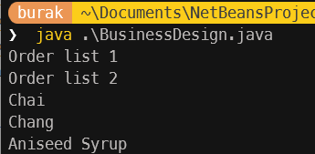
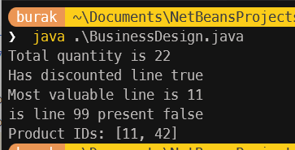
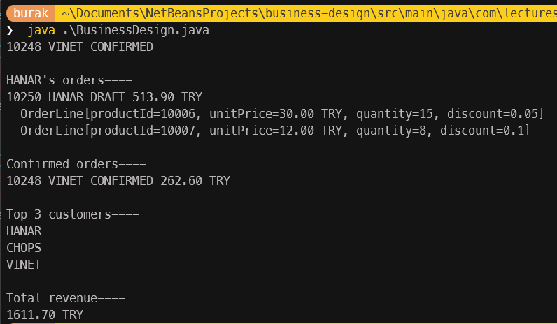
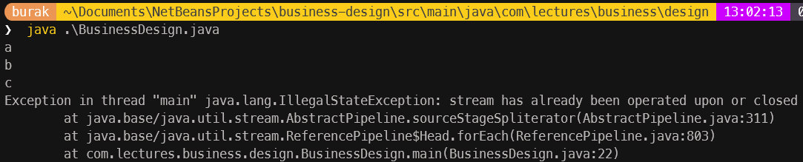
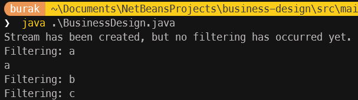
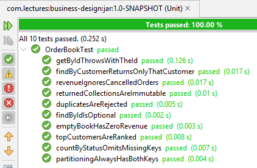

# Hafta 05: Optional, Stream API ve Sorgu Tasarımı

Önceki derslerimizde bir müşterinin siparişlerini Customer sınıfında `List<Order>` olarak tutmayacağımızdan bahsetmiştik. Zira bunun bir alan *(field)* değil, bir sorgu *(query)* operasyonu olduğunu savunmuştuk. Bu derste sorguyu yazmaya çalışacağız ve bunu yaparken Optional ile Stream API enstrümanlarını nasıl kullanabileceğimizi öğreneceğiz.

## Optional Sözleşmesi

Optional enstrümanı, bir değerin var olup olmadığını ifade etmek için kullanılır. Null referanslardan kaynaklanan hataları önlemeye yardımcı olur ve daha anlamlı API'ler tasarlamamızı sağlar. Optional, özellikle bir metodun her zaman bir değer döndürmeyebileceği durumlarda tercih edilir. Örneğin:

```java
Optional<Order> findLatestOrder(Customer customer) {
    // müşteri siparişlerini tarihe göre sıralayıp en yenisini döndür
}
```

Bu metodun döndürdüğü Optional, çağıran tarafa değerin var olup olmadığını kontrol etme sorumluluğunu verir. Optional ile çalışırken `isPresent()`, `ifPresent()`, `orElse()`, `orElseGet()` ve `orElseThrow()` gibi metodlar kullanılarak değerin varlığına göre işlem yapılabilir. Bu sayede null kontrolleri daha güvenli ve okunabilir bir şekilde gerçekleştirilebilir.

Şu ana kadarki nesne tasarımlarımızda Order sınıfının shippedDate ve Customer sınıfının contactName metotlarında Optional kullanmıştık. Aslında bir metodun null yerine dönüş tipi olarak Optional kullanması, "bu metot boş dönebilir" bilgisini metot imzasına açıkça yansıtmak anlamına gelir. Bu sayede çağıran taraf, değerin varlığını kontrol etmeden metodu kullanamaz ve null referans hatalarından korunmuş olur. Hatta şunu kesinlikle söyleyebiliriz de; *Optional dönen metot asla null döndürmez.*

Optional kullanımını birkaç örnekle ele alalım.

```java
public static void main(String[] args) {
    var reims = new Address("59 rue de l'Abbaye", "Reims", "51100", "France");
    var customer = new Customer("VINET", "Vins et alcools Chevalier", reims);

    if (customer.contactName().isPresent()) {
        System.out.println(customer.contactName().get());
    }

    // Optional'ın daha zengin yöntemleri vardır

    customer.contactName().orElse("there is no recorded contact");
    customer.contactName().map(String::toUpperCase).orElse("-");
    customer.contactName().ifPresent(System.out::println);
    customer.contactName().ifPresentOrElse(
            name -> System.out.println("authorized: " + name),
            () -> System.out.println("unauthorized"));
    customer.contactName().orElseThrow(() -> new IllegalStateException("contact required"));
}
```

## Stream API ve Optional ile Çalışmak

Order üzerinden yapabileceğimiz sorgularda kullanmak üzere Optional enstrümanına kısaca değindik. Bir diğer konu ise Stream API'den yararlanmak. Stream API ile ilgili en büyük yanılgılardan birisi onu basit bir for döngüsü sanmaktır. Temelde bir stream üç parçadan oluşur; kaynak veri *(source)*, ara işlemler *(intermediate operations)* ve terminal işlemler *(terminal operations)*. Ara işlemler lazy (tembel) olarak değerlendirilir ve terminal işlem gerçekleşene kadar çalıştırılmaz. Büyük veri kümeleri üzerinde verimli bir şekilde işlemler yapılabilmesini sağlar.

```text
Kaynak --------------> Ara İşlemler ------------------> Terminal İşlemler
lines.stream()-------> filter(...).map(...)-----------> toList() veya reduce() veya count()
```

Basit bir kod parçası ile durumu değerlendirelim;

```java
public static void main(String[] args) {
    var names = List.of("Chai", "Chang", "Aniseed Syrup");
    System.out.println("Order list 1");
    names.stream().peek(System.out::println).filter(n -> n.length() > 4);
    System.out.println("Order list 2");
    names.stream().peek(System.out::println).filter(n -> n.length() > 4).toList();
}
```



Dikkat edileceği üzere ilk stream işlemi ekrana bir çıktı vermemiştir zira herhangi bir terminal işlem *(`toList()`, `reduce()`, `count()` vb.)* çağrılmamıştır. Stream işlemleri lazy *(tembel)* olarak değerlendirildiğinden terminal işlem gerçekleşene kadar ara işlemler çalıştırılmaz.

## Order Sınıfına Sorguları Ekliyoruz

Önceki derslerde de belirttiğimiz üzere konular ilerledikçe ve ekipmanlarımız güçlendikçe var olan tasarımlarımızı değiştirebiliriz. Bir siparişle ilgili sorgulamalar için `Order` sınıfına yeni metotlar ekleyebiliriz. Aşağıdaki metotları göz önüne alalım.

```java
 public Optional<OrderLine> lineFor(int productId) {
    return lines.stream()
            .filter(line -> line.productId() == productId)
            .findFirst();
}

public int totalQuantity() {
    return lines.stream()
            .mapToInt(OrderLine::quantity)
            .sum();
}

public boolean hasDiscountedLine() {
    return lines.stream()
            .anyMatch(line -> line.discount().signum() > 0);
}

public Optional<OrderLine> mostValuableLine() {
    return lines.stream()
            .max(Comparator.comparing(OrderLine::lineTotal));
}

public List<Integer> productIds() {
    return lines.stream()
            .map(OrderLine::productId)
            .sorted()
            .toList();
}
```

lineFor ve mostValuableLine metotları `Optional` döndürdüğünden, çağıran tarafın bu durumu ele alması gerekir. totalQuantity ve hasDiscountedLine metotları ise doğrudan değer döndürür. productIds metodu ise siparişteki ürünlerin ID'lerini sıralı bir liste olarak döndürür. Tüm metotlar Stream API'den yararlanır. Bu haliyle Order nesnesini test edelim.

```java
public static void main(String[] args) {
    var order = new Order(10248, "VINET", java.time.LocalDate.of(1996, 7, 4));

    order.addLine(11, Money.tl("14.00"), 12, java.math.BigDecimal.ZERO);
    order.addLine(42, Money.tl("9.80"), 10, new java.math.BigDecimal("0.15"));

    System.out.println("Total quantity is " + order.totalQuantity());
    System.out.println("Has discounted line " + order.hasDiscountedLine());

    // System.out.println("Most valuable line is " + order.mostValuableLine().get());
    // Yukarıdaki kullanım yerine aşağıdaki kullanımı tercih edelim.
    System.out.println("Most valuable line is " + order.mostValuableLine().map(OrderLine::productId).orElse(-1));
    System.out.println("is line 99 present " + order.lineFor(99).isPresent());
    System.out.println("Product IDs: " + order.productIds());
}
```



## OrderBook ile Sipariş Yönetimi *(Repository Değil)*

Buraya kadar tasarlamaya çalıştığımız iş nesnelerini düşündüğümüzde birbirleriyle olan ilişkileri sayesinde daha anlamlı yapıların ortaya çıktığını görebiliriz. Elbette iş dünyasının akışları veriyi kalıcı olarak saklama noktasında da çeşitli gereksinimler doğurmuştur. İlerleyen derslerde siparişlerin bir veritabanında saklanacağı aşikar ancak şimdilik sipariş listesini in-memory çalışan bir nesnede tutacağız.

> Bu tip in-memory veri yapıları daha küçük örnek kümeleri ile birim testlerde mock repository gibi de kullanılmaktadır. Birim testleri ele aldığımızda bu konuya tekrar dönelim.

```java
import java.util.ArrayList;
import java.util.Comparator;
import java.util.EnumMap;
import java.util.List;
import java.util.Map;
import java.util.Objects;
import java.util.Optional;
import java.util.TreeMap;
import java.util.stream.Collectors;

public final class OrderBook {

    private final List<Order> orders = new ArrayList<>();

    public void add(Order order) {
        Objects.requireNonNull(order, "order must not be null");

        if (findById(order.orderId()).isPresent()) {
            throw new IllegalArgumentException("order already in the book: " + order.orderId());
        }
        orders.add(order);
    }

    public int size() {
        return orders.size();
    }

    public Optional<Order> findById(int orderId) {
        return orders.stream()
                .filter(order -> order.orderId() == orderId)
                .findFirst();
    }

    public Order getById(int orderId) {
        return findById(orderId)
                .orElseThrow(() -> new OrderNotFoundException(orderId));
    }

    public List<Order> findByCustomer(String customerId) {
        return orders.stream()
                .filter(order -> order.customerId().equals(customerId))
                .sorted(Comparator.comparing(Order::orderDate))
                .toList();
    }

    public List<Order> findByStatus(OrderStatus status) {
        return orders.stream()
                .filter(order -> order.status() == status)
                .toList();
    }

    public Map<OrderStatus, Long> countByStatus() {
        return orders.stream()
                .collect(Collectors.groupingBy(
                        Order::status,
                        () -> new EnumMap<>(OrderStatus.class),
                        Collectors.counting()));
    }

    public Map<String, Money> revenueByCustomer() {
        return orders.stream()
                .filter(order -> order.status() != OrderStatus.CANCELLED)
                .collect(Collectors.groupingBy(
                        Order::customerId,
                        TreeMap::new,
                        Collectors.reducing(Money.tl("0"), Order::total, Money::plus)));
    }

    public List<String> topCustomers(int limit) {
        return revenueByCustomer().entrySet().stream()
                .sorted(Map.Entry.<String, Money>comparingByValue().reversed())
                .limit(limit)
                .map(Map.Entry::getKey)
                .toList();
    }

    public Money totalRevenue() {
        return orders.stream()
                .filter(order -> order.status() != OrderStatus.CANCELLED)
                .map(Order::total)
                .reduce(Money.tl("0"), Money::plus);
    }

    public Map<Boolean, List<Order>> partitionByShipped() {
        return orders.stream()
                .collect(Collectors.partitioningBy(
                        order -> order.status() == OrderStatus.SHIPPED));
    }
}
```

OrderBook sınıfı bir aggregate nesnesi olarak düşünülmemelidir. Siparişleri değiştiren operasyonları içermez; sadece mevcut siparişleri sorgulamak ve analiz etmek için bir in-memory veri yapısı olarak kullanılır. Dolayısıyla Order üzerinde tanımlı kuralları atlayan herhangi bir işlem yapmaz. Sorgu metotları değiştirilemez *(immutable)* koleksiyonlar dönmektedir. Genel hatlarıyla kullanılan metotları aşağıdaki tablo ile özetleyebiliriz.

| **Metot** | **Açıklama** |
| --- | --- |
| **add(Order order)** | İçeride tutulan orders koleksiyonuna yeni bir Order nesnesi ekler. İlk etapta null check yapılır ve ardından orderId üzerinden zaten olup olmadığı kontrol edilir. Eğer varsa object user bir exception ile uyarılır. |
| **size()** | İçeride tutulan orders koleksiyonundaki Order nesnelerinin sayısını döner. Bu OrderBook nesnesini kullanan istemci kodlar için koleksiyondaki eleman sayısını öğrenme imkanı sağlar. |
| **findById(int orderId)** | Belirtilen orderId'ye sahip Order nesnesini döner. Eğer böyle bir sipariş yoksa boş bir Optional *(`Optional.empty()`)* döner, asla null dönmez. |
| **getById(int orderId)** | Yukarıdaki metodu çağırır ama bu kez bulamazsa exception fırlatır. Bu biraz anlamsız görünebilir ancak çağıran taraf için find ile get fiillerinin farklı şekilde yorumlanabilmesini de sağlar. *(Bunu tartışalım, gerçekten bir standart olabilir mi?)* |
| **findByCustomer(String customerId)** | Belirtilen customerId'ye sahip Order nesnelerinin listesini döner. Sonuç, orderDate'e göre sıralanmış ve değiştirilemez bir koleksiyon olarak gelir. |
| **findByStatus(OrderStatus status)** | Belirtilen duruma sahip Order nesnelerinin listesini döner. Sonuç değiştirilemez *(immutable)* bir koleksiyon olarak gelir. |
| **countByStatus()** | Order nesnelerini durumlarına göre gruplar ve her bir durum için kaç tane olduğunu döner. |
| **revenueByCustomer()** | İptal edilmemiş siparişlerin müşteri bazında toplam gelirini döner. Sonuç, müşteri kimliğine göre sıralanmış ve değiştirilemez bir koleksiyondur. |
| **topCustomers(int limit)** | En yüksek gelire sahip müşterilerin listesini döner. Limit parametresi, dönecek maksimum müşteri sayısını belirler. |
| **totalRevenue()** | İptal edilmemiş tüm siparişlerin toplam gelirini döner. |
| **partitionByShipped()** | Siparişleri gönderilmiş ve gönderilmemiş olarak iki gruba ayırır. Sonuç, true (gönderilmiş) ve false (gönderilmemiş) anahtarları ile bir map olarak gelir. |

Tüm sorgularda Stream API kullanılmaktadır. Stream API arkasından gelen metot zincirleri aslında fonksiyonel dillerden aşina olduğumuz higher-order functions veya lambda ifadelerinin bir kombinasyonu olarak düşünülebilir. Bu sayede koleksiyonlar üzerinde filtreleme, gruplama, sıralama ve toplama gibi işlemler daha deklaratif ve okunabilir bir şekilde gerçekleştirilmektedir. Pek çok modern dil bu tip koleksiyon işlemleri için benzer fonksiyonel yaklaşımları desteklemektedir. .Net tarafında LINQ, rust tarafında iterators gibi.

> **Bir pratik:** OrderBook sınıfındaki sorgulama metotlarını SQL dilini kullanarak yazmayı deneyin. SQL tarafındaki ifadeler ile programlama dili tarafındaki Stream API zincirlerini karşılaştırın ve benzerlikleri gözlemleyin.

Elimizde nispeten daha işe yarar, herhangi bir veritabanına gitmeden kullanabileceğimiz *(pek tabii sadece uygulamanın çalışma zamanı boyunca yaşayan)* bir in-memory veri yapısı bulunmakta. Aşağıdaki örnek kod parçası ile test edebiliriz.

```java
package com.lectures.business.design;

import java.math.BigDecimal;

import com.lectures.business.design.domain.Address;
import com.lectures.business.design.domain.Money;
import com.lectures.business.design.domain.Order;
import com.lectures.business.design.domain.OrderBook;
import com.lectures.business.design.domain.OrderStatus;

public class BusinessDesign {

    public static void main(String[] args) {
        OrderBook sampleOrders = createSampleOrders();

        // findById sample
        var order = sampleOrders.findById(10248);
        order.ifPresent(o -> System.out.println(o.orderId() + " " + o.customerId() + " " + o.status()));

        // findByCustomer sample
        var customerOrders = sampleOrders.findByCustomer("HANAR");
        System.out.println("\nHANAR's orders----");
        customerOrders.forEach(o -> {
            System.out.println(o.orderId() + " " + o.customerId() + " " + o.status() + " " + o.total());
            o.lines().forEach(line -> System.out.println("  " + line));
        });

        // findByStatus sample
        var statusOrders = sampleOrders.findByStatus(OrderStatus.CONFIRMED);
        System.out.println("\nConfirmed orders----");
        statusOrders.forEach(o -> System.out.println(o.orderId() + " " + o.customerId() + " " + o.status() + " " + o.total()));

        // topCustomer sample
        var topCustomerOrders = sampleOrders.topCustomers(3);
        System.out.println("\nTop 3 customers----");
        topCustomerOrders.forEach(o -> System.out.println(o));

        // total revenue sample
        var totalRevenue = sampleOrders.totalRevenue();
        System.out.println("\nTotal revenue----");
        System.out.println(totalRevenue);
    }

    static OrderBook createSampleOrders() {
        OrderBook orderBook = new OrderBook();
        var order = new Order(10248, "VINET", java.time.LocalDate.of(1996, 7, 4));
        order.addLine(10001, Money.tl("9.40"), 10, BigDecimal.valueOf(0.1));
        order.addLine(10002, Money.tl("19.50"), 5, BigDecimal.valueOf(0.2));
        order.addLine(10003, Money.tl("5.00"), 20, BigDecimal.ZERO);
        orderBook.add(order);
        order.shipTo(new Address("Lisbon Main", "Lisbon", "1000-001", "Portugal"));
        order.confirm();

        order = new Order(10249, "TOMSP", java.time.LocalDate.of(1996, 7, 5));
        order.addLine(10004, Money.tl("15.00"), 10, BigDecimal.valueOf(0.15));
        order.addLine(10005, Money.tl("25.00"), 5, BigDecimal.valueOf(0.1));
        orderBook.add(order);

        order = new Order(10250, "HANAR", java.time.LocalDate.of(1996, 7, 8));
        order.addLine(10006, Money.tl("30.00"), 15, BigDecimal.valueOf(0.05));
        order.addLine(10007, Money.tl("12.00"), 8, BigDecimal.valueOf(0.1));
        orderBook.add(order);

        order = new Order(10251, "VICTE", java.time.LocalDate.of(1996, 7, 9));
        order.addLine(10008, Money.tl("20.00"), 10, BigDecimal.ZERO);
        order.addLine(10009, Money.tl("10.00"), 5, BigDecimal.ZERO);
        orderBook.add(order);

        order = new Order(10252, "SUPRD", java.time.LocalDate.of(1996, 7, 10));
        order.addLine(10010, Money.tl("50.00"), 5, BigDecimal.valueOf(0.2));
        order.addLine(10011, Money.tl("30.00"), 3, BigDecimal.valueOf(0.1));
        orderBook.add(order);
        order.cancel();

        order = new Order(10253, "CHOPS", java.time.LocalDate.of(1996, 7, 11));
        order.addLine(10012, Money.tl("40.00"), 7, BigDecimal.valueOf(0.05));
        order.addLine(10013, Money.tl("22.00"), 4, BigDecimal.valueOf(0.1));
        orderBook.add(order);

        return orderBook;
    }
}
```

Bu programın çalışma zamanı çıktısı da aşağıdaki gibi olacaktır.



## Stream ile İlgili Bilinmesi Gerekenler

Stream API fonksiyonları oldukça kullanışlı olsa da dikkat edilmesi gereken bazı noktalar da vardır. Bunlara kısaca değinelim,

- Stream tek kullanımlıktır; bir kez tüketildikten sonra tekrar kullanılamaz.

```java
// Örnek: Stream tek kullanımlıktır
List<String> list = List.of("a", "b", "c");
Stream<String> stream = list.stream();
stream.forEach(System.out::println);
// Aşağıdaki kullanım IllegalStateException fırlatır
// stream.forEach(System.out::println);
```



- Stream işlemleri tembel (lazy) olarak değerlendirilir; terminal bir işlem yapılana kadar hiçbir şey çalıştırılmaz.

```java
List<String> list = List.of("a", "b", "c");
Stream<String> stream = list.stream().filter(s -> {
    System.out.println("Filtering: " + s);
    return s.startsWith("a");
});
System.out.println("Stream has been created, but no filtering has occurred yet.");
stream.forEach(System.out::println);
```



- findFirst ile findAny aynı şey değildir; findFirst sıralı *(encounter order)* bir stream'de her zaman ilk elemanı döner. findAny ise sıralı *(sequential)* stream'lerde pratikte çoğunlukla ilk elemanı döndürse de bunun bir garantisi yoktur, paralel stream'lerde ise herhangi bir elemanı dönebilir. Bu yüzden amacı belirten findFirst kullanmak daha güvenlidir.

```java
List<String> list = List.of("a", "b", "c");
Optional<String> first = list.stream().findFirst();
Optional<String> any = list.parallelStream().findAny();
System.out.println("findFirst: " + first.orElse("none"));
System.out.println("findAny: " + any.orElse("none"));
```

- Stream kullanımı her zaman okunur değildir. Söz gelimi aşağıda içeriği verilen indexOfProduct metodunu stream'e çevirmek istediğimizi düşünelim.

```java
private int indexOfProduct(int productId) {
    return java.util.stream.IntStream.range(0, lines.size())
            .filter(i -> lines.get(i).productId() == productId)
            .findFirst()
            .orElse(-1);
}
```

bunu şöyle de yazabiliriz,

```java
private int indexOfProduct(int productId) {
    for (int i = 0; i < lines.size(); i++) {
        if (lines.get(i).productId() == productId) {
            return i;
        }
    }
    return -1;
}
```

Dolayısıyla erken çıkış *(early return)*, `break/continue` ya da birden fazla değişkenin birlikte değişmesi gerektiği durumlarda döngü kullanmak daha okunabilir olabilir. Bu açıdan bakarsak Stream'ler veri akışını dönüştürdüğümüz yerlerde daha avantajlıdır diyebiliriz.

- Optional üzerinden oluşturulan zincirleme işlemler if kullanımına kıyasla daha uzun olabilir. Örneğin aşağıdaki kullanımı ele alalım;

```java
Optional<String> optional = Optional.of("value");
optional.filter(s -> s.startsWith("v"))
        .map(String::toUpperCase)
        .ifPresent(System.out::println);
```

Burada, `optional` üzerinde yapılan zincirleme işlemler, önce filtreleme (`filter`), ardından dönüştürme (`map`) ve son olarak eğer değer varsa bir işlem yapma (`ifPresent`) adımlarını içeriyor. Oysa ki bunu klasik if yapısıyla daha kısa ve anlaşılır bir şekilde de yazabiliriz:

```java
Optional<String> optional = Optional.of("value");
if (optional.isPresent() && optional.get().startsWith("v")) {
    String value = optional.get().toUpperCase();
    System.out.println(value);
}
```

## OrderBook için Birim Testler

Daha önceden de belirttiğimiz üzere birim metotların beklediğimiz şekilde çalışacağının garantisi birim testler ile sağlanır. OrderBook sınıfı için de benzer şekilde birim testler yazabiliriz.

```java
import java.math.BigDecimal;
import java.time.LocalDate;

import static org.assertj.core.api.Assertions.assertThat;
import static org.assertj.core.api.Assertions.assertThatThrownBy;
import org.junit.jupiter.api.BeforeEach;
import org.junit.jupiter.api.DisplayName;
import org.junit.jupiter.api.Test;

import com.lectures.business.design.domain.Address;
import com.lectures.business.design.domain.Money;
import com.lectures.business.design.domain.Order;
import com.lectures.business.design.domain.OrderBook;
import com.lectures.business.design.domain.OrderNotFoundException;
import com.lectures.business.design.domain.OrderStatus;

class OrderBookTest {

    private static final BigDecimal NO_DISCOUNT = BigDecimal.ZERO;
    private static final Address REIMS
            = new Address("59 rue de l'Abbaye", "Reims", "51100", "France");

    private OrderBook book;

    private Order draft(int orderId, String customerId, String unitPrice, int quantity) {
        Order order = new Order(orderId, customerId, LocalDate.of(1996, 7, 4));
        order.addLine(11, Money.tl(unitPrice), quantity, NO_DISCOUNT);
        order.shipTo(REIMS);
        return order;
    }

    @BeforeEach
    void setUp() {
        book = new OrderBook();
        Order shipped = draft(10248, "VINET", "14.00", 10);   // 140.00
        shipped.confirm();
        shipped.ship(LocalDate.of(1996, 7, 16));
        Order confirmed = draft(10249, "VINET", "10.00", 3);  // 30.00
        confirmed.confirm();
        Order cancelled = draft(10250, "TOMSP", "99.00", 5);  // 495.00, sayılmayacak
        cancelled.cancel();
        Order open = draft(10251, "TOMSP", "20.00", 4);       // 80.00
        book.add(shipped);
        book.add(confirmed);
        book.add(cancelled);
        book.add(open);
    }

    @Test

    @DisplayName("findById returns the order, or empty — it never returns null")
    void findByIdIsOptional() {
        assertThat(book.findById(10248)).isPresent();
        assertThat(book.findById(99999)).isEmpty();
    }

    @Test
    @DisplayName("getById throws a domain exception carrying the id")
    void getByIdThrowsWithTheId() {
        assertThat(book.getById(10248).customerId()).isEqualTo("VINET");
        assertThatThrownBy(() -> book.getById(99999))
                .isInstanceOf(OrderNotFoundException.class)
                .extracting(e -> ((OrderNotFoundException) e).orderId())
                .isEqualTo(99999);
    }

    @Test
    @DisplayName("the same order cannot be added twice")
    void duplicatesAreRejected() {
        assertThatThrownBy(() -> book.add(draft(10248, "VINET", "1.00", 1)))
                .isInstanceOf(IllegalArgumentException.class);
        assertThat(book.size()).isEqualTo(4);
    }

    @Test
    @DisplayName("findByCustomer answers the question Customer refused to store")
    void findByCustomerReturnsOnlyThatCustomer() {
        assertThat(book.findByCustomer("VINET"))
                .extracting(Order::orderId)
                .containsExactly(10248, 10249);
        assertThat(book.findByCustomer("NOBODY")).isEmpty();
    }

    @Test
    @DisplayName("the returned collections are immutable")
    void returnedCollectionsAreImmutable() {
        assertThat(book.findByCustomer("VINET")).isUnmodifiable();
        assertThat(book.findByStatus(OrderStatus.DRAFT)).isUnmodifiable();
    }

    @Test
    @DisplayName("countByStatus omits statuses that do not occur")
    void countByStatusOmitsMissingKeys() {
        assertThat(book.countByStatus())
                .containsEntry(OrderStatus.SHIPPED, 1L)
                .containsEntry(OrderStatus.CONFIRMED, 1L)
                .containsEntry(OrderStatus.CANCELLED, 1L)
                .containsEntry(OrderStatus.DRAFT, 1L);
        OrderBook empty = new OrderBook();

        assertThat(empty.countByStatus()).doesNotContainKey(OrderStatus.SHIPPED);
        assertThat(empty.countByStatus().getOrDefault(OrderStatus.SHIPPED, 0L)).isZero();
    }

    @Test
    @DisplayName("cancelled orders earn nothing")
    void revenueIgnoresCancelledOrders() {
        assertThat(book.revenueByCustomer())
                .containsEntry("VINET", Money.tl("170.00"))
                .containsEntry("TOMSP", Money.tl("80.00"));
        assertThat(book.totalRevenue()).isEqualTo(Money.tl("250.00"));
    }

    @Test
    @DisplayName("topCustomers ranks by revenue, highest first")
    void topCustomersAreRanked() {
        assertThat(book.topCustomers(1)).containsExactly("VINET");
        assertThat(book.topCustomers(5)).containsExactly("VINET", "TOMSP");
    }

    @Test
    @DisplayName("partitioningBy always produces both keys, even when one side is empty")
    void partitioningAlwaysHasBothKeys() {
        assertThat(book.partitionByShipped().get(true)).hasSize(1);
        assertThat(book.partitionByShipped().get(false)).hasSize(3);

        OrderBook empty = new OrderBook();
        assertThat(empty.partitionByShipped()).containsOnlyKeys(true, false);
        assertThat(empty.partitionByShipped().get(true)).isEmpty();
    }

    @Test
    @DisplayName("an empty book has zero revenue, not a missing one")
    void emptyBookHasZeroRevenue() {
        assertThat(new OrderBook().totalRevenue()).isEqualTo(Money.tl("0"));
    }
}
```

Apache NetBeans üzerinden yakalanan test sonuçları;



## Sorular

Bu dersle ilgili olarak bizi araştırmaya konuları aşağıda bulabilirsiniz.

- Optional dönen bir metodu çağıran taraf, değeri kontrol etmeye gerçekten zorlanır mı? `findById(1).get()` yazmamızı engelleyen bir şey var mı? Notlarda Optional zincirinin `isPresent()` + `get()` ile yazılan if bloğundan daha uzun olduğunu söyledik. Brian Goetz'in Optional'ın tasarım amacı hakkındaki açıklamalarını araştırın ve iki yazım şeklini okunabilirlik ve hata riski açısından karşılaştırın.
- `orElse(Money.tl("0"))` ile `orElseGet(() -> Money.tl("0"))` arasındaki fark nedir? Değer mevcut olduğunda bile `orElse` içindeki ifade çalışır mı? Varsayılan değeri üretmek pahalı bir işlem olsaydı eğer *(örneğin veritabanı çağrısı)* hangisini seçerdiniz?
- `findById` metodu listedeki Order nesnesinin kendisini döndürüyor. Çağıran taraf bu nesne üzerinde `cancel()` metotunu kullanırsa OrderBook içindeki sipariş de değişir mi? `createSampleOrders` metodunda siparişin `add` ile eklendikten sonra `confirm` ile onaylanması da mümkün. Bu nasıl çalışıyor? Bu açıdan baktığımızda "OrderBook siparişleri değiştirmez" iddiamız ne kadar doğrudur?
- Eklediğimiz sorgulama metotlarının değiştirilemez koleksiyonlar *(immutable collections)* döndürdüğünden bahsetmiştik. `toList()` için bu doğruyken, `countByStatus`, `revenueByCustomer` ve `partitionByShipped` için de doğru mudur? *(`isUnmodifiable()` ile test ederek kontrol edebiliriz)*
- Testlerde TOMSP kodlu müşterinin henüz `DRAFT` durumundaki siparişi de gelir hesaplamasına *(revenue)* dahil ediliyor. Onaylanmamış bir sipariş gelir hesaplamasında dahil edilmeli midir yoksa burada farklı bir iş kuralı söz konusu olabilir. Eğer bir iş kuralı söz konusuysa OrderBook sınıfında mı tanımlanmalıdır yoksa `OrderStatus` enum'ına `isBillable()` gibi bir metot olarak mı eklenmelidir?
- `add` metodu her eklemede `findById` çağırarak tüm listeyi tarıyor. Peki 100.000 siparişi tek tek eklemenin zaman karmaşıklığı değeri *(Big O açısından)* ne olabilir? Dahili veri yapısı olarak `List<Order>` yerine örneğin `Map<Integer, Order>` *(veya `LinkedHashMap`)* kullanırsak hangi sorguları hızlandırır, hangilerini değiştirmez?
- `totalRevenue` metodunu `parallelStream()` ile de yazabilirdik ama sonuç değişir miydi? `reduce` metodunun doğru çalışması için başlangıç değerinin *(identity)* ve toplama fonksiyonunun *(associativity)* hangi koşulları sağlaması gerekir? `Money::plus` farklı para birimleri karşısında bu koşulları sağlar mı? *(Paralel stream'lerin hangi durumlarda performansı artırıp hangilerinde düşürdüğünü araştırmakta yarar var)*
- `findByCustomer` siparişleri `orderDate`'e göre sıralıyor. Buna göre aynı müşterinin aynı gün verdiği iki sipariş hangi sırayla gelir? `topCustomers` metodunda iki müşterinin geliri eşitse sonuç her çalıştırmada aynı olur mu? Sonuçların deterministik olması sağlamak için `Comparator.thenComparing` nasıl kullanılabilir?
- `findById` Optional döner, `getById` ise bulamadığında exception fırlatır. Spring Data JPA'daki `findById`, `getById` ve `getReferenceById` metotlarını araştırın. `getById` neden deprecated oldu? `find` / `get` ayrımı bir standart olarak kabul edilebilir mi?
- Stream API ve .NET tarafındaki LINQ arasındaki temel farklar nelerdir? Örneğin .NET tarafında `IEnumerable` sorgusu birden fazla kez çalıştırılabilirken Java'da stream neden tek kullanımlıktır? LINQ'teki deferred execution ile Stream'deki lazy evaluation aynı şey midir? Rust iterator'ları bu karşılaştırmada nereye oturur?
