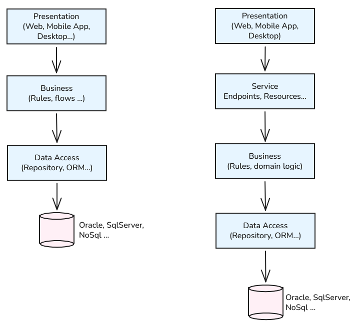
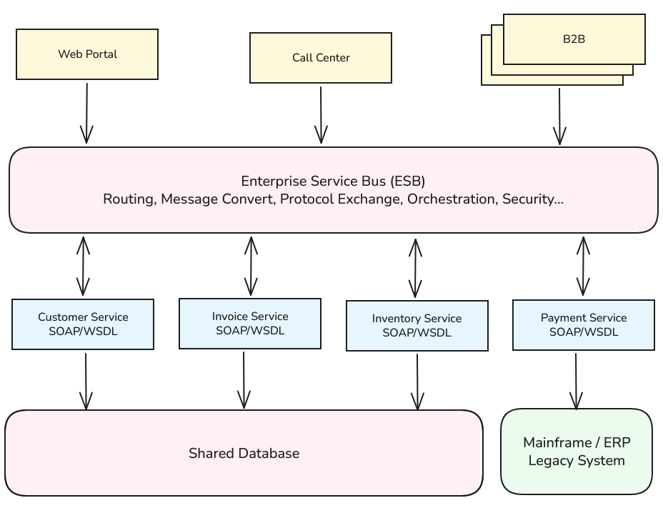
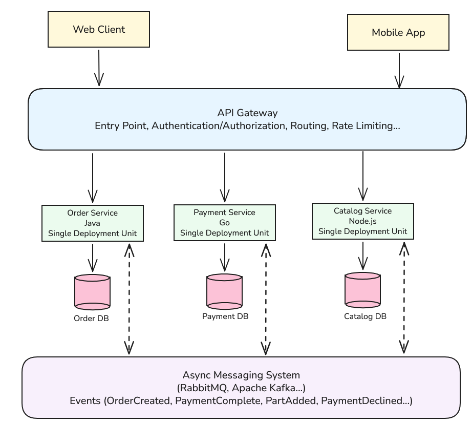
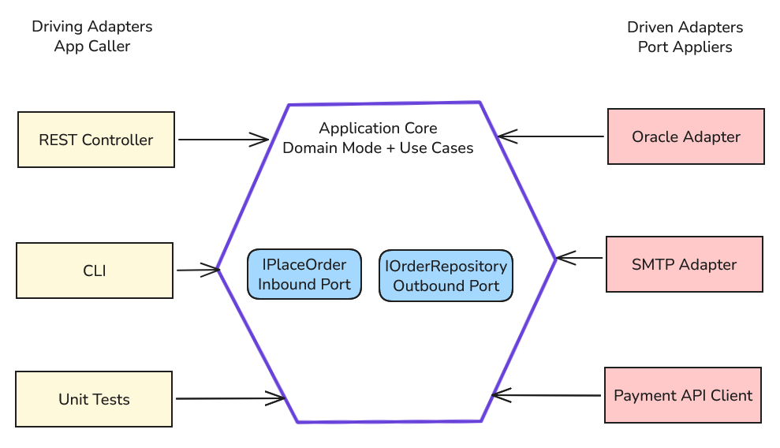
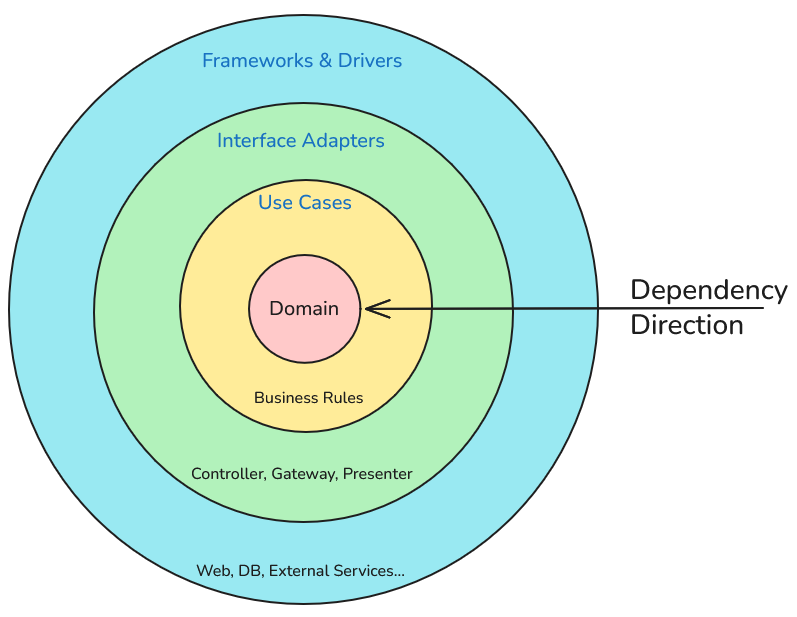
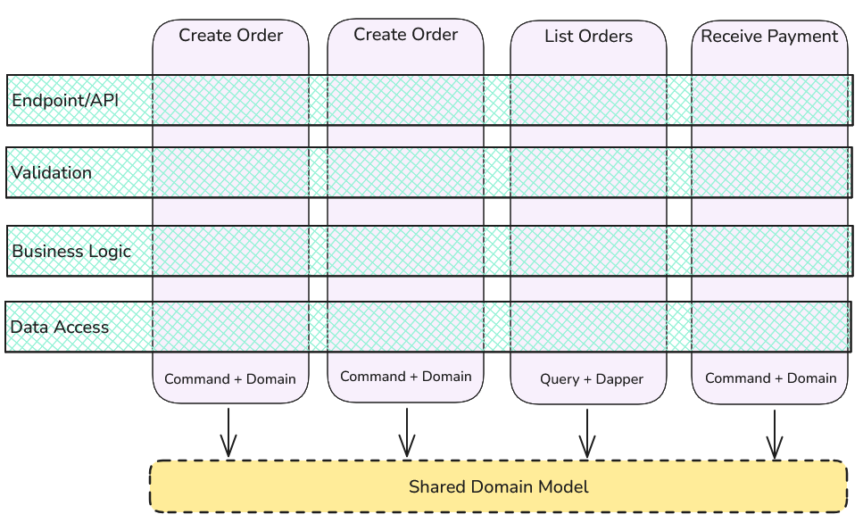
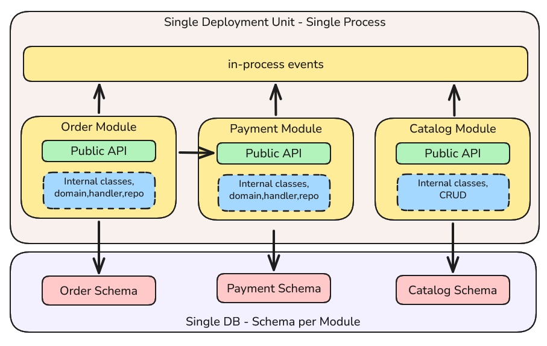

# Hafta 06: Yazılım Mimarileri Üzerine Yardımcı Notlar

Kurumsal çaptakı sistemler karmaşık iş süreçleri barındırır ve tasarımları da bu karmaşıklığı yönetebilecek şekilde olmalıdır. Bu nedenle yazılım mimarileri, sistemin ölçeklenebilirliğini *(scalability)*, bakımını *(maintainability)*, performansını *(performance)*, yönetilebilirliği *(manageability)* ve daha birçok faktörü doğrudan etkiler. Kısaca yazılım mimarisi, **sonradan değiştirilmesi pahalı ve zor olan kararlar bütünü** olarak tanımlanabilir. Esasında doğru yazılım mimarisi yok demek yanlış olmaz. Bunun yerine içeriğe *(context)* uygun trade-off' lar vardır *(trade-off: bir avantajı elde etmek için başka bir avantajdan vazgeçmek)*.

> **Bilgi:** Her mimari bir problemi çözerken beraberinde yeni bir maliyette getirir. Dolayısıyla önce problemi masaya yatırıp ona cevap verecek mimariyi bulmaya çalışmak önemlidir.

## Ölçütler

Popüler yazılım mimarilerini değerlendirmeden önce bazı ölçüt kavramlarına aşina olmakta yarar var. Özellikle **coupling**, **cohesion**, **test edilebilirlik**, **dağıtım** *(deployment)*, **ölçeklenebilirlik** *(scalability)*, **operasyonel maliyet** ve **bilişsel yük** *(cognitive load)* gibi kavramlara aşina olmak mimariler arası karşılaştırmalar yaparken de büyük kolaylık sağlar. Bu ölçütler için aşağıdaki sorular yol gösterici olacaktır.

- **Yazılımdaki bir parçayı değiştirince kaç parça etkileniyor?** -> Coupling *(bağımlılık)* ölçütü ile ilgilidir. Düşük coupling, değişikliklerin etkisini minimize eder.
- **Birlikte değişen şeyler bir arada mı?** -> Cohesion *(içsel bağlılık/uyum)* ölçütü ile ilgilidir. Yüksek cohesion, bir modülün tek bir sorumluluğu olmasını ve değişikliklerin etkisinin sınırlı olmasını sağlar.
- **Bir iş kuralını veritabanı ya da UI olmadan test edebiliyor muyuz?** -> Test edilebilirlik *(testability)* ölçütü ile ilgilidir. Yüksek test edilebilirlik, birim testlerinin kolayca yazılabilmesini, sistemin güvenilirliğinin artmasını anlamına gelir.
- **Sistemi izleme, network ve veri tutarlılığını sağlamak ne kadar zor?** -> Operasyonel maliyet *(operational cost)* ile ilgilidir. Bazı mimariler önemli avantajlar sunarken operasyonel maliyeti artırır.
- **Projeye yeni katılan bir geliştiricisi sisteme ne kadar kolay adapte olabiliyor?** -> Bilişsel yük *(cognitive load)* ölçütü ile ilgilidir. Düşük bilişsel yük, yeni geliştiricilerin sistemi anlamasını ve katkıda bulunmasını kolaylaştırır.

## Popüler Yazılım Mimarileri

Bu derste yüzeysel olarak ele alacağımız mimarileri tarihsel gelişimleri açısından şöyle sıralayabiliriz; 90lı yıllar için katmanlı mimari *(layered architecture)*, 2000'li yıllar için servis odaklı mimari *(SOA - Service Oriented Architecture)*, 2005 Hexagonal mimari *(hexagonal architecture)*, 2008 Onion mimari *(onion architecture)*, 2012 *clean architecture*, 2014 Mikroservis mimari *(microservices architecture)*, 2018 Dikey dilim mimari *(vertical slice architecture)* ve 2020'ler için Modular Monolitik mimari *(modular monolithic architecture)*.

### Katmanlı Mimarisi (Layered Architecture / N-Tier)

Yazılımla tanışan herkesin büyük ihtimalle ilk öğrendiği veya çalıştığı mimari türü olarak düşünülebilir. Uygulama kodu sorumluluklarına göre yatay katmanlara bölünü ve her katman yalnızca bir altındaki katmanı çağırır. Öğrenimi kolay olan bu mimari, küçük ve orta ölçekli projelerde oldukça etkilidir. Ancak katmanlar arası bağımlılıklar arttıkça değişikliklerin etkisi de büyüyebilir, bu nedenle dikkatli tasarım gerektirir. Genellikle 3-Tier veya 5-Tier olarak karşımıza çıkar.

- **3-Tier:** Presentation katmanı (UI) -> Business Logic katmanı (iş mantığı) -> Data Access katmanı (veri erişimi) -> Veritabanı (Database)
- **5-Tier:** Presentation katmanı (UI) -> Application katmanı (Service, API gibi) -> Business Logic katmanı (iş mantığı, domain kuralları) -> Data Access katmanı (veri erişimi) -> Veritabanı (Database)

Kabaca yukarıdaki görselde olduğu gibi tarifleyebiliriz. Burada **layer** ve **tier** kavramlarını birbirine karıştırmamak gerekir. **Layer**, yazılımın sorumluluklarına göre ayrılmış mantıksal bir bölümü ifade ederken, **tier**, fiziksel olarak ayrılmış bir katmanı ifade eder. Söz gelimi 3 katmanlı bir mimari tasarım tek bir fiziksel sunucuda çalışabilir ve bu durumda tek bir tier olarak kabul edilir. Tier'ı ağ sınırı olarak da düşünebiliriz. Dolayısıyla bir mimari tasarımda katman sayısı ile tier sayısı her zaman aynı olmak zorunda değildir.

Bir diğer önemli mesele de katmanlar arası bağların katı *(strict)* ya da gevşek *(relaxed)* olmasıdır. Katı bağ, bir katmanın yalnızca bir alt katmanı çağırabilmesini ve doğrudan diğer katmanlara erişememesini ifade eder. Gevşek bağda ise katmanlar arasında daha fazla adım atlamak mümkündür fakat bu bağımlılıkların süratle dağılmasına da sebebiyet verir. Bazen derleme zamanı kontrolleri veya çeşitli testlerle bu kaçaklar bilhassa engellenir *(ArcUnit konusu ve ADR kavramlarını araştıralım)*

Bu mimaride bağımlılıklar yukarıdan aşağıya doğru iner. Yani iş mantığı veritabanına bağımlıdır. Clean Architecture veya Hexagonal Architecture gibi modern yaklaşımlarda ise bağımlılıklar tersine çevrilir ve iş mantığı altyapı detaylarından bağımsız hale getirilir. Yani katmanlı mimaride zayıflık olarak görülen bu bağımlılık ilkesi diğer mimariler için bir avantaj haline gelir.

Dikkat edilmesi gereken noktalardan birisi de **Sinkhole Anti-Pattern**'dir. İsteklerin çoğu katmanlardan geçerken hiçbir iş yapılmıyorsa *(yani alt katman geriye sadece bir çağrı sonucu dönüyorsa)* katmanların maliyet ürettiği söylenir. Eğer bu durum yüzdesel olarak 20'yi geçiyorsa mimariyi gözden geçirmek ve gereksiz katmanları ortadan kaldırmak faydalı olabilir *(Ref: [O'Reilly, Software Architecture Patterns](https://www.oreilly.com/content/software-architecture-patterns/))*

Uygulaması kolay bir mimari olsa da başta da belirttiğim gibi her mimarinin bazı trade-off'ları vardır. Bu yaklaşımda basit bir özellik eklemek *(Örneğin siparişlere not eklenmesi)* tüm katmanlarda değişiklik yapılmasını gerektirebilir ve değişiklik ufak olsa bile yeniden tüm tier'ın deploy edilmesini zorunlu kılabilir. Bu durum özellikle büyük ve dağıtık sistemlerde operasyonel maliyetleri artırabilir. Örneğin bu zayıflık Vertical Slice Architecture'ın ortaya çıkmasına da vesile olmuştur.

### Servis Odalı Mimari *(SOA - Service Oriented Architecture)*

Kurumun iş yetenekleri etrafında organize edilen ve bu yetenekleri destekleyen servislerin bir araya gelmesiyle oluşan bir mimari yaklaşımdır. SOA'da servisler genellikle birbirinden bağımsızdır ve belirli iş süreçlerini yerine getirir. Bu servisler genellikle Enterprise Service Bus (ESB) gibi bir altyapı üzerinden konuşur. Amaç kurum genelinde yeniden kullanım ve entegrasyonu sağlamaktır. Aşağıdaki görsel kabaca mimarinin temel parçalarını göstermektedir.

Servisler aynı veritabanını paylaştıkları için görünmez bir biçimde birbirlerine bağlıdırlar. Servisler sözleşme bazlıdır *(contract-first)*. Buna göre çoğunlukla WSDL/XSD gibi resmi sözleşme standartları söz konususur. Genellikle SOAP *(Simple Object Access Protocol)* veya REST *(Representational State Transfer)* protokolleri kullanılır. Bu kurguda tüm trafik ESB hattı üzerinden geçer. ESB'nin birçok görevi olur. Mesajların yönlendirilmesi, mesaj içeriklerini farklı formatlara çevrilmesi veya değiştirilmesi, protokol geçişleri gibi işlemler ESB tarafından yönetilir. En önemli avantaj eski sistemlerin *(mainframe'ler, paket yazılımlar vs)* organizasyonun kalanıyla tek bir çatı altında konuşturabilmesidir. Pek tabii bu mimarinin de güçlü ve zayıf yönleri vardır. Örneğin zamanla biriken iş mantığı *(business logic)* tek bir ekipde toplanabilir ve tek hata noktası ile darboğaz riski oluşturabilir.

> SOA aslında bir felsefe sunar ve mikro servis mimarisi aslında bu felsefenin bir uygulamasıdır. SOA ve Microservice üzerine referans için [Martin Fowler - Microservices](https://martinfowler.com/articles/microservices.html) makalesine göz atabilirsiniz.

SOA, çok sayıda eski ve hazır sistemin entegre edilmesi gerektiği durumlarda tercih edilen bir yaklaşımdır. Bu nedenle bankacılık, telekom ve kamu sektöründe sıkça kullanılır.

### Mikroservis Mimarisi *(Microservices Architecture)*

Madem SOA'ya değindik öyleyse onun felsefesini uygulayan ve sıklıkla karıştırılan mikroservis mimarisine de bir bakalım. Bu mimaride sistem, her biri tek bir iş yeteneğine odaklanmış *(bounded context)*, diğerlerinden bağımsız şekilde dağıtılabilen *(independently deployable)* ve kendi veritabanını kullanan servislere bölünür. Küçük servisler olarak ifade edilirler zira her biri tek bir iş yeteneğini kapsar ve sorumlulukları nettir. Buradaki avantaj bağımsız yayınlama ve ölçeklendirme imkanıdır. Her servis kendi yaşam döngüsüne sahiptir ve diğer servislerden bağımsız olarak güncellenebilir veya yeniden dağıtılabilir. Lakin bunun da bir dezavantajı vardır; sistemin karmaşıklığı artar ve servisler arası iletişim maliyetleri yükselir. Bunu çok da yabana atmamak gerekir. Başlangıçta oldukça makul görünen çözüm binlerce servisin yönetilmesi gerektiğinde ciddi bir karmaşıklığa dönüşebilir. Mimariyi kabaca aşağıdaki görselle özetleyebiliriz.

Buradaki servisler sistemin kalanı ile event bazlı bir haberleşme kurar. Burada asenkron bir olay akışı söz konusudur. Örneğin bir ödeme alınması durumunda ilgili servis bir "ödeme alındı" olayı yayınlar ve bu olaya abone olan diğer servisler gerekli işlemleri gerçekleştirir.

Servisler kendi veritabanlarına sahiptir ve diğlerinin tablolarında doğrudan erişemez, sorgu atamazlar. Eğer diğer bir servisin verisine ihtiyaç varsa bunun yolları bellidir. Ya bir API noktası ya da bir event ile. *(Bazı vakalarda aynı veritabanını kullanan servisler de görülür ve bu genellikle dağıtık monolit olarak adlandırılır.)* Servis sınırları aslında iş alanlarıyla paraleldir ve her servis kendi iş yeteneğini kapsar. Bu sınırları teknik bir katman olarak düşünmemek doğrudur. Çizimdeki servisler ile olan iletişim günümüz standartlarında birçok şekilde yapılabilir. REST en popülerlerinden birisi olsa da bazı durumlarda yüksek performans ve `HTTP/2` avantajları nedeniyle gRPC gibi protokoller de tercih edilebilir.

Mikro servis ve SOA gibi mimariler aslında dağıtık sistemlerin odak alanına girerler. Dağıtık sistemlerde veri tutarlılığı, ağ gecikmeleri, hata toleransı gibi konular da ön plana çıkar. Özellikle mikro servis mimarisinde veri tutarlılığı nihai *(eventual)* olarak sağlanır. Dağıtık transaction yönetimi SAGA, Outbox pattern gibi yaklaşımlarla yönetilir ancak uygulaması karmaşıklık ve dikkat gerektirir.

> Dağıtık sistemlerin güçlüklerini anlamanın en iyi yolu, L. Peter Deutsch'un "Fallacies of distributed computing" maddelerini incelemekten geçer. [Fallacies of distributed computing](https://en.wikipedia.org/wiki/Fallacies_of_distributed_computing)

Bağımsız olarak dağıtılabilen sayısız servis `CI/CD` süreçlerini de zorlaştırabilir. Ayrıca container orkestrasyonu, merkezi loglama, dağıtık izleme *(tracing)*, servis keşfi *(service discovery)*, devre kesme *(circuit breaking)* gibi birçok kavram da işin içerisine girer. Dolayısıyla küçük ekiplerde, domain sınırlarının belirsiz olduğu senaryolarda ve özellike MVP aşamalarında tercih edilmesi doğru olmayabilir. Çoğu durumda en iyi başlangıç monolit bir mimari ile yapılır ve sistem olgunlaştıkça mikro servis mimarisine geçiş düşünülebilir *(Geçiş yapmak da ayrı bir beceri gerektirebilir, sırf bunun için özel patternler ve stratejiler vardır; örneğin Strangler Fig pattern)*.

### Hexagonal Mimari *(Ports and Adapters)*

Hexagonal mimari, uygulamanın iş mantığını dış dünyadan ayırmayı amaçlar. Bu mimaride uygulama merkezi bir çekirdek olarak tasarlanır ve dış dünya ile olan iletişim portlar ve adaptörler aracılığıyla sağlanır. Portlar, uygulamanın ihtiyaç duyduğu işlevleri tanımlar ve adaptörler bu portları gerçek dünyadaki teknolojilere bağlar. Bu sayede iş mantığı, veri tabanı, kullanıcı arayüzü veya üçüncü taraf servislerden bağımsız hale gelir. Mimariyi kabaca aşağıdaki görselle özetleyebiliriz.

Uygulama çekirdeği yalnızca kendi tanımladığı portları *(arayüzler olarak düşünebiliriz)* bilir. Veritabanı, kullanıcı arayüzü *(User Interface)*, mesaj kuyruğu *(Message Queue)* gibi dış dünya bileşenler bu portlara takılan adaptörlerdir. Şekildeki Driving ve driven kavramlarını şöyle de ifade edebiliriz; sol taraftakiler uygulamayı sürenler, sağ taraftakiler ise uygulamanın sürdükleridir. Interface gibi türler üzerinden tanımlanan portlar çekirdeğe ait ve genellikle domain ya da application projelerinde tanımlanırlar. Arayüz implementasyonu altyapı *(infrastructure)* projesinde gerçekleştirilir. Burada esas Dependency Inversion prensibinin mimari ölçekte uygulanmasıdır. Katmanlı mimaride gördüğümüz gibi alt üst katman gibi bir kavram yerine iç ve dış diye bir kavram vardır *(Katmanlı mimaride belirttiğimiz `iş mantığı veritabanına bağımlıdır` sorunu burada tersine çevrilir)*. SOA ve mikroservis mimarilerinde olduğu gibi test edilebilirlik burada en büyük kazanımlardan birisidir ama daha da önemlisi bu kurguya göre teknoloji değişimi adaptör değişimidir. Dolayısıyla SQL Server'dan örneğin PostgreSQL'e geçmek çekirdeğe dokunmadan mümkündür *(yine de soyutlamalarda olası sızıntılara dikkat etmek gerekir)*.

### Onion/ Clean Architecture *(Onion/ Clean Architecture)*

Clean Architecture, Onion Architecture ve Hexagonal Architecture genelde birbirleri ile içiçe geçebilen kavramlardır. Karıştırılabilirler. Aslında üçü de aynı fikrin farklı çizimleri gibi de yorumlanabilirler. Ortak olan noktaları ise bağımlılık ilkelerini tersine çevirmeleri ve iş mantığını dış dünya bağımlılıklarından izole etmeleridir. Biz genel bir halka modeli olarak yaklaşıp bağımlılıkların yönünü de göz önüne alarak aşağıdaki gibi bir şemayı tartışabiliriz.

Merkezde yer alan domain katmanı hiçbir yere bağımlı değildir. Tüm bağımlılıklar halkaların en dışından merkeze doğru yönelir. Bu sayede iş mantığı, veri tabanı, kullanıcı arayüzü veya üçüncü taraf servislerden bağımsız hale gelir ve test edilebilirlik artar. Dış katmanlar ise iç katmanlara bağımlıdır ve iç katmanların tanımladığı arayüzleri implement ederler. Bu kurguda framework sadece bir detaydır. Spring, Hibernate en dış halkada konumlanırlar ve gerektiğinde kolayca değiştirilebilirler. Domain katmanı bu halkadakileri bilmez ve bilmek zorunda da değildir.

> **Screaming Architecture** Projenin klasör yapısına bakıldığında iş mantığının ve domain modelinin hemen göze çarpması gerektiğini savunan bir tasarım felsefesidir. Yani klasör yapısı, projenin asıl amacını ve iş mantığını "bağırır" olmalıdır. Örneğin bu bir MVC uygulaması demek yerine bir araç kiralama sistemidir diyebilmeliyiz.

Şekilde dört halka kullandık ama bu şart değildir. Kural, bağımlılıkların yönüdür. Diğer yandan bu mimarinin de bazı zayıf tarafları vardır. Bunlardan en önemlisi küçük projelerde bile çok sayıda soyutlama ve arayüz gerektirebilmesidir. Bir noktada `over-engineering` sorununa yol açabilir.

### Dikey Dilim Mimari *(Vertical Slice Architecture)*

Kodu teknik katmanlara göre değil de, işlevsel bir özelliğe göre *(use case, feature)* bölmeyi öneren bir yaklaşımdır. Her dilim *(slice)* bir talebin uçtan uca tüm kodunu *(endpoint, doğrulama, iş mantığı, veri erişimi)* bir arada tutar. Bu sayede dilimler arası bağımlılıklar azalır ki özellikler bağımsız olarak geliştirilebilir ve test edilebilir hale gelir. Kabaca aşağıdaki gibi bir çizimle ifade edilebilir.

Çizimdeki dikey kesitler klasik katmanları, dikey sütunlar ise dilimleri ifade etmektedir. Bu mimari modele göre yeni bir özellik eklemek aslında tek bir klasör yeni bir dosya eklemek kadar basittir, var olan mevcut dikeyler bundan etkilenmez. Her dikey dilim kendi alanında kendi tekniğini kullanabilir. Sözgelimi basit bir sorgu için doğrudan SQL script çalıştıran bir paket kullanılabilirken, daha karmaşık bir iş mantığı domain modelini baz alan bir komut işletilebilir. Her dikeyin aynı katmanı kullanma zorunluluğu yoktur. Vertical Slice Architecture, çoğu zaman CQRS *(Command Query Responsibility Segregation)* ile birlikte anılır. Buna göre örneğin `Features/Orders/CreateOrder` altında Endpoint, Command, CommandHandler, Validator gibi tüm bileşenler bir arada bulunur.

Tabii bu yapıda tekrarlar ve dağınıklık kaçınılmazdır. Her dikey dilim kendi bağımsız yapısını içerdiği için benzer işlevler farklı dilimlerde tekrar edebilir. Bu yüzden gerçekten paylaşılan kurallar varsa bunları domain modeline çekmek mantıklı bir yaklaşım olacaktır *(DRY - Don't Repeat Yourself)*

### Modular Monolitik Mimari *(Modular Monolithic Architecture)*

Son yıllarda bu mimari yaklaşım da popülerlik kazanmıştır. Modüler monolitik mimari, tek bir uygulama içinde modüler yapılar oluşturarak, hem monolitik yapının basitliğini hem de mikroservislerin modülerliğini bir arada sunmayı amaçlar. Her modül kendi bağımsız işlevselliğine sahip olup, diğer modüllerle minimum bağımlılıkla çalışır. Aşağıdaki şekilde bu yaklaşım görselleştirilmiştir.

Order modülü, sipariş ödemesi için Payment modülüne ihtiyaç duyar ve bunun için ödeme modülünün Public API'sini kullanır. Diğer etkileşimler olay tabanlı iletişimle gerçekleşir ve her modül sadece ve sadece kendi şemasına yazar. Burada modül aslında bounded context olarak düşünülebilir. Sınırlar aynen mikroservislerdeki gibi belirgin ve bağımsızdır. Modüllerin tek bir açık kapısı olur yani dışarıya public API'ler ile *(interface, façade gibi enstrümanlar)* açılırlar. Modüller arası iletişimin bir diğer yoluysa süreç içi olaylar *(domain events)* aracılığıyla gerçekleşir. Tabii burada önemli bir kural da vardır. Diğer modüllerin entity nesnelerine veya tablolarına dokunmak yasaktır. Veritabanı ortaktır ama modüller için ayrı şemalar söz konusudur. Diğer yandan aynı veritabanı kullanılsa da tablolara arası JOIN işlemleri yapılmaz ya da foreign key ile doğrudan bağlanmaz.

Mimarinin ilginç ayrıntılarından birisi de her modülün kendi içinde bağımsız mimari yaklaşımları kullanabilmesidir. Örneğin bir modül Hexagonal Architecture'ı benimserken, başka bir modül Clean Architecture veya Vertical Slice yaklaşımını tercih edebilir. Bu esneklik, modüllerin kendi ihtiyaçlarına göre en uygun yapıyı seçmelerine de olanak tanır.

> İyi ayrılmış bir modül gerçekten bağımsız ölçekleme veya dağıtım gerektirdiğinde servis olarak dışarı çıkabilir. Süreç içi olaylar asenkron mesaj kuyruğuna, public API çağrıları da HTTP/gRCP'ye döner. Dolayısıyla modüler monolitik yapı, mikroservis mimarisine geçiş için de doğal bir adım haline gelir.

Elbette burada da bir takım zorluklar ve dikkat edilmesi gereken noktalar vardır. Örneğin modül sınırları ArchUnit, Spring Modulith gibi araçlarla denetlenmelidir. Aksi takdirde modüller arası bağımlılıklar ve kuralların ihlali **big ball of mud** olarak adlandırılan karmaşık ve yönetilemez bir yapıya yol açabilir. [Big Ball of Mud, Brian Foote, Joseph Yoder, 1997](https://www.cin.ufpe.br/~sugarloafplop/mud.pdf) Zaten modular monolitik yapının amacı monolitik sistemlerin kaçınılmaz olarak bir çamur yığınına dönüşmesini engellemektir.

## Karar Matrisi

Doğrusu mimarilerin her birinin kendine özgü avantajları ve dezavantajları vardır. Bu nedenle bir projede hangi mimarinin kullanılacağına karar verirken projenin büyüklüğü, karmaşıklığı, ekip yapısı ve uzun vadeli bakım gereksinimleri gibi faktörler göz önünde bulundurulmalıdır. Aşağıdaki tablo belli ölçütlerde karar vermeyi kolaylaştırabilir.

| **Mimari** | **Neyi Böler?** | **Bağımlılık Yönü** | **En Büyük Avantajı** | **En Büyük Maliyeti** | **Hangi Konsept** |
| --- | --- | --- | --- | --- | --- |
| **Katmanlı *(N-Tier)*** | Teknik sorumluluğu yatay katmanlara böler | Yukarıdan aşağıya | Basit ve anlaşılır yapı | İş mantığı altyapıya bağımlıdır | Küçük-Orta CRUD projeleri |
| **SOA** | Kurumsal iş yeteneklerini servisler aracılığıyla böler | Servislerden ESB'ye | Heterojen sistem entegrasyonu kolaylığı | ESB darboğazı, ağır standartlar | Büyük kurumlar, eski sistemler |
| **Mikroservis** | Bounded Context (dikey fiziksel) olarak böler | Servisler arası API/Event tabanlı | Bağımsız dağıtım ve ölçeklenebilirlik | Dağıtık sistem karmaşıklığı | Kalabalık ekipler ama net domain sınırları |
| **Hexagonal** | Çekirdek ve dış dünya arasındaki bağımlılıkları böler | Dıştan içe portlarla | Test edilebilirlik, teknoloji bağımsızlığı | Arayüz ve mapping karmaşıklığı | Çok sayıda entegrasyon gerektiren projeler |
| **Clean/Onion** | Eş merkezli katmanlarla çekirdeği dış bağımlılıklardan ayırır | Dıştan içe | Domain'in korunması | Proje sayısının artmasıyla karmaşıklık | Uzun ömürlü, iş kuralları yoğun sistemler |
| **Vertical Slice** | Özelliğe/senaryoya göre dikey dilimlere böler | Dikey dilim içinde bağımsız | Yeni özellik eklemek basit ve izole | Tekrarlayan kod ve dağınıklık | Feature odaklı hızlı gelişen ürünler |
| **Modüler Monolitik** | Tek bir uygulama içinde bağımsız modüllere böler *(Dikey, mantıksal bounded context)* | Modüller arası public API, olay tabanlı iletişim | Net sınırlara sahip ve tek parça deployment | Modül sınırları test edilmezse aşınır | 1-5 ekipli projeler, yeni ürünler ve mikroservis geçişi planlayan projeler |

Dolayısıyla karar verirken şu soruları sormak faydalı olacaktır:

- Aynı kod tabanında kaç ekip çalışıyor ve birbirlerini bekliyorlar mı?
- Domain sınırları net mi yoksa keşfedilmesi mi gerekiyor?
- Sistemin farklı parçaları farklı yük altında mı çalışacak?
- CI/CD, izleme ve konteyner altyapısı hazır mı ve etkin bir şekilde kullanılacak mı?
- İş kuralları karmaşık mı yoksa CRUD *(Create, Read, Update, Delete)* operasyonları gibi uygulama ağırlıklı mı?

---

## Bölüm Soruları

Yazılım mimarilerini teorik olarak öğrenmek pek kolay değildir. Gerçek hayat senaryolarında yaşanan birçok durum teorik bilgilerin ötesinde pratik deneyim gerektirir. Bu nedenle, farklı mimarilerin avantajlarını ve dezavantajlarını anlamak için gerçek projelerde uygulama yapmak oldukça önemlidir. Yine de yukarıdaki bilgiler ışığında aşağıdaki sorular tartışılabilir.

1. Üç kişilik bir ekip yeni bir SaaS *(Software as a Service)* ürününe mikroservis mimarisi ile başlayabilir mi?
2. Katmanlı bir uygulamayı Clean Architecture'a taşırken ilk olarak hangi bağımlılığı ters çevirirsiniz *(Dependency Inversion Principle)*?
3. Vertical Slice ve mikroservis yaklaşımları arasındaki benzerlik ve fark nedir?
4. Hexagonal ve Clean/Onion mimarileri arasındaki temel farklar nelerdir?
5. *Fallacies of distributed computing* neyi ifade eder ve neden önemlidir?

## Karşılıklar Tablosu

| **Konu** | **.NET Karşılığı** | **Java Karşılığı** |
| --- | --- | --- |
| Web/Application Framework | ASP.NET Core | Spring Boot, Quarkus, Micronaut, Jakarta EE |
| ORM/Data Access | Entity Framework Core, Dapper | JPA/Hibernate, Spring Data, jOOQ, JdbcTemplate |
| Module/Layer Boundary | csproj + project ref, internal | Maven/Gradle, JPMS, package-private |
| Architecture Tests | NetArchTest, ArchUnit | ArchUnit, jMolecules |
| Modular Monolith Support | N/A | Spring Modulith |
| CQRS/mediator | MediatR, Wolverine | Axon Framework, Spring ApplicationEventPublisher |
| Microservice Infrastructure | YARP, Ocelot, .NET Aspire | Spring Cloud, Eureka |
| Resilience *(Circuit Breaker, Retry, Timeout)* | Polly | Resilience4j |
| Messaging | MassTransit, RabbitMQ, Azure Service Bus | Spring AMQP, Spring Kafka, Apache Camel |
| SOA/ESB Architecture | WCF *(Legacy)*, BizTalk | JAX-WS, Apache Camel, MuleSoft, WSO2 |
